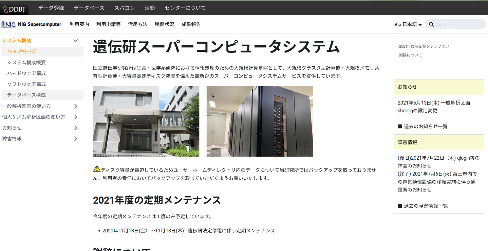

# NIG Supercomputer Home Page (version 2)

This website is built using [Docusaurus 2](https://docusaurus.io/), a modern static website generator.

## Installing Node.js 

Node.js must be installed as a prerequisite for building and launching the NIG supercomputer home page in your local environment.

1. Installing `nvm`

```
curl -o- https://raw.githubusercontent.com/nvm-sh/nvm/v0.35.3/install.sh | bash
```
Please check the following page to see what the latest version is. https://github.com/nvm-sh/nvm

2. Activate nvm by running `source ~/.bashrc` or similar command.
3. Run `nvm ls-remote` to display the available node.js versions.
4. Install Node.js with `nvm install v16.18.1`.  (v16.18.1 is the appropriate one from the node.js version displayed in the aforementioned command.)
5. Activate Node.js with `nvm use v16.18.1`.

### 編集用ページの表示

以下の方法で web サーバを起動すると、markdown ファイルの編集結果がリアルタイムで画面上に反映される。

1. この git リポジトリを clone する。

```
git clone https://github.com/oogasawa/nigsc_homepage2
```

2. 以下のコマンドにて web サーバを起動する。（ブラウザが開きページが表示される）

```
cd nigsc_homepage2
npm install  # 初回のみ
npm start
```

これによりローカル環境の web ブラウザ上に web ページが表示される。

- これで表示されるのは開発用サイトであり、全文検索が効かない、多言語設定が効かないといった制限がある。
- リモート環境からアクセスしたい場合は`npm start -- --host 0.0.0.0`等とする。



英語版を表示するには`npm start`の際に言語を指定する必要がある。

```
npm start -- --locale en
```


### 静的サイトの生成

実際のサービスに使うためには以下のコマンドで静的サイトをビルドする。英語版も含めてサイト全体が生成される。

```
npx browserslist@latest --update-db
npm run build  # Markdown => HTML
```

生成された静的サイトをテスト用に表示するには、例えば以下のようにする。

```
npm run serve  # HTML 化されたサイトの表示 
```

これによりローカル環境の web ブラウザ上に web ページが表示される。（リモート環境からアクセスしたい場合は`npm run serve -- --host 0.0.0.0`等とする）


最終的には上記コマンドで出来た build ディレクトリを Apache サーバなどで見せれば良い。以下は一例。

```
sudo -u www-data rm -Rf /var/www/html ; sudo -u www-data mv build /var/www/html
```
