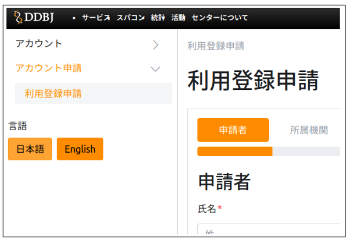
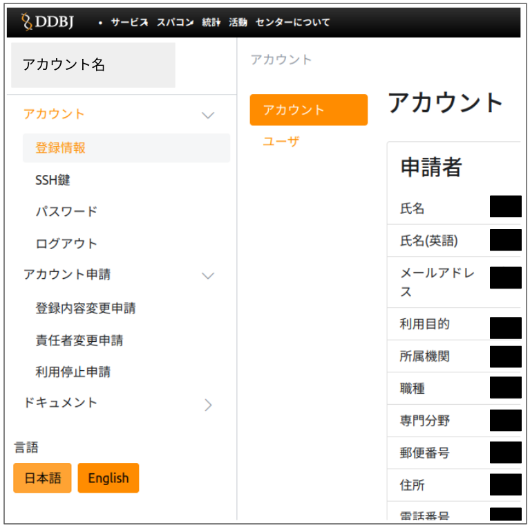

- アカウント登録フォームの URL はこちらです。=><!-- <a href="https://sc-account.ddbj.nig.ac.jp/application/registration">アカウント登録システム</a> --> [アカウント登録システム](/blog/2024-10-25-account_system_maintenance)
- 申請についての説明はこちらです。=>[アカウントの新規登録](/application/registration)

<table>
<tr>
<td valign="top">

初期画面

</td>
<td valign="top">

ログイン後の最初の画面

</td>
</tr>
</table>

- アカウントの新規登録がより簡単になりました。
- アカウント登録システムのフォームで、SSH 公開鍵の登録ができるようになりました。
  - これまでの手順では、アカウントの新規登録後、おおよそ 1 週間程度でアカウント登録証を受け取り、ユーザご自身でログインした後に SSH 公開鍵の登録を行う 2 段階方式でした。
  - しかし今後は、アカウント登録システムのフォームの中で SSH 公開鍵の登録も行うことができます。
- 年度末アカウント継続申請が容易になりました。
  - すべての項目を 1 つ 1 つ手入力する必要がなくなり、PubMedID を入力するだけで論文情報が取得・自動入力できるようになります。

### 注意事項

- 公開鍵などの設定直後は `gw2.ddbj.nig.ac.jp` からログインして頂けますようお願いします。
    - 現在、新しいアカウント登録システムへの移行作業を行っております。そのため、新しいゲートウェイ `gw2.ddbj.nig.ac.jp` への公開鍵登録については即時設定が反映されますが、古い方のゲートウェイ `gw.ddbj.nig.ac.jp` へ設定が反映されるまでに１日程度かかります。次回の定期メンテナンス（12 月）の際に、古いゲートウェイにも即時設定が反映されるようシステムを改修する予定です。
- `sc2.ddbj.nig.ac.jp` サーバは閉鎖しました。

