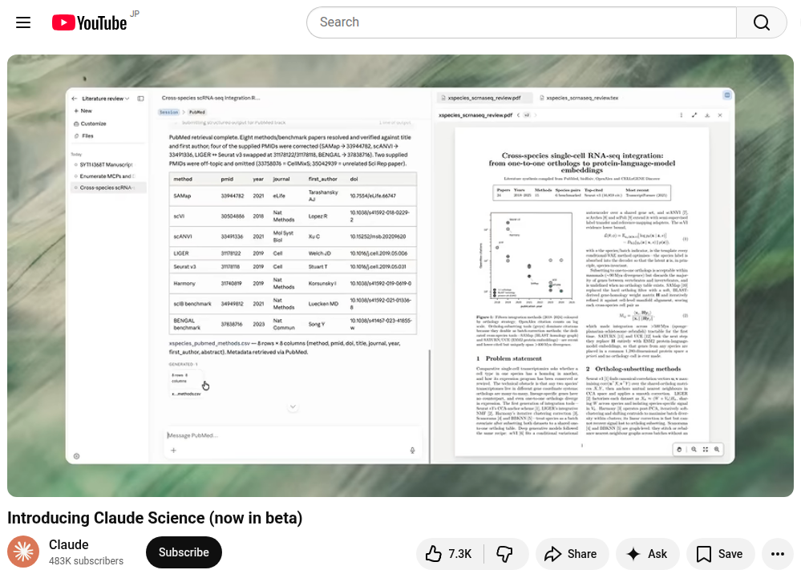
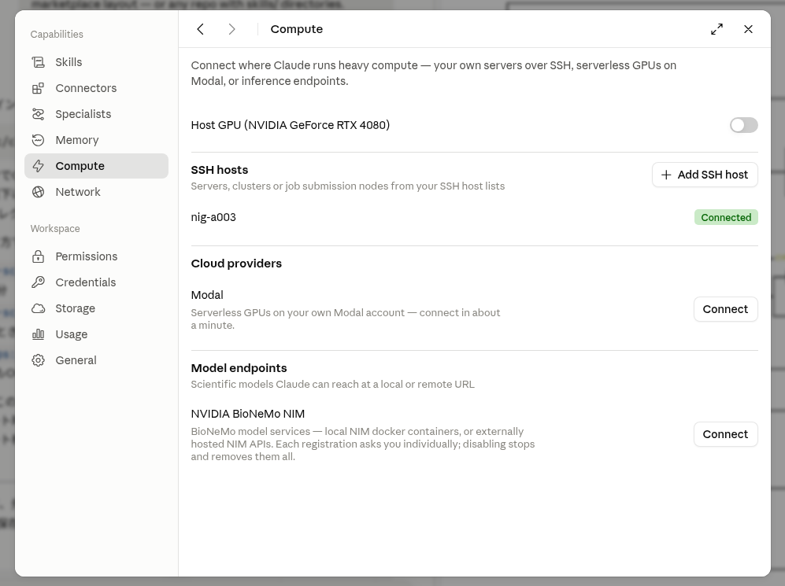
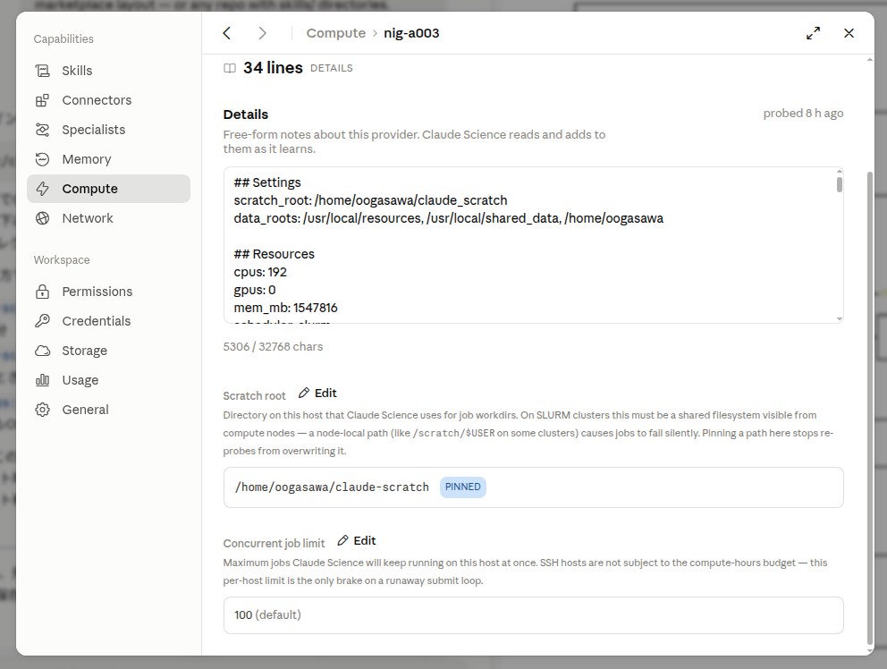
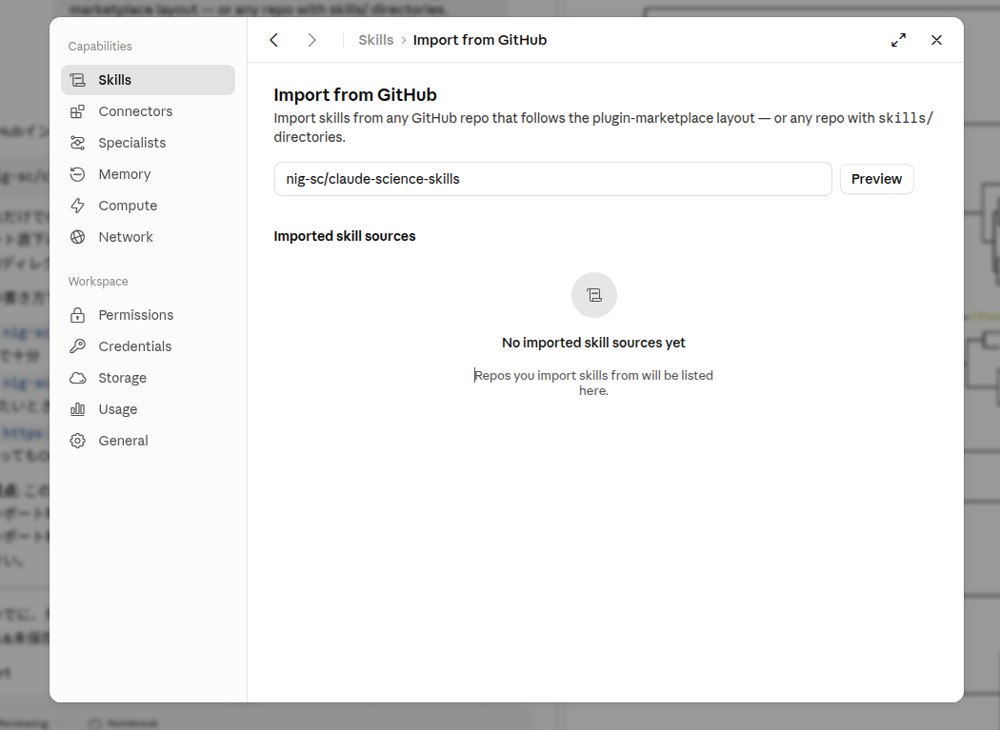
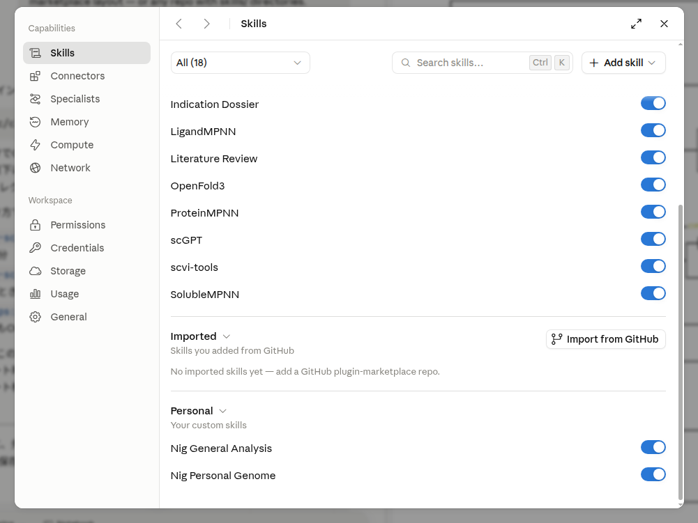

## Claude Scienceとは

Claude Science は、研究・データ解析を半自律的に進める AI エージェントです。
利用者が普通の言葉で「こういう解析をしたい」と伝えると、Claude Science自身がコードを書き、実行し、結果を見て次の手を決める、という多段の作業を実行します。

Claude Science は、文献調査・データ解析・作図・原稿執筆という研究のあらゆる段階を通して使えるよう設計されています（公式の紹介文では "designed with every stage of research in mind"）。


:::info
利用には Anthropic の有料 Claude プランが必要です。
:::

<a href="https://www.youtube.com/watch?v=idtMsa_1yNk">

</a>


公式ドキュメント
- 概要: https://claude.com/docs/claude-science/overview
- はじめかた: https://claude.com/docs/claude-science/get-started
- ダウンロード・製品ページ（生物学の作業例つき）: https://claude.com/product/claude-science
- 発表ブログ（実際の研究者の使用例つき）: https://www.anthropic.com/news/claude-science-ai-workbench
- Claude for Life Sciences: https://www.anthropic.com/news/claude-for-life-sciences
- 公式（リモート計算クラスタ）: https://claude.com/docs/claude-science/remote-compute-clusters

## システム構成

Claude Scienceの中核はclaude science serveプログラムです。
これはユーザのPCにインストールしてPC上で動かす想定のプログラムになっています。

Claude science serveプログラムは、ユーザPC上に解析環境をオンデマンドで構築し、データベースなどからデータをダウンロードしPC上で解析を実行し、結果をAnthropicクラウドに送付し、ユーザPCのWebブラウザで表示します。

この解析作業を外部の計算機にSSH接続するなどの方法で外部化することが可能です。
この文章では遺伝研スパコンを使って大規模解析を行う方法を説明します。

:::caution
データはAnthropicクラウドに転送されることになります。
個人ゲノムデータ等閉鎖環境での解析を前提としている場合には注意が必要です。
:::


Claude Scienceには
生命科学の主要なデータベースに接続するコネクタが同梱されています（`Settings > Connectors and Skills` で有効化）。
2026年7月時点で使えるデータベース、コネクタ、スキルは以下の通りです。

**Connect to the scientific web**
- NCBI / NIH: PubMed, Entrez, NIH
- Genomics & biology: Ensembl, Reactome, KEGG, gnomAD, GTEx, ENCODE
- Proteomics: UniProt, STRING, EBI, Foldseek, RCSB PDB, Protein Atlas
- Literature & citations: Semantic Scholar, arXiv, bioRxiv, Crossref, DOI, OpenAlex
- Clinical & pharma: FDA, ClinicalTrials, Open Targets, COSMIC, ClinGen, CIViC

**Anthropic 提供コネクタ:** BioMart, bioRxiv, Cancer Models, CellGuide, ChEMBL, Chemistry, Clinical Genomics, Clinical Trials, Drug Regulatory, Expression, Genes & Ontologies, Genomes, Human Genetics, Ketcher Chemistry, Literature Graph, Omics Archives, Protein Annotation, PubMed, Regulation, Research Resources, RNA, Structures & Interactions, Variants, ZINC

**外部提供（ディレクトリ）コネクタ:** AdisInsight, Biomni Lab, BioRender, Boltz API, Consensus, Cortellis Regulatory Intelligence, EDEN by Basecamp Research, Elicit, Helix GenoSphere, Inductive Bio, LatchBio, Medidata, Open Targets, Owkin, Scholar Gateway, Scite, Synapse.org, Synthesize Bio


## インストール手順

### 1. ユーザのPCに Claude Science をインストールする

Claude Science は macOSまたはLinuxで動きます。

Windows はWSL2（Ubuntu 24.04 以降）を使うことによりLinux と同じ手順で動きます
- https://claude.com/docs/claude-science/run-on-windows-wsl 


Linux の場合は、先に依存パッケージを入れてください（`bubblewrap` 0.8.0 以上と `socat`。非特権ユーザー名前空間が有効であること。macOS では不要）。

```bash
# ユーザのPC（Linux）で実行。依存パッケージを入れる
sudo apt update && sudo apt install -y bubblewrap socat
```

次を実行して Claude Science をインストールしてください。

```bash
# ユーザのPC で実行
curl -fsSL https://claude.ai/install-claude-science.sh | bash
```

`claude-science` は `~/.local/bin` に入ります。今のシェルと今後のシェルの両方で使えるよう、`PATH` に追加してください。

```bash
# ユーザのPC で実行
echo 'export PATH="$HOME/.local/bin:$PATH"' >> ~/.bashrc
source ~/.bashrc
```

### 2. ユーザのPCで claude science serve を起動してサインインする

次を実行すると serve が起動し、既定の Web ブラウザにサインイン用のタブが自動で開きます。

```bash
# ユーザのPC で実行。このコマンドはフォアグラウンドで動き続けます（終了は Ctrl-C）
claude-science serve --port 43000
```

開いたタブで Claude アカウントにサインインしてください。


画面の案内に従って操作するとセットアップ画面になります。


ブラウザが自動で開かない場合は、別のターミナルで次を実行し、表示されたリンクを開いてください。

```bash
# ユーザのPC で実行（別のターミナル）
claude-science url
```

セットアップ画面になったら、画面の案内に従って順次必要項目を入力してください。


最終的に以下のような画面になります。


## 遺伝研スパコンをClaude Scienceから利用可能にする

### 1. ユーザPC上の`~/.ssh/config`を編集しパスワード無しで直接インタラクティブノードにログインできるようにする

SSH計算ホストとして登録するには、
ユーザPCから（ゲートウィノードに明示的にログインすることなく)インタラクティブノードへ一度のコマンドでログインできるように設定する必要が有ります。

ユーザのPC の `~/.ssh/config` に次のように書いてください。

```sshconfig
# ユーザのPC の ~/.ssh/config に書く
Host nig-gw
  HostName gw.ddbj.nig.ac.jp                 # 遺伝研スパコン ゲートウェイノード
  User youraccount
  IdentityFile ~/.ssh/<遺伝研スパコン用の秘密鍵>
  IdentitiesOnly yes

Host nig-a003
  HostName a003                              # 遺伝研スパコン インタラクティブノード
  User youraccount
  IdentityFile ~/.ssh/<遺伝研スパコン用の秘密鍵>
  IdentitiesOnly yes
  ProxyJump nig-gw                           # gw を自動で経由する
```

秘密鍵にパスフレーズがある場合は、`ssh-agent` に読み込んで置く必要が有ります（serve が非対話で接続するため）。次を実行して、`ssh nig-a003`でインタラクティブノードへログインできることを確認してください。

```bash
# ユーザのPC で実行
ssh-add ~/.ssh/<遺伝研スパコン用の秘密鍵>
ssh nig-a003
```

### 2. 遺伝研スパコンのインタラクティブノード を SSH 計算ホストとしてclaude scienceに登録する

Claude Science の Web UI で `Settings > Compute > SSH hosts > Add SSH host` を開き、`~/.ssh/config` のエイリアス `nig-a003` を選びます。





- 追加すると read-only の probe が走り、CPU・メモリ・GPU・`sbatch` の有無・partition などを検出します（a003 側には何もインストールされません）。


ホスト詳細ページで **Scratch root** を、共有ファイルシステム上のパスに設定します。ここに中間データなどが書き込まれます。
例えば`/home/youraccount/claude-scratch`のように書いておけばよいです。



Detailsにはなにも書かなくてOKです。


### 3. 遺伝研スパコン用のskillをclaude scienceに設定する

このSkill https://github.com/nig-sc/claude-science-skills は遺伝研スパコンの使い方をclaudeのLLMに教えるものです。

`左下の歯車 > Settings > Skills > Import from Githubボタン` をクリックすると以下の画面になります。



GitHubインポート欄には、こう書きます:

```
nig-sc/claude-science-skills
```

これだけでOKです(owner/repo 形式)。先ほど push したリポジトリがこれで、ルート直下に nig-general-analysis/ と nig-personal-genome/ の2つのskillディレクトリが入っているので、この1行で両方取り込まれます。





## 終了、アンインストール


### 1. claude science serveプロセスの終了

#### 状態の確認

```
# ユーザのPC で実行
$ claude-science status
{
  "running": true,
  "pid": 2533288,
  "version": "0.1.16-dev.20260707.t155726.shaf2472db",
  "port": 43000,
  "started_at": "2026-07-08T07:40:26.387Z",
  "health": {
    "flavor": "release",
    "channel": "public",
    "uptime_ms": 4187589,
    "active_frames": 1,
    "active_conversations": 1,
    "require_token": true,
    "fell_back_from": null,
    "url_host": "localhost"
  }
}
```

#### 終了

```
# ユーザのPC で実行
$ claude-science stop
Daemon stopped (pid 2533288).
```

#### 終了確認

使っていたポート番号が表示されないことを確認する。
ポート番号は上記の`claude-science status`で確認できる。

```
# ユーザのPCで実行。指定したポート番号の範囲で使用中の番号だけが表示される。
ss -tlnp 'sport >= :43000 and sport <= :43100'
```

### 2. claude science serveのアンインストール

```
# ユーザのPC で実行
# プログラム本体を消す
rm ~/.local/bin/claude-science

# データと conda 環境を消す
rm -rf ~/.claude-science
```


