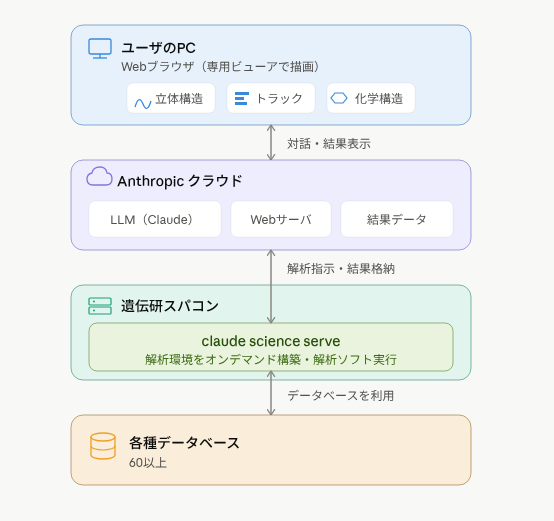
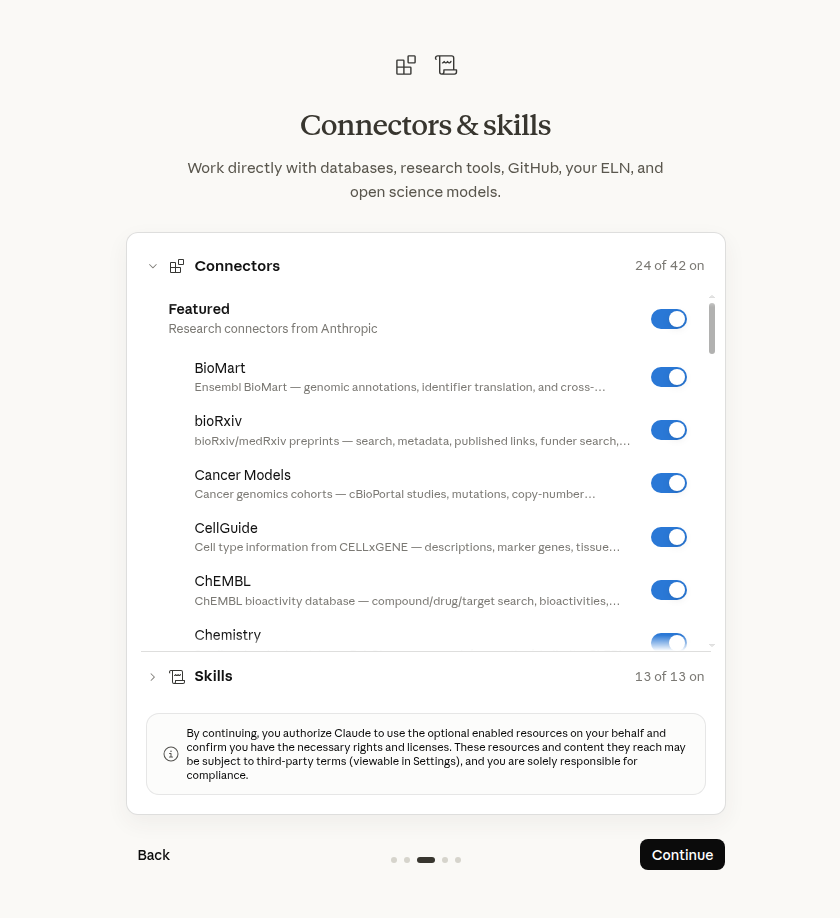

# Claude Science serveを遺伝研スパコン上で動作させる（ユーザの操作）

ユーザのPCではなく遺伝研スパコンのノード上でclaude science serveを動かす構成について説明する。

- ユーザのPCが非力な場合に有効
- slurmにジョブを投入する使い方をすることが困難になる。

推奨される使い方ではないが、この構成とすることが必要な場合もあるだろうからメモとして残しておく。

## システム構成




## インストール手順


### 1. ログインノードに直接ログインできるように多段 SSH を設定する


ユーザのPC の `~/.ssh/config` に次のように書いてください。ユーザPCから(げーとうぇいのーどにめいじてきにろぐいんすることなく)ログインノードa003 へ一度のコマンドでログインできるようになります。

```sshconfig
# ユーザのPC の ~/.ssh/config に書く（ユーザのPC 上のファイル）
Host nig-gw
  HostName gw.ddbj.nig.ac.jp                 # 遺伝研スパコン ゲートウェイ計算機（踏み台）
  User youraccount
  IdentityFile ~/.ssh/<遺伝研スパコン用の秘密鍵>
  IdentitiesOnly yes

Host nig-a003
  HostName a003                              # 遺伝研スパコン a003 計算ノード計算機（gw から見える名前）
  User youraccount
  IdentityFile ~/.ssh/<遺伝研スパコン用の秘密鍵>
  IdentitiesOnly yes
  ProxyJump nig-gw                           # gw を自動で経由する
```

次を実行して、ユーザのPCからa003 に一回の操作でログインできることを確認してください。

```bash
# ユーザのPC で実行（ログイン端末を開く）。a003 にログインする
ssh nig-a003   # a003 まで入れる
```

### 2. ログインノード上でスパコンの自分のホームディレクトリに claude-science をインストールする。

次を実行して claude-science をインストールしてください。

```bash
# a003 で実行（ログイン端末で a003 にログイン済み）
curl -fsSL https://claude.ai/install-claude-science.sh | bash
```


### 3. PATH環境変数の設定

`claude-science` は `~/.local/bin` にインストールされます。
今のシェルと今後のシェルの両方で使えるよう、`PATH`環境変数にパスを追加してください。

```bash
# a003 で実行
echo 'export PATH="$HOME/.local/bin:$PATH"' >> ~/.bashrc
source ~/.bashrc
```


## 利用手順

claude scienceは最も単純な構成ではユーザのPC上でwebブラウザとclaude science serveの両方を動かしますが、大きな計算を遺伝研スパコンなど別の計算機上で動かすことも出来ます。
その場合は２つの計算機の間をSSHポートフォワードでつなぐことになります。


### 1. 利用可能なポートの確認

以下のコマンドにより空いているポートを確認してください。

```
# a003 で実行（ログイン端末）。この範囲で使用中の番号だけが表示される。出なかった番号から選ぶ
ss -tlnp 'sport >= :43000 and sport <= :43100'
```

### 2. 自分のホームディレクトリのパスの確認

claude science serverの起動の際に、遺伝研スパコンではホームディレクトリ
`/home/youraccount`がシンボリックリンクになっていることが起動の問題になります。
そのため以下のコマンドにより本当のディレクトリのフルパスを取得してください。

```
readlink -f $HOME
```

実行例

```
youraccount@a003:~$ readlink -f $HOME
/lustre10/home/youraccount
```

### 3. claude science serveの起動

以下のコマンドによりclaude science serveを起動してください。

```
# a003 で実行（ログイン端末）。このコマンドはフォアグラウンドで動き続け、以後この端末を専有する
HOME=/lustre10/home/youraccount claude-science serve --no-browser --port 43000 
```

- `--port`には1.で確認した空いているポートを指定する。
- `HOME=`には2.で確認した自分のホームディレクトリのパスを指定する。


実行例

```
youraccount@a003:~$ HOME=/lustre10/home/youraccount claude-science serve --no-browser --port 43000
[claude-science] data dir: /lustre10/home/youraccount/.claude-science (0xbd00bd0)
[migrate] 1ms total · 0 stmts · 0 slow (≥100ms)
[daemon] growthbook: not signed in — flags stay at defaults
[daemon] sandbox origin: http://localhost:43001/mcp_apps
[daemon] warming 24 built-in MCP connectors...
[daemon] listening on 127.0.0.1:43000 (pid 2532362, version 0.1.16-dev.20260707.t155726.shaf2472db)

  ───────────────────────────────────────────────────────────────────────────────────
  Web UI →  http://localhost:43000/?nonce=19XXXXXXXXXXXXXXXXXXXXf9f375fab6ed23385
  ───────────────────────────────────────────────────────────────────────────────────

  Remote? Forward both ports: 43000 (app) and 43001 (sandbox content)

  This link is a one-time password, not a bookmark: it logs one
  browser tab in, then expires (3 min). The tab stays logged in
  until the daemon restarts.

  Seeing "session expired", or need a fresh link?  claude-science url

... 以下メッセージが続きます
```

ここに表示されたWeb UIを5.のステップで使います。


### 4. SSHポートフォワード

**ユーザのPCで新しくターミナルエミュレータを開き**以下のコマンドを実行してください。

```bash
# ユーザのPC で実行（ポート転送端末を新しく開く。ログイン端末とは別のウィンドウ）
ssh -L 43000:localhost:43000 nig-a003
```

- `43000`は3.で使ったポート番号を指定してください。


| 部分 | 意味 |
|---|---|
| 左の `43000` | ユーザのPC 側のポート番号。この番号がユーザのPCでも空いている必要がある。 |
| `localhost` | `nig-a003`が自分自身の `localhost:43000` へ転送するという意味 |
| 右の `43000` | a003 計算ノード計算機 上のポート番号（手順1の `--port 43000` と一致させる） |
| `nig-a003` | ユーザのPCの`~/.ssh/config`に書いた接続先の名前 |


:::note 
特別な理由がない限り**ユーザのPC 側とserve側のポート番号は、同じ番号に揃える。**とよい。 揃えない場合、5.のステップで `forbidden origin` エラーになり先へ進めない。

このエラーが出る理由は
Claude Science の serve プロセスは、Web UI への書き込みや WebSocket 接続に対して CSRF 対策の Origin チェックを行うからである。serve は自分が待ち受けているアドレス（`http://localhost:43000`）を、正規の Origin として許可リストに持っている。この判定は scheme（`http`）・ホスト（`localhost`）・**ポート番号まで完全一致**で行われる。
:::


実行するとログインメッセージのあと、a003 のプロンプトが出た状態で止まります。このターミナルは開いたままにしておいてください。


実行例:

```
youraccount@stonefly514:~ (2026-07-08 17:54:26)
$ ssh -L 43000:localhost:43000 nig-a003
Welcome to Ubuntu 24.04.4 LTS (GNU/Linux 6.8.0-90-generic x86_64)

 * Documentation:  https://help.ubuntu.com
 * Management:     https://landscape.canonical.com
 * Support:        https://ubuntu.com/pro

 System information as of Thu Jul  9 00:57:53 JST 2026

  System load:  4.22                Temperature:                 70.0 C
  Usage of /:   15.4% of 878.65GB   Processes:                   3063
  Memory usage: 40%                 Users logged in:             14
  Swap usage:   99%                 IPv4 address for ibp129s0f0: 172.19.13.3

 * Strictly confined Kubernetes makes edge and IoT secure. Learn how MicroK8s
   just raised the bar for easy, resilient and secure K8s cluster deployment.

   https://ubuntu.com/engage/secure-kubernetes-at-the-edge

Expanded Security Maintenance for Applications is not enabled.

3 updates can be applied immediately.
To see these additional updates run: apt list --upgradable

99 additional security updates can be applied with ESM Apps.
Learn more about enabling ESM Apps service at https://ubuntu.com/esm


*** System restart required ***
Last login: Thu Jul  9 00:57:53 2026 from 172.19.13.202
youraccount@a003:~$
```


### 5. ブラウザでweb UIを表示する 

**ユーザのPC上で**Webブラウザを起動し、3.で表示されたURLをwebブラウザで表示してください。
`http://localhost:43000/?nonce=19XXXXXXXXXXXXXXXXXXXXf9f375fab6ed23385`

以下のような画面が表示されるはずです。


:::note
うまく行かない場合はログインがタイムアウトしているかもしれません。
その場合は一旦claude science serveを停止して、手順3, 5, を繰り返してください。
:::

案内に従って順次必要項目を入力してください。





### 6. claude science serveの停止

状態の確認

```
youraccount@a003:~$ HOME=/lustre10/home/youraccount claude-science status
{
  "running": true,
  "pid": 2533288,
  "version": "0.1.16-dev.20260707.t155726.shaf2472db",
  "port": 43000,
  "started_at": "2026-07-08T07:40:26.387Z",
  "health": {
    "flavor": "release",
    "channel": "public",
    "uptime_ms": 4187589,
    "active_frames": 1,
    "active_conversations": 1,
    "require_token": true,
    "fell_back_from": null,
    "url_host": "localhost"
  }
}
youraccount@a003:~$ 
```

終了

```
youraccount@a003:~$ HOME=/lustre10/home/youraccount claude-science stop
Daemon stopped (pid 2533288).
youraccount@a003:~$ 

```


### 7. SSHポートフォワードの停止

SSHポートフォワードを実行しているターミナルエミュレータ上で`exit`コマンドを実行してください。

実行例

```
channel 3: open failed: connect failed: Connection refused
channel 3: open failed: connect failed: Connection refused

youraccount@a003:~$ exit
logout
Connection to a003 closed.
your-pc$
```


### 8. claude science serveのアンインストール

```
# プログラム本体を消す
rm ~/.local/bin/claude-science

# データと conda 環境を消す
rm -rf /lustre10/home/youraccount/.claude-science
```

## トラブルシュート

### You're note signed in to Claude Science

以下のようなエラーメッセージがブラウザに表示された場合

```
You're not signed in to Claude Science
This browser's login is no longer valid — your sign-in link or session may have expired, or the daemon may have restarted.

To get back in: relaunch Claude Science the way you normally start it — open the Claude Science app from your Applications / launcher, or if you use the command line, run claude-science url and open the link it prints.
```

これは

`http://localhost:43000/` のようなURLで起動した場合に出ます。`nounce`が付記されたURLを使ってください。
`http://localhost:43000/?nonce=19XXXXXXXXXXXXXXXXXXXXf9f375fab6ed23385`

あるいはログインがタイムアウトしているかもしれません。
その場合は一旦claude science serveを停止して、手順3, 5, を繰り返してください。


## その他のFAQ

## 複数のclaude science serveを立てる方法

Claude Science は **1つの data-dir につき1デーモンしか起動できない**。
`--data-dir`コマンドラインオプションをつけてインストールからやり直せば複数のclaude science serverを立てることができる。


```bash
# a003 で実行（2つ目。--port と --data-dir を1つ目と変える）
HOME=/lustre10/home/youraccount claude-science serve --no-browser --port 43010 --data-dir /lustre10/home/youraccount/.claude-science-2
```

```bash
# ユーザのPC で実行（2つ目のポートを転送。1つ目とは別のターミナル）
ssh -L 43010:localhost:43010 nig-a003
```

起動時に表示された `http://localhost:43010/?nonce=...` をブラウザで開く。


### 重い処理をSlurm へ投入する方法, GPU を使う方法

このインストール方法だと、Slurmに投入することが難しくなる。サンドボックスでslurmへのジョブ投入が防がれてしまうからである。むりやりSlurmを使おうおするならば、SSH先にnig-a003を書くことだが、そうするとスパコン上に秘密鍵を置かないといけなくなる。

正しい構成は、ユーザPCにclaude science serveをインストールして、SSHにnig-a003を指定することである。


