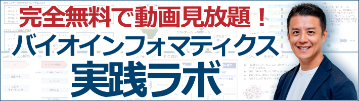
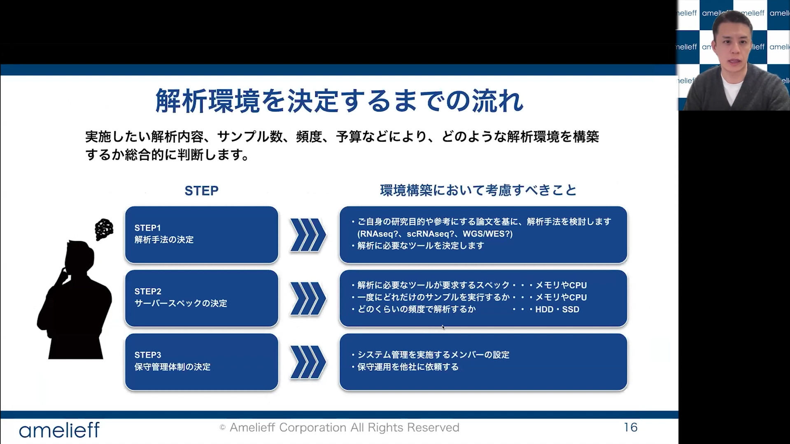

年々、研究者自らが、自身の解析課題に関わる配列データを、その中身を理解しながら自らの手で解析したいというニーズは高まっています。一方で、解析希望者それぞれの目的やデータに応じた解析手法の選定、解析環境の立ち上げ、そしてそれを安定的に実行できる形に整えることには、少なからぬハードルがあります。

こうした背景のもと、遺伝研が実施・推進している先進ゲノム支援事業をはじめ、国内のさまざまな機関でバイオインフォマティクス講習会が開催されています。

:::info 先進ゲノム支援事業

- 過去の講習会情報（ビデオ・資料）- 先進ゲノム支援事業公式ページ
    - https://www.genome-sci.jp/bioinformatic
- 【関連】NBDCデータ解析講習会（AJACS）ビデオ資料 - DBCLS 統合TV
    - https://togotv.dbcls.jp/ajacs_text.html
:::

しかし、参加対象が限られている場合があることに加え、講習時に参加者が一斉に実行するデモ環境と、実際に各自が研究で用いる解析環境とが異なることも少なくありません。また、参加者の習熟度もさまざまであり、個別の状況に応じた対応が難しいという現状もあります。

そのような状況を踏まえ、先進ゲノム支援事業の研究支援協力者（遺伝研拠点）でもある小笠原理DDBJシステム管理部門長の協力の下、遺伝研スパコンにおける解析環境やユーザー向け情報の整備を進めています。あわせて、初学者が取り組みやすく、先進ゲノム支援事業および遺伝研スパコン利用者が活用しやすい情報資源について、関連するノウハウを持つ情報リソース機関の取りまとめも順次進めています。

昨年度は、アカデミア発の便利ツールを紹介しました。今年度は新たに、アカデミアの研究を支援する企業の取り組みの一例として、アメリエフ株式会社をご紹介します。

## 遺伝研スパコンの活用に役立つアメリエフ株式会社「BI実践ラボ」のご紹介

生命科学研究におけるデータ量の爆発的な増加に伴い、大規模な解析リソースであるスーパーコンピュータ（以下、スパコン）の活用は欠かせないものとなっています。スパコンを利用してバイオインフォマティクス解析を行う皆様へ、解析スキルの習得と日々のトラブルシューティングに役立つ無料の学習サイトをご紹介します。

### ① スパコン利用者の課題解決に役立つ「バイオインフォマティクス実践ラボ（BI実践ラボ）」** 

実は、スパコン解析でエラーが出たり解析が止まる原因の多くは、解析ツール自体の不具合ではなく、Linuxコマンドの操作やデータの入出力といった「基礎知識」不足に起因することが少なくありません。しかし、こうした基礎を独学で一つひとつ積み上げていくには、どうしても膨大な時間が必要です。

そこでご活用いただきたいのが、アメリエフ株式会社（以下、アメリエフ社）が提供する無料会員制動画配信サイト「BI実践ラボ（https://amelieff.jp/online/）」です。 本サイトでは、バイオインフォマティクスのプロである同社のエンジニアや解析担当者が、初学者が「ハマりやすいポイント」を丁寧に解説しています。プロの視点で「解析のコツ」をいち早く掴めるよう構成しているため、一人で悩む試行錯誤の時間を最小限に抑え、ご自身の手でスムーズに解析を進められるよう後押しします。さらに、本サイトの動画コンテンツはすべて完全無料・見放題でご利用いただけます。

 

### ② 延べ100回以上「バイオインフォ勉強会」のエッセンスを動画で公開**

アメリエフ社は、2009年の創業以来、「バイオインフォマティクス人材の不足」という課題に向き合い、無料の勉強会を継続的に開催するなど、初学者から実務者まで幅広い人材の育成を支援してきた企業です。 同社は、解析支援事業とバイオインフォマティクスの普及活動の両面から、研究者の皆さまがインフラ構築のストレスや操作ハードルを乗り越え、ご自身の手で自由自在に解析を進められる「自立化」への歩みを、一貫して後押ししています。

研究者の皆さまが限られたリソースを有効に使い、研究を加速させることを支援する同社の姿勢は、共同利用機関として研究環境の充実を図る当研究所の方向性とも重なるものです**。**効率的な解析技術を習得するための一つの手段として、こうした公開リソースもぜひ役立てていただければ幸いです。

**③ まずはこの3本！ おすすめ動画** BI実践ラボにご登録後、スムーズな解析の第一歩としてぜひご視聴いただきたい動画を3本ピックアップしました。

* **研究室用解析環境立ち上げのエッセンス** 手元のノートパソコンからステップアップし、本格的なデータ解析用のシステムを準備したい方に最適です。オンプレミス、スパコン、クラウドのメリット・デメリットの比較から、スパコン等のLinuxサーバー運用で非常によく起きる「メモリ枯渇によるシステム遅延」や「ライブラリが見つからないエラー」の原因と、`htop`や`kill`、`find`コマンドなどを用いた具体的な解決策まで、実践的なノウハウを解説しています。

[https://amelieff.jp/online/cat\_system/video\_bisg78/](https://amelieff.jp/online/cat_system/video_bisg78/)

* **NGSケーススタディ講座（RNA-seq解析）** 次世代シーケンサーを用いたRNA-seqを研究に取り入れたい方に向けた動画です。FastQCでのクオリティチェックから、STARによるマッピング、featureCounts（Rパッケージ）による発現定量といったLinux上での処理ステップに加え、Rを用いた主成分分析や二群間比較、パスウェイ・GO解析までの一連の流れを網羅しています。実際の公開データを用いて、得られた結果の生物学的な解釈方法まで丁寧に解説します。  

  [https://amelieff.jp/online/cat\_transcriptome/video\_csrna/](https://amelieff.jp/online/cat_transcriptome/video_csrna/)  
* **論文執筆のためのバイオインフォマティクス入門** SRAやGEOなどのデータベースから公開データを取得し、ご自身の研究に活用したい方に、役立てていただきたい内容です。論文のMethodに記載されたバイオインフォマティクス解析を追試・再現するコツをお伝えします。動画ではシングルセルRNA-seq解析を例に挙げ、Seuratパッケージを用いたデータの読み込み、クオリティコントロール、次元削減（UMAP）、細胞種同定までの解析ワークフローを実例を交えて紹介しています。  

  
  [https://amelieff.jp/online/cat\_general/video\_bisg95/](https://amelieff.jp/online/cat_general/video_bisg95/)

**【ご登録はこちらから】** たった30秒で登録完了！今すぐ「BI実践ラボ」にご登録いただき、日々の研究・解析にお役立てください。 👉 [https://amelieff.jp/online/](https://amelieff.jp/online/)

