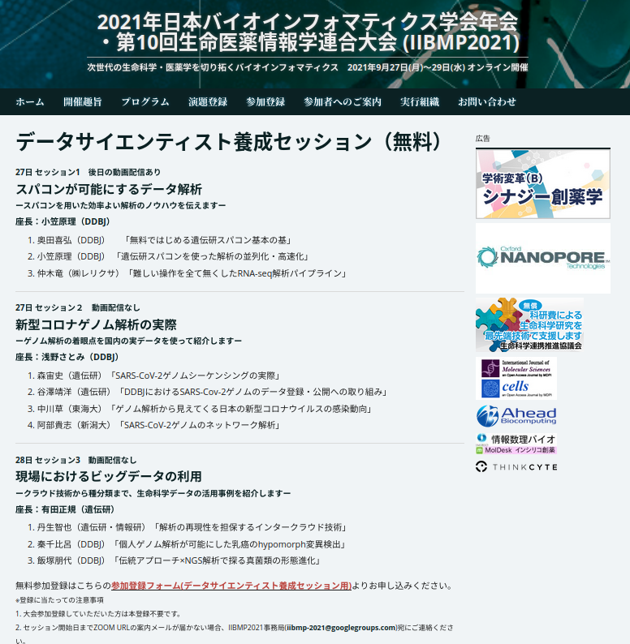
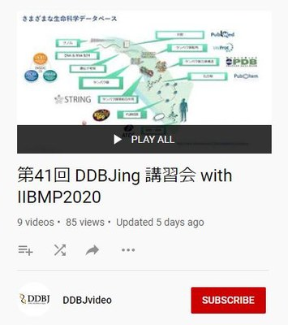

## 2021

<table>
<tr>
<td width="400">

</td>
<td>

[2021年日本バイオインフォマティックス学会年会　第10回生命医薬情報学連合大会 (IIBMP2021) 9月27日 データサイエンティスト養成セッション](https://www.jsbi.org/iibmp2021/ddbj_session/)

  <table>
  <tr>
  <td>9/27（月） 13:30〜15:00</td> 
  <td>
  <h4>スパコンが可能にするデータ解析　〜スパコンを用いた効率よい解析のノウハウを伝えます〜</h4>
  座長：小笠原理（国立遺伝学研究所）
   
  1. 奥田喜弘（DDBJ） <a href="https://www.youtube.com/playlist?list=PL_dbAF_dbOEqpnyqPlXxwZTpjmrNsPy50">「無料ではじめる遺伝研スパコン基本の基」</a>
   
  2. 小笠原理（DDBJ） <a href="https://www.youtube.com/playlist?list=PL_dbAF_dbOErzUIYuBu_4DSQCv-X3pARC">「遺伝研スパコンを使った解析の並列化・高速化」</a>
   
  3. 仲木竜（㈱レリクサ） 「難しい操作を全て無くしたRNA-seq解析パイプライン」
  </td>
  </tr>
  
  <tr>
  <td>9/27（月） 15:15〜16:45</td>
  <td>
　<h4>新型コロナゲノム解析の実際　〜ゲノム解析の着眼点を国内の実データを使って紹介します〜</h4>
  座長：浅野さとみ（国立遺伝学研究所）
   
  1. 森宙史（遺伝研） <a href="https://www.youtube.com/playlist?list=PL_dbAF_dbOEoFmjuLCs5yqTV01RcNGqNQ">「SARS-CoV-2ゲノムシーケンシングの実際」</a>
   
  2. 谷澤靖洋（遺伝研） 「DDBJにおけるSARS-Cov-2ゲノムのデータ登録・公開への取り組み」
   
  3. 中川草（東海大） <a href="https://www.youtube.com/playlist?list=PL_dbAF_dbOErw9z5bzxrM0psq_HaBeslU">「ゲノム解析から見えてくる日本の新型コロナウイルスの感染動向」</a>
   
  4. 阿部貴志（新潟大） <a href="https://www.youtube.com/playlist?list=PL_dbAF_dbOEpKA5dWTiHIkLTKefc0yqLt">「SARS-CoV-2ゲノムのネットワーク解析」</a>
  </td>
  </tr>
  
  <tr>
  <td>9/28（火） 8:45〜10:15</td>
  <td>
  <h4>現場におけるビッグデータの利用　〜クラウド技術から主分類まで、生命科学データの活用事例を紹介します〜</h4>
  座長：有田正規（国立遺伝学研究所）
   
  1. 丹生智也（遺伝研・情報研） <a href="https://www.youtube.com/playlist?list=PL_dbAF_dbOEorgG4AHl5ws_y_JFhELLPh">「解析の再現性を担保するインタークラウド技術」</a>
   
  2. 秦千比呂（DDBJ） 「個人ゲノム解析が可能にした乳癌のhypomorph変異検出」
   
  3. 飯塚朋代（DDBJ） 「伝統アプローチ×NGS解析で探る真菌類の形態進化」
  </td>
  </tr>
  </table>
</td>
</tr>
</table>

---

## 2020

<table>
<tr>
<td width="400">

</td>
<td>

[2020年日本バイオインフォマティックス学会年会　第９回生命医薬情報学連合大会 (IIBMP2020) 9月2日 スポンサードセッション](https://www.jsbi.org/iibmp2020/program/sponsor.html#sp4)

  <table>
  <tr>
  <td>9/2（水） 9:15〜10:45</td> 
  <td>
  <h4><a href="https://www.jsbi.org/iibmp2020/program/sponsor.html#sp4">データサイエンティスト養成セッション：初級者向けバイオインフォマティクス</a></h4>
  座長：小笠原理（国立遺伝学研究所）
   
  ・飯塚 朋代（国立遺伝学研究所） <a href="https://www.youtube.com/playlist?list=PL_dbAF_dbOEr8FRWhAgWqbIxtFYkl1nSL">「DDBJと公共リポジトリ」</a>
   
  ・津村 学（株式会社ノーム） <a href="https://www.youtube.com/playlist?list=PL_dbAF_dbOErF7YfAsGwGl7aikh3v1PB2">「Mac/Windows/遺伝研スパコン上でのデータ解析 (1)」</a>
   
  ・奧田 喜弘（国立遺伝学研究所） <a href="https://www.youtube.com/playlist?list=PL_dbAF_dbOEorBr-so3ZFcqDMZWRCVVhB">「Mac/Windows/遺伝研スパコン上でのデータ解析 (2)」</a>
  </td>
  </tr>
  
  <tr>
  <td>9/2（水） 13:00〜14:30</td>
  <td>
  <h4><a href="https://www.jsbi.org/iibmp2020/program/sponsor.html#sp5">
  データサイエンティスト養成セッション：実践的次世代シークエンス解析</a></h4>
  座長：中村保一（国立遺伝学研究所）
   
  ・谷澤 靖洋（国立遺伝学研究所） <a href="https://www.youtube.com/playlist?list=PL_dbAF_dbOEp58VYRT8tAQhsC0AiiaF-C">「微生物ゲノム解析」</a>
   
  ・坂本 美佳（国立遺伝学研究所） <a href="https://www.youtube.com/playlist?list=PL_dbAF_dbOEq0NeuFp1N6La5K1HRQb710">「真核生物ゲノム解析」</a>
   
  ・川島 武士（国立遺伝学研究所） <a href="https://www.youtube.com/playlist?list=PL_dbAF_dbOEq-K3ROBWCDediHoNv_e0Fy">「比較ゲノム解析」</a>
  </td>
  </tr>
  
  <tr>
  <td>9/2（水） 14:45〜16:15</td>
  <td>
  <h4><a href="https://www.jsbi.org/iibmp2020/program/sponsor.html#sp6">
  データサイエンティスト養成セッション：実践的オミックス解析</a></h4>
  座長：有田正規（国立遺伝学研究所）
   
  ・櫻井 望（国立遺伝学研究所） <a href="https://www.youtube.com/playlist?list=PL_dbAF_dbOEoJ4VpTVuKQRG44D5uoNtq1">「メタボロミクス解析」</a>
   
  ・森 宙史（国立遺伝学研究所） <a href="https://www.youtube.com/playlist?list=PL_dbAF_dbOErWEZ8QfhYPVeeN13nLg2lE">「メタゲノム解析」</a>
   
  ・秦 千比呂（国立遺伝学研究所） <a href="https://www.youtube.com/playlist?list=PL_dbAF_dbOEqlXSV_HxkOubagpzKmPopk">「ヒトゲノム疾患解析」</a>
  </td>
  </tr>
  </table>

</td>
</tr>
</table>
