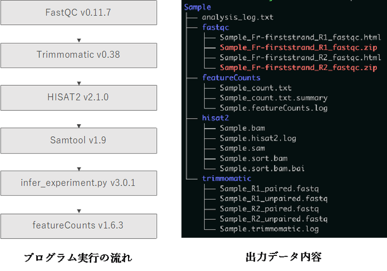

国立遺伝学研究所と包括連携協定を結ぶ株式会社Rhelixa（代表取締役：仲木 竜）より、RNA-seq※1解析パイプラインが提供され、スーパーコンピュータシステムに実装されました。

※1 RNA-seq：次世代シーケンサーを用いた遺伝子発現の網羅的解析手法です。特定のRNA配列をキャプチャーするマイクロアレイとは異なり、RNA-seqは転写産物を網羅的に検出することができます。転写産物全体の配列を調べることで未知のmRNAアイソフォームやスプライシングを含めた多くのRNA情報を得られる方法として汎用性が高く、比較可能な公共データが豊富に存在することから、特定の組織・細胞における遺伝子プロファイルの同定や、特異的に発現が変動する遺伝子の絞り込みにおいて、幅広い研究分野で利用されています。

## 解析パイプラインの概要

本パイプラインは、RNA-seqアプリケーションにより得られた単一サンプルのシーケンスリードデータを参照ゲノムにマッピングし、遺伝子領域ごとに集計し、全遺伝子の発現量を計算するものです。

本パイプラインにおいては、簡便なコマンドライン操作により、以下の処理を一括で実行できます。

- FastQC：fastqファイルに含まれるシーケンスリードのクオリティを評価します。
- Trimmomatic：クオリティ情報に基づきfastqファイルのトリミングを行います。
- RSeQC：fastqファイルよりライブラリのストランド情報を取得します。
- Hisat2：fastqファイルに含まれるシーケンスリードを参照ゲノム※2にマップします。
- Samtools：マップ後に得られるsamファイルをbamファイルに変換します。
- featureCounts：遺伝子ごとにマップされたリードのカウントを計算します。

※2 ：参照ゲノムはヒト（hg19、hg38）およびマウス（mm9、mm10）のみ対応しております。

 

## 解析パイプラインの利用方法

遺伝研スーパーコンピュータシステムの利用者であれば、どなたでも本パイプラインを無償で利用することが可能です。より発展的な解析を必要とされる際は、株式会社Rhelixaまでご相談ください。

## 使用について

[使用マニュアル](/advanced_guides/Rhelixa_RNAseq_manual)

## Rhelixa相談窓口

customer-service@rhelixa.com

## 株式会社Rhelixaについて

| 会社名     | 株式会社Rhelixa（レリクサ）                            |
|------------|--------------------------------------------------------|
|設立年月日  |	2015年2月                                             |
|本社 	     | 東京都中央区入船3-7-2 KDX銀座イーストビル 5F   |
|代表者      | 仲木 竜                                                |
|主な事業内容| 	ゲノミクス・エピジェネティクス研究のコンサルティングサービスおよびエピゲノムデータを活用した事業開発。|
