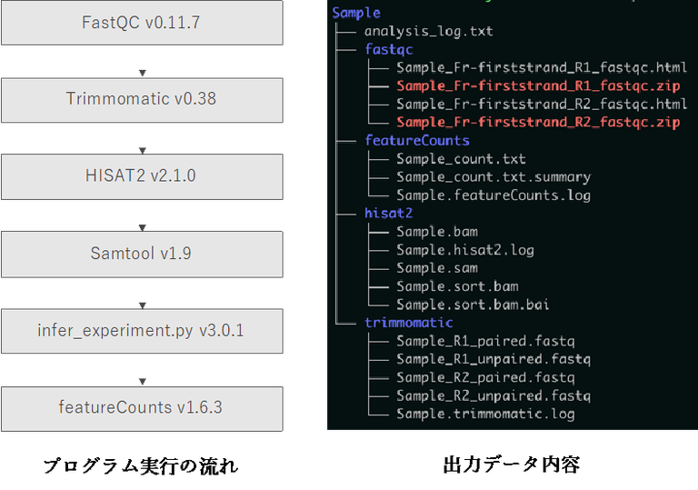

---

## ヒト全ゲノム解析の公共データの再解析データセット

2023.06.05

公的データベースにオープンアクセスで公開されているヒトの全ゲノム解析データを再解析したデータを遺伝研スパコン上で共有します。

これらのデータは文部科学省新学術領域研究「 ゲノム配列を核としたヤポネシア人の起源と成立の解明」（ヤポネシアゲノム）の中で解析するために公的データベースからダウンロードし、遺伝研スパコンの中で再解析したものです。研究班終了後（2023 年 4 月〜）も広く研究に使える様にするために遺伝研スパコンの利用者向けに共有データとして保管することになりました。

データはいずれも SRA に登録されたオープンアクセスとなっています。サンプルの背景や利用の条件はオリジナルの論文を参照し利用者の責任で利用してください。

GRCh38 にマッピングした CRAM 形式のファイルと GATK4 または Parabricks の HaplotypeCaller アルゴリズムで解析した gVCF 形式のファイルを共有しています。

同等の解析内容が得られるパイプラインは下記から入手できます。

https://github.com/NCGM-genome/WGSpipeline

また、遺伝研スパコンからは以下の方法でデータセットを入手可能です。

 - 一般解析区画の全計算ノードについて、`/usr/local/shared_data/public-human-genomes/GRCh38/`の下にデータセットがマウントされているので遺伝研スパコン中の解析プログラムから直接アクセスして利用することが可能です。
    - 個人ゲノム解析区画については、現在準備中です。
- HTTPS: https://ddbj.nig.ac.jp/public/public-human-genomes/GRCh38/ 
- FTP: ftp.ddbj.nig.ac.jp/public-human-genomes/GRCh38

<table>
<tr>
<td>データセット</td>
<td>データソース</td>
<td>参考 URL</td>
</tr>
<tr>
<td>International 1000Genomes Project (100Genomes)</td>
<td>https://www.ebi.ac.uk/ena/browser/view/PRJEB31736</td>
<td>https://doi.org/10.1016/j.cell.2022.08.004</td>
</tr>
<tr>
<td>Human Genome Diversity Project (HGDP)</td>
<td>https://www.ebi.ac.uk/ena/browser/view/PRJEB6463</td>
<td>https://doi.org/10.1126/science.aay5012</td>
</tr>
<tr>
<td>Simons Genome Diversity Project (SGDP)</td>
<td>https://www.ebi.ac.uk/ena/browser/view/PRJEB9586</td>
<td>https://www.ebi.ac.uk/ena/browser/view/PRJEB9586</td>
</tr>
<tr>
<td>Korean Personal Genomics Project (KPGP)</td>
<td>https://www.ebi.ac.uk/ena/browser/view/PRJNA284338</td>
<td>https://doi.org/10.1038/s41598-018-23837-x</td>
</tr>
</table>

## Archaea tools(旧 HCPtools)

2023.01.10

2022 年 10 月、HCPtools ソフトウェア提供元が、データ転送系のブランド名称として、「Bytix(バイティックス)」というブランド名を立ち上げ、製品名称が「HCPtools」から「Archaea tools」へ変更になりました。

変更についての詳細は、[&#x1f517;<u>Bytix 公式ページ「製品名称変更等について」のページをご参照ください</u>](https://support.bytix.tech/important/)。

製品名称変更後も、これまで通り HCPtools で使用していたコマンドと同じコマンドをそのままお使いいただけます。

また、Windows, Linux に加え macOS からも利用可能となりました。([&#x1f517;<u>Bytix 公式ページ「対応プラットフォーム」をご参照ください</u>](https://support.bytix.tech/docs/archaea/tools/1.4/A_overview/A09_platforms))。

Archaea tools(旧 HCPtools) の使い方は、[&#x1f517;<u>Bytix 公式ページ「ドキュメント」のページをご参照ください</u>](https://support.bytix.tech/document/)。

<table>
<tr>
<td width="400">

</td>
<td valign="top">
遺伝研スパコンに対してファイルのアップロード、ダウンロードを行うには、一般的に広く用いられているファイル転送ソフトウェアである`scp`や`sftp`をつかうことができますが、`scp`などでは遠距離間で大量のファイルを転送する際に転送速度が遅くなる性質があります。

遠距離の高速通信のために、遺伝研スパコンでは、一般解析区画では Aspera、個人ゲノム解析区画では Archaea tools(旧 HCPtools)というファイル転送ソフトウェアが利用可能となっています。

</td>
</tr>
</table>

---

## NBDC-DDBJ Imputation Server (beta)

2022.10.18

**インピュテーションサーバ（Imputation Server）** は、SNP アレイデータのインピュテーション解析を支援するサービスです。**[&#x1f517;<u>ミシガン大学のインピュテーションサーバ</u>](https://imputationserver.sph.umich.edu/)** や **[&#x1f517;<u>TOPMed プロジェクトのインピュテーションサーバ</u>](https://imputation.biodatacatalyst.nhlbi.nih.gov/)** が公開されています。これらのサーバは日本国外に設置されており、利用のためにゲノムデータ（SNP アレイデータ）を国外のサーバにアップロードする必要がありました。

そこで、**[&#x1f517;<u>国立研究開発法人科学技術振興機構 NBDC 事業推進部</u>](https://biosciencedbc.jp)** では日本の研究者が利用しやすい日本版インピュテーションサーバとして、**NBDC-DDBJ インピュテーションサーバ**のシステムを開発しました。現在このシステムは、**[国立遺伝学研究所スーパーコンピュータシステム](https://sc.ddbj.nig.ac.jp)** の **[個人ゲノム解析区画](https://sc.ddbj.nig.ac.jp/personal_genome_division/pg_introduction/)** で利用可能です。

本サーバで使用しているインピュテーションのワークフローは、以下の AMED 事業において国立国際医療研究センターが検討した情報（インピュテーションソフトウェアの選定・パラメータの設定）の提供を受け、その情報を参考に NBDC 事業推進部がウェブサービスとして改変・実装したものです。 事業名：ゲノム医療実現推進プラットフォーム事業（国際的データシェアリングに関する課題解決のための調査研究及び開発研究） 課題名：「クラウド計算環境を利用したゲノム医科学研究の倫理・技術課題の調査と実践」

<table>
<tr>
<td width="400">

</td>
<td valign="top">

NBDC-DDBJ インピュテーションサーバ（ベータ版）（以下、本システム）は、遺伝研スパコンの個人ゲノム解析区画で利用可能です。研究者（利用者）はご自身のゲノムデータをサーバにアップロードし、Web ユーザインターフェースを介してインピュテーション解析ワークフローを実行することができます。

- [NBDC-DDBJ Imputation Server の概要](/advanced_guides/imputation_server)
- [インストールマニュアル](/advanced_guides/imputation_server_install)
- [チュートリアル 1、公開レファレンスパネルを使う場合](/advanced_guides/imputation_server_tutorial)
- [チュートリアル 2、制限公開レファレンスパネルを使う場合](/advanced_guides/imputation_server_tutorial2)
- [チュートリアル 3、hail を用いた PRS 計算](/advanced_guides/imputation_server_hail)

</td>
</tr>
</table>

---
## PortablePipeline

2022.05.10

東京大学大学院農学生命科学研究科水圏生物科学専攻水圏生物工学研究室の吉武和敏先生により、NGS 解析パイプラインについて、PortablePipeline というツールが開発されました。

ツールの実行手順等は、&#x1f517;<u><a href="https://www.suikou.fs.a.u-tokyo.ac.jp/blog/2022/04/28/%e9%81%ba%e4%bc%9d%e7%a0%94%e3%81%ae%e3%82%b9%e3%83%91%e3%82%b3%e3%83%b3%e3%81%a7%e6%89%8b%e8%bb%bd%e3%81%abngs%e8%a7%a3%e6%9e%90%e3%82%92%e5%ae%9f%e8%a1%8c%e3%81%99%e3%82%8b%e6%89%8b%e9%a0%86/">水圏生物工学研究室のページ</a></u>をご参照ください。

<table>
<tr>
<td width="400">

</td>
<td valign="top">
「Windows や Mac から遺伝研のスパコンにお手軽に NGS 解析ジョブを投げるツールとして PortablePipeline を開発しました。当研究室で使用頻度の高い解析パイプラインが実行できます。解析サーバとしては python3 と docker もしくは singularity がインストールされていればスパコンでなくても実行できます。」（水圏生物工学研究室のページより）
</td>
</tr>
</table>

---

## DFAST

2021.10.02

DFAST は、国立遺伝学研究所 情報研究系中村研究室・大量遺伝情報研究室の谷澤靖洋先生により作られた原核生物ゲノムの自動アノテーションツールです。DDBJ へのゲノム塩基配列登録用のファイルを生成することもできます。ファイルをアップロードするだけで利用可能なウェブ版 https://dfast.ddbj.nig.ac.jp とコマンド操作で実行するスタンドアローン版があります。

<table>
<tr>
<td width="400">

</td>
<td valign="top">
スタンドアローン版をスパコンで実行する場合、&#x1f517;<u><a href="https://github.com/nigyta/dfast_core/">https://github.com/nigyta/dfast_core/ </a></u>からソースコードを取得してインストールする方法 (Python 3.6 以降 + Biopython が必要) とスパコンで提供されている singularity コンテナを利用する方法 (参考: &#x1f517;<u><a href="https://qiita.com/nigyta/items/e1de21f6ece65d69ec1d">https://qiita.com/nigyta/items/e1de21f6ece65d69ec1d</a></u>) があります。
</td>
</tr>
</table>

---

## Rhelixa RNAseq パイプライン

2020.09.08

国立遺伝学研究所と包括連携協定を結ぶ[&#x1f517;<u>株式会社 Rhelixa</u>](https://www.rhelixa.com/)（代表取締役：仲木 竜）より、RNA-seq 解析パイプラインが提供され、スーパーコンピュータシステムに実装されました。

本パイプラインは、RNA-seq アプリケーションにより得られた単一サンプルのシーケンスリードデータを参照ゲノムにマッピングし、遺伝子領域ごとに集計し、全遺伝子の発現量を計算するものです。

<table>
<tr>
<td width="400">

</td>
<td valign="top">
Rhelixa RNAseq パイプラインは Singularity コンテナイメージとしての形で遺伝研スパコン上にインストールされています。
Singularity コンテナイメージの遺伝研スパコン外での利用はできません。
利用方法は下記リンクをご参照ください。 
 

- [Rhelixa RNAseq パイプラインの紹介](/advanced_guides/Rhelixa_RNAseq)
- [Rhelixa RNAseq パイプライン 利用マニュアル](/advanced_guides/Rhelixa_RNAseq_manual)

</td>
</tr>
</table>

