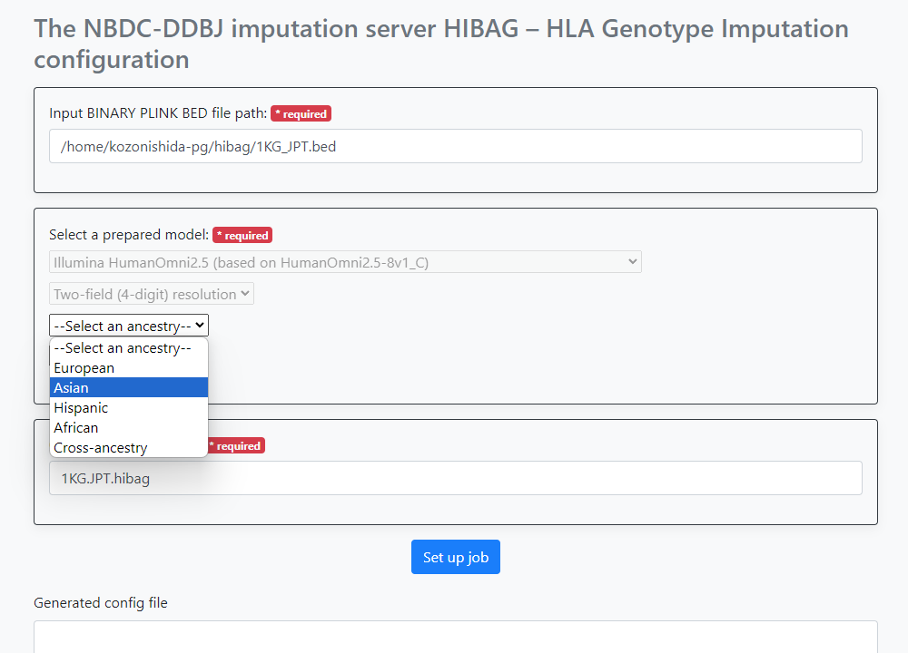
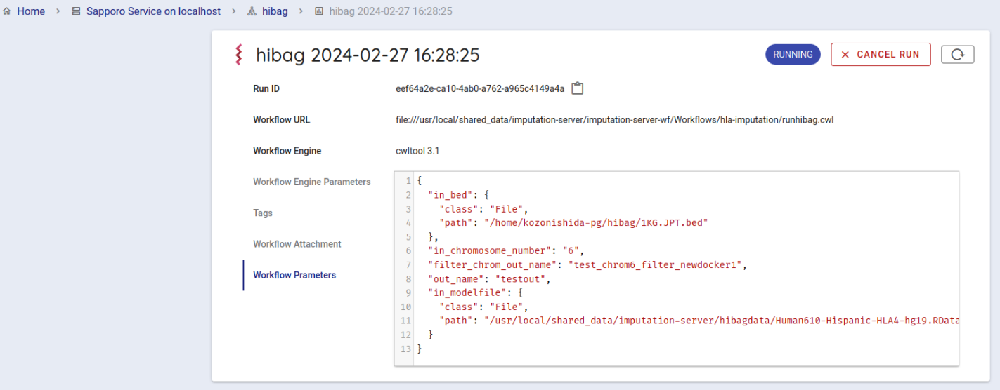
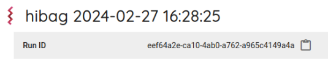

## Guacamole 環境への接続

この作業は、遺伝研個人ゲノム解析区画 Guacamole 環境から行いますので、VPN 接続を行い Guacamole に接続してください。

次に Guacamole デスクトップ環境の「アクティビティ」からターミナルを起動してください。

以下は上記で開いた Guacamole のデスクトップ中の Firefox や、そのデスクトップ内のターミナルの中で作業を行います。


## システム利用方法

本システムでは、以下の流れで [HIBAG](https://bioconductor.org/packages/release/bioc/html/HIBAG.html) を用いた HLA Genotype Imputation ワークフローを実行します。

1. テスト入力データの準備
2. HLA Genotype Imputation Workflow 用の設定ファイルの生成
3. HLA Genotype Imputation Workflow の実行

## テスト入力データの準備

チュートリアルをすすめるにあたって、使用するテスト入力データをダウンロードし、遺伝研スパコン個人ゲノム解析区画へコピーします。
本ワークフローへの入力として必要となるデータは、PLINK の bed、bim、fam ファイルです。

### PLINK bed、bim、fam ファイル の準備

[Test data for Imputation Server HIBAG Workflow](https://zenodo.org/records/10579034) にアクセスします。以下の3つのファイルがおいてあります。

- `1KG.JPT.bim`
- `1KG.JPT.fam`
- `1KG.JPT.bed`

`1KG.JPT.bim`、`1KG.JPT.fam`、`1KG.JPT.bed` のすべてをダウンロードします。


### 遺伝研スパコン個人ゲノム解析区画へコピーします。
さきほどダウンロードしたテストデータをコピーします。

次に、さきほどダウンロードしたテストデータを次のコマンドでコピーします。(PLINKのファイルはすべて同じ directory 内に配置してください。)

以下の例では、コピーしたいテストデータは、ダウンロードフォルダの中にあり、コピー先は、遺伝研スパコン個人ゲノム解析区画のお使いのアカウントのホームディレクトリになります。

```
scp -i 秘密鍵ファイル ~/Downloads/1KG.JPT.bim (お使いのアカウント名)@gwa.ddbj.nig.ac.jp:~/
scp -i 秘密鍵ファイル ~/Downloads/1KG.JPT.fam (お使いのアカウント名)@gwa.ddbj.nig.ac.jp:~/
scp -i 秘密鍵ファイル ~/Downloads/1KG.JPT.bed (お使いのアカウント名)@gwa.ddbj.nig.ac.jp:~/
```

これでテスト入力データの準備は終了です。

## HLA Genotype Imputation Workflow 用の設定ファイルの生成

以下のアドレスにアクセスします。

```
http://localhost:5000/hibag
```

実際にアクセスすると、次のような画面になります。


以下の項目について設定を行います。

- PLINK の bed ファイルのパス
- 本システムが予め備えている HIBAG のモデルの選択
- 本ワークフローが出力するファイルのプレフィックス名

「PLINK の bed ファイルのパス」 には、解析対象の bed ファイルのフルパスを指定します。
ここでは先程アップロードした、ファイルを使います。
具体的なフルパスは `/home/youraccountname/1KG.JPT.bed` のようになります。

次に HIBAG のモデルのオプションを選択します。
以下の3つについて、選択が可能です。3つの選択肢を選択すると、どのモデルを用いるかが決まります。

1. Genotyping platform
1. Resolution
1. Ancestry

最後に 本ワークフローが出力するファイル(複数)のプレフィックス名 を入力します。

入力例は下記の画像ようになります。


ここでは、入力の bed ファイルのパスを入力後、

- `--Select a genotyping platform--` のドロップダウンリストで `Illumina HumanOmni2.5 (based on HumanOmini2.5-8v1_C` を選択
- `--Select a resolution--` のドロップダウンリストで `Two-field (4-digit) resolution` を選択
- `-Select an ancestry--` のドロップダウンリストで `Asian` を選択

そして `Output file name prefix` に `1KG.JPT.hibag` を入力しました。
(注意: `Output file name prefix` にパスを書くことはできません。 `/` が含まれているとエラーになります)

パラメータの指定が終わったら、Set up job ボタンを押します。 
画面下部に、生成されたパラメータが表示されます。これをsapporo-web で使います。


## Imputation Workflowの実行

以下のアドレスにアクセスします。

```
http://localhost:1121
```

以下のような画面が表示されます。


次に、デフォルトで使用可能になっている Sapporo Service on localhost を選択します。

クリックすると以下のような画面がでてきます


次にバックエンドワークフローを使用するために少し下にスクロールし、 Workflows という項目から hibag をクリックします。


Compose Run の項目から、Workflow Engine の項目で `cwltool 3.1` を選択します。


Workflow Parameters に先程、 imputationserver-web-ui で生成したパラメータを入力します。 このとき、最初から書かれている `{}` を消して、生成したパラメータを入力します。


一番下にある `EXECUTE` ボタンを押して、ワークフローを実行します。 ジョブの状態が `RUNNING` になります。



正常にワークフローの実行が開始されるとcwltoolでワークフローが実行されます。

正常に動作すると10分程度でステータスが `COMPLETE` に変わります。


結果ファイルは、ブラウザから取得が可能です。 Run log の中の、Outputs をクリックすると結果ファイル一覧が表示されます。

ダウンロードしたいファイルをクリックするとダイアログが表示され、 デフォルトでは、 `~/ダウンロード` 以下にダウンロードされます。

## 結果
Imputation Workflow 実行後、以下のものが取得できます。

ウェブブラウザから取得ができます。

以下のコマンドを、手元のパソコンにコピーすることが可能です。

ターミナルを開きます。

実行すると、現在コマンドを実行しているディレクトリにファイルがダウンロードされます。

`scp (お使いのアカウント名)@gwa.ddbj.nig.ac.jp:~/ダウンロード/(ダウンロードしたいファイル名) .`

-  `(お使いのアカウント名)` は、個人ゲノム解析環境へのログインに使用するアカウントです
- `(ダウンロードしたいファイル名)` に、ダウンロードしたいファイル名を指定します。

また、sapporo-serviceの結果ディレクトリから直接ダウンロードすることも可能です。

`Run ID`を調べます。`Run ID` の右に表示されているものが `Run ID` です。 右にあるアイコンをクリックすることで、 `Run ID` (以下runid)をコピーすることが可能です。



インストールしたディレクトリ/sapporo-service/run/`runid` の最初の２文字 /`runid`/outputs/ 以下にすべてのファイルがあります。

`runid`が`eef64a2e-ca10-4ab0-a762-a965c4149a4a`の場合、最初の２文字は `ee` になります。

scpでコピーするときは、お手元の計算機に以下のように入力します。 手元の計算機に、`outputs` というディレクトリが作成され、その中に解析結果が個人ゲノム解析区画から、お手元の計算機にコピーされてきます。

```
scp -i 秘密鍵ファイル -r (お使いのアカウント名)@gwa.ddbj.nig.ac.jp:~/sapporo-install/sapporo-service/run/ee/eef64a2e-ca10-4ab0-a762-a965c4149a4a/outputs outputs
```

作業を終える場合は、Guacamole を表示しているブラウザタブを閉じてください。
