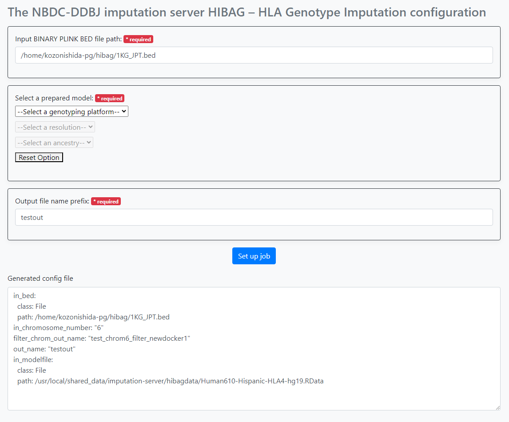
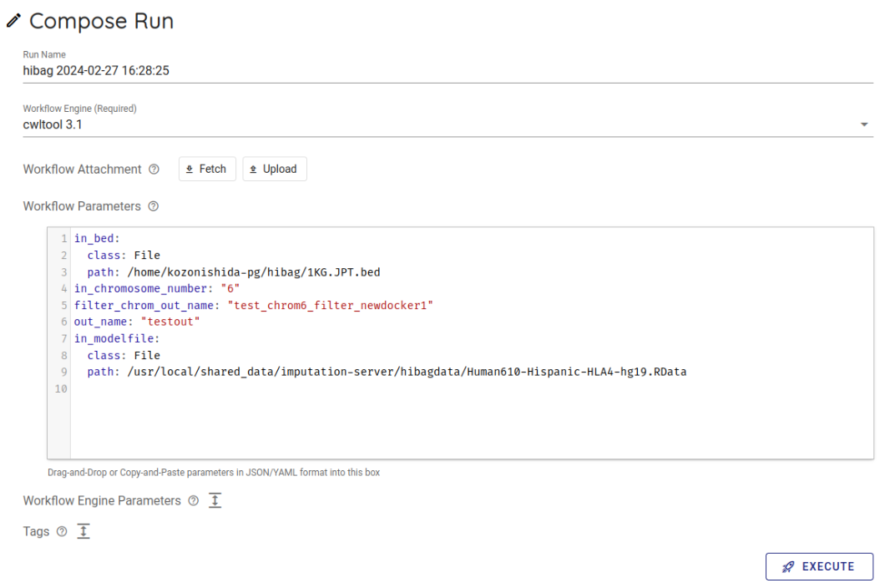

## システム利用方法

本システムでは、以下の流れで [HIBAG](https://bioconductor.org/packages/release/bioc/html/HIBAG.html) を用いた HLA Genotype Imputation ワークフローを実行します。

1. テスト入力データの準備
2. HLA Genotype Imputation Workflow 用の設定ファイルの生成
3. HLA Genotype Imputation Workflow の実行

## テスト入力データの準備

チュートリアルをすすめるにあたって、使用するテスト入力データをダウンロードし、遺伝研スパコン個人ゲノム解析区画へコピーします。
本ワークフローへの入力として必要となるデータは、PLINK の bed、bim、fam ファイルです。

### PLINK bed、bim、fam ファイル の準備

[Test data for Imputation Server HIBAG Workflow](https://zenodo.org/records/10579034) にアクセスします。以下の3つのファイルがおいてあります。

- `1KG.JPT.bim`
- `1KG.JPT.fam`
- `1KG.JPT.bed`

`1KG.JPT.bim`、`1KG.JPT.fam`、`1KG.JPT.bed` のすべてをダウンロードします。


### 遺伝研スパコン個人ゲノム解析区画へコピーします。
さきほどダウンロードしたテストデータをコピーします。

遺伝研スパコンへ接続するためのVPNを接続してください。

次に、さきほどダウンロードしたテストデータを次のコマンドでコピーします。(PLINKのファイルはすべて同じ directory 内に配置してください。)

以下の例では、コピーしたいテストデータは、ダウンロードフォルダの中にあり、コピー先は、遺伝研スパコン個人ゲノム解析区画のお使いのアカウントのホームディレクトリになります。

```
scp -i 秘密鍵ファイル ~/Downloads/1KG.JPT.bim (お使いのアカウント名)@gwa.ddbj.nig.ac.jp:~/
scp -i 秘密鍵ファイル ~/Downloads/1KG.JPT.fam (お使いのアカウント名)@gwa.ddbj.nig.ac.jp:~/
scp -i 秘密鍵ファイル ~/Downloads/1KG.JPT.bed (お使いのアカウント名)@gwa.ddbj.nig.ac.jp:~/
```

これでテスト入力データの準備は終了です。

## HLA Genotype Imputation Workflow 用の設定ファイルの生成

遺伝研スパコンの guacamole 経由で以下のアドレスにアクセスします。

```
http://localhost:5000/hibag
```

実際にアクセスすると、次のような画面になります。


以下の項目について設定を行います。

- PLINK の bed ファイルのパス
- 本システムが予め備えている HIBAG のモデルの選択
- 本ワークフローが出力するファイルのプレフィックス名

「PLINK の bed ファイルのパス」 には、解析対象の bed ファイルのフルパスを指定します。
ここでは先程アップロードした、ファイルを使います。
具体的なフルパスは `/home/youraccountname/1KG.JPT.bed` のようになります。

次に HIBAG のモデルのオプションを選択します。
以下の3つについて、選択が可能です。3つの選択肢を選択すると、どのモデルを用いるかが決まります。

1. Genotyping platform
1. Resolution
1. Ancestry

最後に 本ワークフローが出力するファイル(複数)のプレフィックス名 を入力します。

パラメータの指定が終わったら、Set up job ボタンを押します。 
画面下部に、生成されたパラメータが表示されます。これをsapporo-web で使います。



## Imputation Workflowの実行

guacamole 経由で、以下のアドレスにアクセスします。

```
http://localhost:1121
```

以下のような画面が表示されます。


次に、デフォルトで使用可能になっている Sapporo Service on localhost を選択します。

クリックすると以下のような画面がでてきます


次にバックエンドワークフローを使用するために少し下にスクロールし、 Workflows という項目から hibag をクリックします。


Compose Run の項目から、Workflow Engine の項目で `cwltool 3.1` を選択します。


Workflow Parameters に先程、 imputationserver-web-ui で生成したパラメータを入力します。 このとき、最初から書かれている `{}` を消して、生成したパラメータを入力します。



一番下にあるExecute ボタンを押して、ワークフローを実行します。 ジョブの状態がRunning になります。

FILL_THE_SCREENSHOT

正常にワークフローの実行が開始されるとcwltoolでワークフローが実行されます。

正常に終了すると `COMPLETE` になります。

結果ファイルは、ブラウザから取得が可能です。 Run log の中の、Outputs をクリックすると結果ファイル一覧が表示されま す。

ダウンロードしたいファイルをクリックするとダイアログが表示され、 デフォルトでは、 `~/ダウンロード` 以下にダウンロードされます。

## 結果
Imputation Workflow 実行後、以下のものが取得できます。

ウェブブラウザから取得ができます。

以下のコマンドを、手元のパソコンにコピーすることが可能です。

ターミナルを開きます。

実行すると、現在コマンドを実行しているディレクトリにファイルがダウンロードされます。

`scp (お使いのアカウント名)@gwa.ddbj.nig.ac.jp:~/ダウンロード/(ダウンロードしたいファイル名) .`

-  `(お使いのアカウント名)` は、個人ゲノム解析環境へのログインに使用するアカウントです
- `(ダウンロードしたいファイル名)` に、ダウンロードしたいファイル名を指定します。

また、sapporo-serviceの結果ディレクトリから直接ダウンロードすることも可能です。

`Run ID`を調べます。`Run ID` の右に表示されているものが `Run ID` です。 右にあるアイコンをクリックすることで、 `Run ID` (以下runid)をコピーすることが可能です。

FILL THE SCREENSHOT

インストールしたディレクトリ/sapporo-service/run/`runid` の最初の２文字 /`runid`/outputs/ 以下にすべてのファイルがあります。

`runid`が`1b19d002-8d4c-4f52-973c-66a165cd135f`の場合、最初の２文字は `1b` になります。

scpでコピーするときは、お手元の計算機に以下のように入力します。 手元の計算機に、`outputs` というディレクトリが作成され、その中に解析結果が個人ゲノム解析区画から、お手元の計算機にコピーされてきます。

```
scp -i 秘密鍵ファイル -r (お使いのアカウント名)@gwa.ddbj.nig.ac.jp:~/sapporo-install/sapporo-service/run/1b/1b19d002-8d4c-4f52-973c-66a165cd135f/outputs outputs
```
