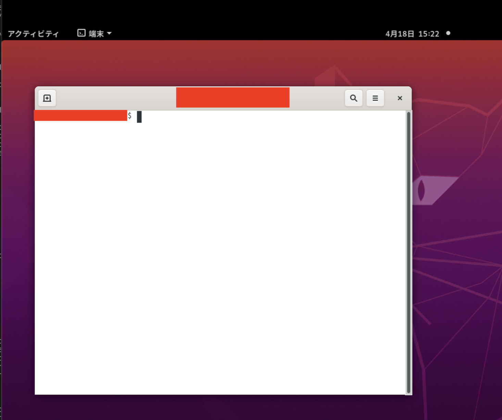

## 事前準備

### Guacamole環境への接続

NBDC-DDBJインピュテーションサーバをインストールする前に、下記2点を行なってください。

- 遺伝研スパコンの個人ゲノム解析区画へVPNを貼ってください
- Guacamoleを使って、仮想デスクトップ環境へログインしてください
「Guacamole ― 接続手順 (2024/02/27)」マニュアルP.5には「ポート番号は、Guacamole の利用申請を受理した際にお渡しした VNC のポート番号」と記載があります。インピュテーションサーバをご利用の方は、Guacamole の利用申請は必要ありません。VNC のポート番号は 5901以上をご指定ください。

これら2点については別途ご案内が届いているかと思います。

該当するご案内が届いていない場合には、imputation-server@ddbj.nig.ac.jp までお問合せください

### ターミナルを開く

正しくGuacamole環境に接続できると以下のような画面がでてきます。


次に、左上の`アクティビティ`をクリックします。以下のような画面が表示されます。


画面中央の`検索ワードを入力`と書いてある、検索窓をクリックします。
そこに、`terminal`と入力します。以下のような画面が表示されます。


`端末`をクリックします。以下のような画面が表示されます。



## 構成・使用方法

以下は上記で開いたターミナルの中で作業を行います。

### jq のインストール

`jq` というコマンドが必要なので、ないときはインストールします。

以下のコマンドで `jq` があるかどうかの確認をします。存在するときは `jq` のパスが返ってきます。存在しないときは、存在しないというメッセージとともに、エラーが返ってきます。

```
which jq
```

`~/bin`がない場合は、新規ディレクトリ`~/bin`を作成します。

```
mkdir -p ~/bin
```

環境変数PATHに `~/bin` を追加します。
そこに`jq`コマンドをインストールする例です。

```
PATH=$PATH:~/bin
curl -L -o ~/bin/jq https://github.com/stedolan/jq/releases/download/jq-1.6/jq-linux64
chmod 755 ~/bin/jq
```

再び、 `which jq` を実行し、 `jq` が利用可能なことを確認します。

### セットアップ、サービス実行方法

本システムをセットアップし、サービスの実行を行うスクリプトがあります。

#### インストールスクリプトの実行

guacamole上のターミナルで作業を行います。

インストール用のディレクトリを作り、そこに移動します。

```
mkdir ~/imputation-server-test
cd ~/imputation-server-test
```

以下のコマンドで、必要なものをインストールし、サービスの起動を行います。
途中で入力をもとめられてたら、nを入力してください。
10分程度でインストールが完了します。

```
cp /usr/local/shared_data/imputation-server/imputation-desktop/scripts/install.sh install.sh
./install.sh
```

デフォルトでは、`$PWD/sapporo-install` 以下に必要なものがインストールされます。

インストール先を変更したい場合は、スクリプトの中の `INSTALLDIR` を変更してください。

このスクリプトでは以下のものが、指定されたディレクトリにインストールされます。

- Python 3.9.7
- Node.js v14.17.6

また、以下の３つのサービスが起動します。

- ImputationServer web ui
- Sapporo web 1.0.10
- Sapporo Service 1.0.16

これでインストール完了です。

以下は、サービスの起動と停止方法について記述してあります。

すでに3つのアプリケーションが起動している状態となりますので、「起動と停止」セクションはスキップしてチュートリアルに進んでください。

### 注記：途中で入力をもとめられてたら、nを入力してください。

スクリプト実行中以下のような画面になって入力受付待ちになることがありましたら、「n」を入力して、続行してください。（nを押した後 Enterキーを押します）

```
?? NuxtJS collects completely anonymous data about usage.                                                                                                                                                                            16:55:30
  This will help us improve Nuxt developer experience over time.
  Read more on https://git.io/nuxt-telemetry
? Are you interested in participating? (Y/n)
```

## 起動と停止

インストールスクリプトを実行すると自動的に、以下の３つのサービスが起動します

- ImputationServer web ui
- Sapporo web
- Sapporo service


### すべてのサービスの起動と停止

インストールしたディレクトリに、以下の２つのスクリプトがあります。

全てのサービス一括起動スクリプト
`startall.sh `

全てのサービス一括停止スクリプト
`stopall.sh `

これらをご使用ください。


### ImputationServer web ui のみの起動と停止

ImputationServer web ui のみの起動方法

```
cd imputation-server-ui
./start-imputation-server-ui.sh
```

ImputationServer web ui のみの停止方法

```
cd imputation-server-ui
./stop-imputation-server-ui.sh
```

### Sapporo web のみの起動と停止

Sapporo web のみの起動方法

```
cd sapporo-web
./start-sapporo-web.sh
```

Sapporo web のみの停止方法

```
cd sapporo-web
./stop-sapporo-web.sh
```


### Sapporo service のみの起動と停止

Sapporo service のみの起動方法

```
cd sapporo-service
./start-sapporo-service.sh
```

Sapporo service のみの停止方法

```
cd sapporo-service
./stop-sapporo-service.sh
```
