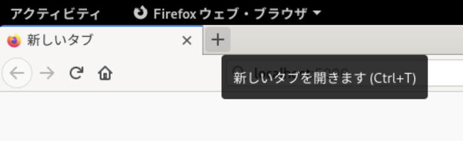
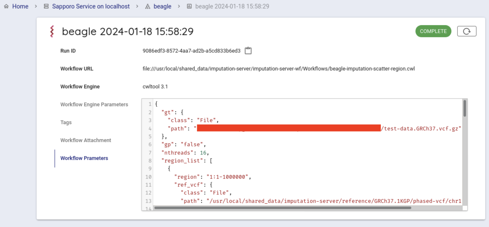

## システム利用方法

本システムでは、以下の流れでワークフローを実行します。

1. テストデータの準備
2. Imputation Workflow用の設定ファイルの生成
3. Imputation Workflowの実行

## テストデータの準備

**この作業は、手元のPCで行います**

チュートリアルをすすめるにあたって、使用するテストデータをダウンロードし、遺伝研スパコン個人ゲノム解析区画へコピーします。

### テスト用データのダウンロード

[&#x1f517;<u>Test data for Imputation Workflow</u>](https://zenodo.org/record/6650681#.YrD-HOxBykr)にアクセスします。以下の２つのファイルがおいてあります。

- `test-data.GRCh37.vcf.gz`
- `test-data.GRCh38.vcf.gz`

今回は、`test-data.GRCh37.vcf.gz`を使うので、これをダウンロードします。

`test-data.GRCh38.vcf.gz`であっても、操作の流れは同じで、必要に応じて、GRCh38を選択していただければ問題なく進めていただけます。


### 遺伝研スパコン個人ゲノム解析区画へのコピー

さきほどダウンロードしたテストデータをコピーします。

遺伝研スパコンへ接続するためのVPNを接続してください。

次に、さきほどダウンロードしたテストデータを次のコマンドでコピーします

以下の例では、コピーしたいテストデータは、ダウンロードフォルダの中にあり、コピー先は、遺伝研スパコン個人ゲノム解析区画のお使いのアカウントのホームディレクトリになります。

```
scp -i 秘密鍵ファイル ~/ダウンロード/test-data.GRCh37.vcf.gz (お使いのアカウント名)@gwa.ddbj.nig.ac.jp:~/
```

これでテストデータの準備は終了です。

## Imputation Workflow用の設定ファイルの生成

**この作業は、遺伝研個人ゲノム解析区画Guacamole環境から行いますので、VPN接続を行いGuacamoleに接続してください**

まず、遺伝研スパコンのguacamole の中で、`Firefox`を起動します。

Guacamole環境の左上`アクティビティ`をクリックし、検索窓に、`Firefox`と入力します。

以下のような画面がでてきますので、でてきたアイコンをクリックします。


Guacamole内で起動した、Firefox経由で以下のアドレスにアクセスします。

```text
http://localhost:5000
```

アドレスを入力中は、以下のような画面になります。


実際にアクセスすると、次のような画面になります。


以下の項目について設定を行います。

- Target VCF file
- Reference panel preset config or other
- Output genotype probability
- Number of threads

Target VCF file には、解析対象の VCFファイル (\*.vcf.gz ファイル) のフルパスを指定します。
ここでは先程アップロードした、ファイルを使います。
具体的なフルパスは `/home/youraccountname/test-data.GRCh37.vcf.gz`のようになります。


次にReference panel preset config orを選択します。
デフォルトで以下の４つについて、選択が可能です。

- GRCh37.1KGP
- GRCh37.1KGP-EAS
- GRCh38.1KGP
- GRCh38.1KGP-EAS

それぞれについては[&#x1f517;<u>利用可能なリファレンスパネルの種類</u>](https://sc.ddbj.nig.ac.jp/advanced_guides/imputation_server/#%E5%88%A9%E7%94%A8%E5%8F%AF%E8%83%BD%E3%81%AA%E3%83%AA%E3%83%95%E3%82%A1%E3%83%AC%E3%83%B3%E3%82%B9%E3%83%91%E3%83%8D%E3%83%AB%E3%81%AE%E7%A8%AE%E9%A1%9E)を参照ください。

上記以外のものをReference Panelとして使いたいときはother を選択し、Reference panel config fileに使いたいものを指定します。

Output genotyhpe probabilityを選択します。
以下の２種類が選択可能です。デフォルトでは falseが選択されています。

- false
- true

Number of threadsは、ワークフローを実行する際のジョブのスレッド数を指定します。

デフォルトでは、16 が指定されています。

パラメータの指定が終わったら、Set up job ボタンを押します。
画面下部に、生成されたパラメータが表示されます。これをsapporo-web で使います。


赤く塗りつぶされているところは、お使いのアカウント名になります。

**ここで作業を終える場合は、手元のPC上で開いている、遺伝研個人ゲノム解析環境のGuacamoleを表示しているタブを閉じてください**

### 補足

`/home/youraccountname/test-data.GRCh37.vcf.gz` で指定するのは、ユーザが手元に持っている(QC後の)SNPアレイデータを想定しています。
VCF の CHROM は、`chr1`, `chr2`, ..., `chrX`, `chrY` ではなく、`1`, `2`, ..., `X`, `Y` となっている必要があります。
現在の実装では、特定の染色体のみを含むデータは想定しておらず、`1`〜`22`, `X` の染色体について、参照パネルと共通しているバリアントが1つ以上必要です(X染色体は、PAR1, PAR2, nonPARのそれぞれで参照パネルと共通しているバリアントが1つ以上必要です)。

## Imputation Workflowの実行

**この作業は、遺伝研個人ゲノム解析区画Guacamole環境から行いますので、VPN接続を行いGuacamoleに接続してください**

新しいタブを開きます。

Firefox の「+」ボタンを押下して別のタブを開いてください。新たなタブの URL 欄に http://localhost:1121 と入力すると、Sapporo wes のページが表示されますので、チュートリアルを進めてください。

新しいタブを開くための「+」押す直前の画面例



以下のアドレスにアクセスします。

```text
http://localhost:1121
```

Sapporo wes のページがされます。


次に、デフォルトで使用可能になっている Sapporo Service on localhost を選択します。

クリックすると以下のような画面がでてきます。


次にバックエンドワークフローを使用するために少し下にスクロールし、
Workflows という項目から beagle をクリックします。


Compose Run の項目から、Workflow Engine の項目で `cwltool 3.1` を選択します。


Workflow Parameters に先程、 imputationserver-web-uio で生成したパラメータを入力します。
このとき、最初から書かれている `{}` を消して、生成したパラメータを入力します。

Guacamole環境内での、コピーアンドペーストは、「Ctrl+c」でコピー、「Ctrl+v」でペーストが可能です。
（Macユーザの方は、「Command+c」や「Command+v」ではなく「Ctrl+c」や「Ctrl+v」であることにご注意ください）


一番下にあるExecute ボタンを押して、ワークフローを実行します。
ジョブの状態が `Running` になります。

その後、12〜15時間程度で imputation の計算が完了します。


正常にワークフローの実行が開始されるとcwltoolでワークフローが実行されます。

正常に終了すると `COMPLETE` になります。



結果ファイルは、ブラウザから取得が可能です。
Run log の中の、Outputs をクリックすると結果ファイル一覧が表示されます。

ダウンロードしたいファイルをクリックするとダイアログが表示され、デフォルトでは、 `~/ダウンロード` 以下にダウンロードされます。

**ここで作業を終える場合は、手元のPC上で開いている、遺伝研個人ゲノム解析環境のGuacamoleを表示しているタブを閉じてください**

## 結果の取得

Imputation Workflow 実行後、以下のものが取得できます。

Guacamole内のブラウザから結果を取得することができます。

### RunIDを調べる

**この作業は、遺伝研個人ゲノム解析区画Guacamole環境から行いますので、VPN接続を行いGuacamoleに接続してください**

ターミナルを開きます。

実行すると、現在コマンドを実行しているディレクトリにファイルがダウンロードされます。


`Run ID`を調べます。
`Run ID` の右に表示されているものが `Run ID` です。
右にあるアイコンをクリックすることで、 `Run ID` (以下runid)をコピーすることが可能です。


インストールしたディレクトリ/sapporo-service/run/`runid`の最初の２文字/`runid`/outputs/ 以下にすべてのファイルがあります。

`runid`が`1b19d002-8d4c-4f52-973c-66a165cd135f`の場合、最初の２文字は `1b` になります。


### インピューテーション後のデータ

**この作業は、遺伝研個人ゲノム解析区画Guacamole環境から行いますので、VPN接続を行いGuacamoleに接続してください**


guacamoleデスクトップ環境にてターミナルを開いていただき、下記のコマンドで結果をコピーしてください。
chr\{1-22,X_PAR1,X_PAR2,X_nonPAR\}.beagle.vcf.gz がインピュテーション後のデータです。
これをチュートリアル3で利用します。

```
$ cd ~/imputation-server-test
$ cp -r sapporo-install/sapporo-service/run/runidの最初の２文字/runid/outputs .
$ ls outputs/
chr1.beagle.log
chr1.beagle.vcf.gz
chr1.beagle.vcf.gz.tbi
chr1.conform-gt.log
chr1.conform-gt.vcf.gz
...
```

**ここで作業を終える場合は、手元のPC上で開いている、遺伝研個人ゲノム解析環境のGuacamoleを表示しているタブを閉じてください**


### インピュテーション後のデータを手元のPCへ持ってくる

**この作業は、手元のPCで行います**

#### Guacamole内のブラウザでファイルをダウンロードしたところからの取得

```console
scp (お使いのアカウント名)@gwa.ddbj.nig.ac.jp:~/ダウンロード/(ダウンロードしたいファイル名) .
```

- `(お使いのアカウント名)` は、個人ゲノム解析環境へのログインに使用するアカウントです
- `(ダウンロードしたいファイル名)` に、ダウンロードしたいファイル名を指定します。

#### sapporo-serviceの結果ディレクトリからの取得

また、sapporo-serviceの結果ディレクトリから直接ダウンロードすることも可能です。

scpでコピーするときは、お手元の計算機に以下のように入力します。
手元の計算機に、`outputs` というディレクトリが作成され、その中に解析結果が個人ゲノム解析区画から、お手元の計算機にコピーされてきます。

```
scp -i 秘密鍵ファイル -r (お使いのアカウント名)@gwa.ddbj.nig.ac.jp:~/imputation-server-test/sapporo-install/sapporo-service/run/1b/1b19d002-8d4c-4f52-973c-66a165cd135f/outputs outputs
```
