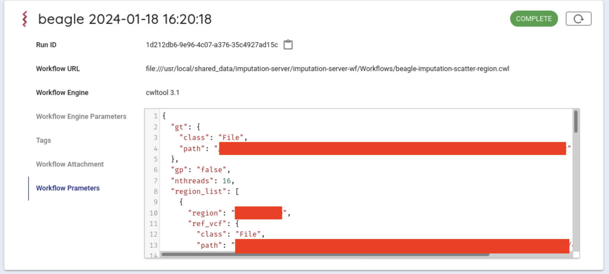

## システム利用方法

本システムでは、以下の流れでワークフローを実行します。

1. 制限公開データの準備
1. Imputation Workflow用の設定ファイルの生成
1. Imputation Workflowの実行


## 制限公開データの準備

チュートリアルをすすめるにあたって、制限公開データは、すでに遺伝研スパコン個人ゲノム解析区画にすでにあるものとします。

### 制限公開データのファイル名に関する注意点

ファイル名に　`+` が含まれているとその後の処理で問題が発生することがあるため、`_` 等に置換してください。

#### 制限公開データの展開と準備

以下の方法で、ファイルを展開し、コンフィグファイルの作成、コンフィグファイルが正しく作成されたことの確認します。

ファイルの展開。

```
tar zxvf <制限公開データのファイル名.tar.gz>
```

コンフィグファイルの作成。

```
cd <制限公開データが展開されたディレクトリ>
./generate-default-conofig-file.sh $(pwd)
```

コンフィグファイルが正しく作成されたことの確認。

```
ls -l default.config.yaml
```

このファイルは次のUIで、 `Reference panel config file` として、UIに入力します。

#### Imputation Workflow用の設定ファイルの生成

遺伝研スパコンのguacamole 経由で以下のアドレスにアクセスします。

```text
http://localhost:5000
```

実際にアクセスすると、次のような画面になります。


以下の項目について設定を行います。

- Target VCF file
- Reference panel preset config or other
- Output genotype probability
- Number of threads

Target VCF file には、解析対象の VCFファイル (\*.vcf.gz ファイル) のフルパスを指定します。
ここでは先程アップロードした、ファイルを使います。
具体的なフルパスは `/home/youraccountname/制限公開データ/データvcf.gz`のようになります。

次にReference panel preset config orを選択します。
デフォルトで以下の４つについて、選択が可能です。

- GRCh37.1KGP
- GRCh37.1KGP-EAS
- GRCh38.1KGP
- GRCh38.1KGP-EAS

それぞれについては[利用可能なリファレンスパネルの種類](https://sc.ddbj.nig.ac.jp/advanced_guides/imputation_server/#%E5%88%A9%E7%94%A8%E5%8F%AF%E8%83%BD%E3%81%AA%E3%83%AA%E3%83%95%E3%82%A1%E3%83%AC%E3%83%B3%E3%82%B9%E3%83%91%E3%83%8D%E3%83%AB%E3%81%AE%E7%A8%AE%E9%A1%9E)を参照ください。

上記以外のものをReference Panelとして使いたいときは
other を選択し、Reference panel config fileに使いたいものを指定します。

今回は、otherを選択し、Reference panel config file を指定します。

Output genotyhpe probabilityを選択します。
選択可能は以下の２種類で、デフォルトでは false が選択されています。

- false
- true

Number of threadsは、ワークフローを実行する際のジョブのスレッド数を指定します。

デフォルトでは、16 が指定されています。

パラメータの指定が終わったら、Set up job ボタンを押します。
画面下部に、生成されたパラメータが表示されます。これをsapporo-web で使います。


#### Imputation Workflowの実行

guacamole 経由で、以下のアドレスにアクセスします。

```text
http://localhost:1121
```

以下のような画面が表示されます


次に、デフォルトで使用可能になっている Sapporo Service on localhost を選択します。

クリックすると以下のような画面がでてきます


次にバックエンドワークフローを使用するために少し下にスクロールし、
Workflows という項目から beagle をクリックします。


Compose Run の項目から、Workflow Engine の項目で `cwltool 3.1` を選択します。


Workflow Parameters に先程、 imputationserver-web-ui で生成したパラメータを入力します。
このとき、デフォルトで書かれている `{}` を消して、生成したパラメータを入力します。


一番下にあるExecute ボタンを押して、ワークフローを実行します。
ジョブの状態がRunning になります。


正常にワークフローの実行が開始されるとcwltoolでワークフローが実行されます。

正常に終了すると `COMPLETE` になります。



結果ファイルは、ブラウザから取得が可能です。
Run log の中の、Outputs をクリックすると結果ファイル一覧が表示されま
す。

ダウンロードしたいファイルをクリックするとダイアログが表示され、
デフォルトでは、 `~/ダウンロード` 以下にダウンロードされます。

### 結果

Imputation Workflow 実行後、以下のものが取得できます。

ウェブブラウザから取得ができます。

以下のコマンドを、手元のパソコンにコピーすることが可能です。

ターミナルを開きます。

実行すると、現在コマンドを実行しているディレクトリにファイルがダウンロードされます。

```console
scp (お使いのアカウント名)@gwa.ddbj.nig.ac.jp:~/ダウンロード/(ダウンロードしたいファイル名) .
```

- `(お使いのアカウント名)` は、個人ゲノム解析環境へのログインに使用するアカウントです
- `(ダウンロードしたいファイル名)` に、ダウンロードしたいファイル名を指定します。

また、sapporo-serviceの結果ディレクトリから直接ダウンロードすることも可能です。

`Run ID`を調べます。
`Run ID` の右に表示されているものが `Run ID` です。
右にあるアイコンをクリックすることで、 `Run ID` (以下runid)をコピーすることが可能です。


インストールしたディレクトリ/sapporo-service/run/`runid`の最初の２文字/`runid`/outputs/ 以下にすべてのファイルがあります。

`runid`が`1b19d002-8d4c-4f52-973c-66a165cd135f`の場合、最初の２文字は `1b` になります。

scpでコピーするときは、お手元の計算機に以下のように入力します。
手元の計算機に、`outputs` というディレクトリが作成され、その中に解析結果が個人ゲノム解析区画から、お手元の計算機にコピーされてきます。

```
scp -i 秘密鍵ファイル -r (お使いのアカウント名)@gwa.ddbj.nig.ac.jp:~/sapporo-install/sapporo-service/run/1b/1b19d002-8d4c-4f52-973c-66a165cd135f/outputs outputs
```

