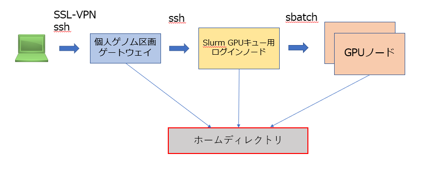
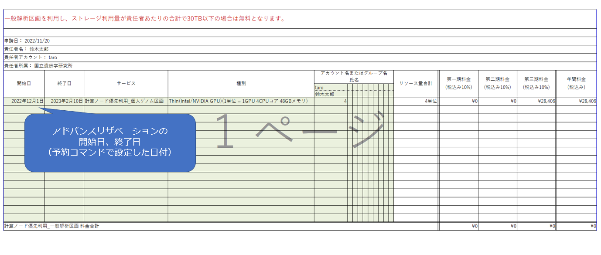

## システム概要

NVIDIA Clara Parabricks は GATK 互換のゲノム解析パイプラインです。
GPU を利用することにより GATK の公式実装に比べて大幅に処理時間を短縮できます。

参考資料

- [&#x1f517;<u>NVIDIA Clara Parabricks 公式サイト</u>](https://www.nvidia.com/ja-jp/clara/genomics/)
    - [&#x1f517;<u>Clara Parabricks Documentation</u>](https://docs.nvidia.com/clara/)

遺伝研スパコン個人ゲノム解析区画では Slurm リソーススケジューラ配下で管理した GPU ノードの上に Parabricks をインストールし提供しており、Slurm リソーススケジューラのアドバンスリザベーションを用いてジョブを投入することができます。

- Slurm GPU キュー用ログインノードは他のユーザと共用になります。ログインノードを共用にしたくない場合は通常の手順で個人ゲノム解析区画の計算ノードをノード貸しで借りて、そこに Slurm をインストールするよう問い合わせてください。
- Parabricks を使用する場合は GPU ノードの全 GPU (4 つ)をすべて使う想定となりますので同時に同じ GPU ノードに別のユーザのジョブが入ることはありません。

## 利用手順の概要

遺伝研スパコン個人ゲノム解析区画における Parabricks の利用の手順は以下のとおりです。

1. 利用の準備
    1. 個人ゲノム解析区画の利用申請をしてください。[<u>利用申請の方法はこちらをご参照ください。</u>](/personal_genome_division/pg_application)
    2. 利用計画表を提出してください。
    3. アドバンスリザベーションの設定をしてください。
2. ログインとジョブの投入:  Slurm ログインノードにログインし Worker ノード(GPU ノード)にジョブを投入します。

## Parabricks 利用時の利用計画表の書き方

[<u>利用計画表の提出</u>](/application/resource_extension)のページの記載に従って利用計画表を作成し提出してください。

個人ゲノム解析区画の GPU ノードの優先利用に関する、料金試算表の書き方は以下のとおりです。

- 「サービス」のところで「計算ノード優先利用_個人ゲノム解析区画」を選択します。
- 「種別」のところで「Thin(Intel/NVIDIA GPU)(1 単位 = 1GPU 4CPU コア 48GB メモリ)」を選択します。
- 利用量は 4 単位で指定してください。

開始日・終了日は、アドバンスリザベーションの予約コマンドで設定した日付を入力します。
混雑しているときには希望の日付で予約ができない場合がありますので、予約ができた時点で予約された開始日・終了日を記載して利用計画表を差し替えてください。

## アドバンスリザベーションの設定方法

基本的な手順は、一般解析区画における Grid Engine のアドバンスリザベーションの手順と同様です。([<u>アドバンスリザベーションサービス使用手順</u>](/general_analysis_division/advance_reservation)をご参照ください。)

- slurm によるアドバンスドリザベーションコマンドの方法は現在作成中ですので、現時点では予約枠はスパコン SE に依頼して確保してください。

## Slurm ログインノードへのログイン方法

作成中

## ジョブの投入方法

作成中

