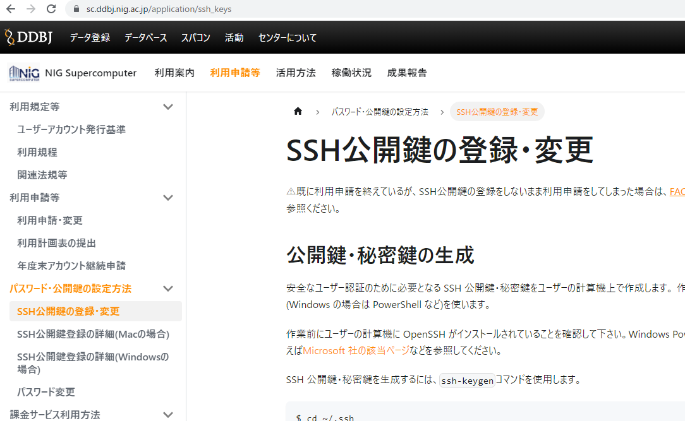
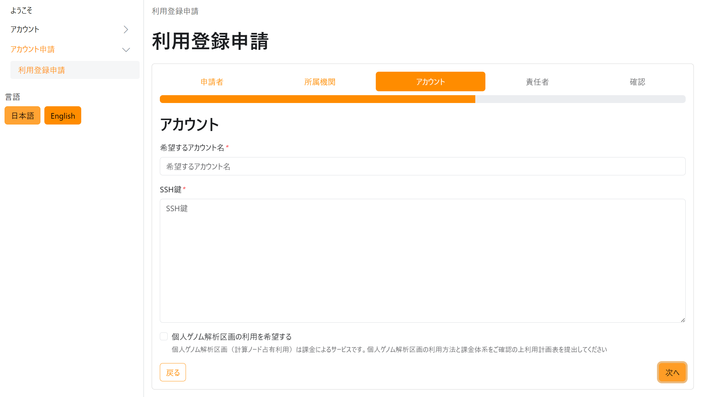

:::danger これは古いドキュメントです

現在、セキュリティ向上のためにアカウント申請システムのリプレース作業をしております。

本ドキュメントは古いアカウントシステムに関するものです。

アカウント登録自体は随時受け付けています。（[ただし大規模利用ユーザについては一時停止しております](https://sc.ddbj.nig.ac.jp/#registration-suspension)。）
新しいアカウント申請システムが稼働開始するまでは、[問い合わせ窓口](/application/reference/)までメールでお問い合わせください。

アカウント申請の手順は現在以下のとおりです。

1. 問い合わせ窓口からアカウントを申請します。
2. アカウント登録証が郵送で送られます。
3. [SSH公開鍵・秘密鍵鍵を作ります。](/application/ssh_keys/)
4. [SSH公開鍵を遺伝研スパコンに`ssh-copy-id`コマンドで転送します。](/application/ssh_keys/)
5. SSHログインができるようになります。

:::

[&#x1f517;アカウントの新規登録はアカウント申請システムにて](/blog/2024-10-25-account_system_maintenance)<!-- (https://sc-account.ddbj.nig.ac.jp/application/registration) -->随時受け付けています。

- アカウントの新規登録が受理されると高速ストレージ 1TB が利用可能となります。
- 利用可能なストレージ領域を拡張したい場合や課金サービスを利用したい場合は、アカウントの新規登録が受理されたあとで[利用計画表を提出](/application/resource_extension)してください。
  - &#x26A0;現在、個人ゲノム解析区画および一般解析区画大規模ユーザのアカウントの新規登録の受付を停止しております。詳細は[こちらのお知らせをご参照ください](/blog/2022-05-13-suspension-of-applications)。

### アカウントの新規登録手順 {#how-to-apply-for-use}

<table>
<tr>
<td width="400" valign="top">

</td>
<td width="400" valign="top">

まず、SSH 公開鍵を生成します。 

次のステップでアカウントの新規登録をする際に、SSH 公開鍵の登録も一緒に行います。このため、事前に生成しておきます。 

<!--
生成方法は、以下をご参照ください。

1. [Windows の場合](/application/ssh_keys_ssh-keygen_win)
2. [Mac の場合](/application/ssh_keys_ssh-keygen_mac)
3. [Linux の場合](/application/ssh_keys_ssh-keygen_linux)
-->
</td>
</tr>

<tr>
<td width="400" valign="top">

</td>
<td width="400" valign="top">

<!-- 次に、<a href="https://sc-account.ddbj.nig.ac.jp/application/registration">&#x1f517;アカウント登録システムの申請フォーム</a> --> 
次に、
[アカウント登録システムの申請フォーム](/blog/2024-10-25-account_system_maintenance)にアクセスします。 

アクセスすると左図のような画面が表示されますので、アカウント登録システムのフォームに入力し、「次へ」をクリックします。

- メールアドレスは誤送信対策のためフリーメールではなく所属機関のメールアドレスを記載してください。
- 利用目的は正確に記載してください。ここで記載した利用目的以外でのスパコンの利用は禁止しています。
- 間違ったメールアドレスを入力した場合、誤送信により申請情報が漏洩する可能性がありますが、責任を負いかねますので、お気を付けください。
- JGA や AGD のアカウントをすでにお持ちの場合は「JGA アカウント」や「AGD アカウント」に入力してください。
持っていない場合は何も入力しないでください。

</td>
</tr>

<tr>
<td>

</td>
<td>

次に、所属機関の住所を記入し、「次へ」をクリックします。 

本人確認のために、記入した所属機関の住所に郵送でアカウント証をお送りします。

</td>
</tr>

<tr>
<td>

</td>
<td>

次に、一番最初に生成した SSH 公開鍵を、アカウント登録システムの申請フォームにコピー&ペーストして登録します。 

<!--
コピー&ペーストして登録する方法は、以下をご参照ください。 
1. [Windows の場合](/application/ssh_keys_register_win)
2. [Mac の場合](/application/ssh_keys_register_mac)
3. [Linux の場合](/application/ssh_keys_register_linux)
-->

:::note
個人ゲノム解析区画を利用したい場合は、一番下のチェックボックスにチェックを入れてください。
:::

</td>
</tr>

<tr>
<td>

</td>
<td>

責任者の情報を入力し、「次へ」をクリックします。 

セキュリティー上のトレーサビリティーの観点からアカウントの新規登録に際して責任者を指定していただいております。
[責任者の指定方法の詳細についてはこちらのページ](/application/terms_and_policies/user_account_issurance_criteria/#the-responsible-persons-responsibilities)を参照してください。 

</td>
</tr>

<tr>
<td>

</td>
<td>
アカウントの新規登録が完了します。 

左図のように利用登録申請完了の画面が表示され、アカウントの新規登録が完了となります。
 

アカウントの新規登録が完了すると、通常一週間以内に DDBJ から申請者本人と責任者宛てにメールが届きます。
 

詳細は、以下のリンクから、「アカウントの新規登録から利用開始までの流れ」をご参照ください。
<ul>
  <li><a href="https://sc.ddbj.nig.ac.jp/guides/using_general_analysis_division/ga_application#steps-from-application-to-start">一般解析区画</a></li>
  <li><a href="https://sc.ddbj.nig.ac.jp/guides/using_personal_genome_division/pg_application#starting-to-use">個人ゲノム解析区画</a></li>
</ul>

</td>
</tr>

</table>

