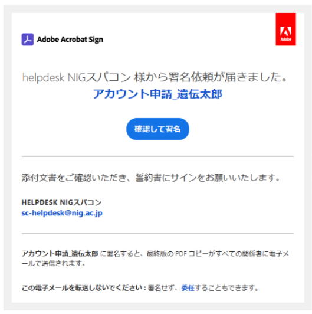
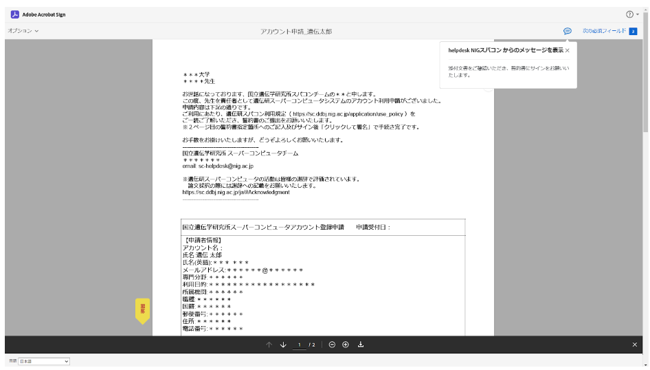
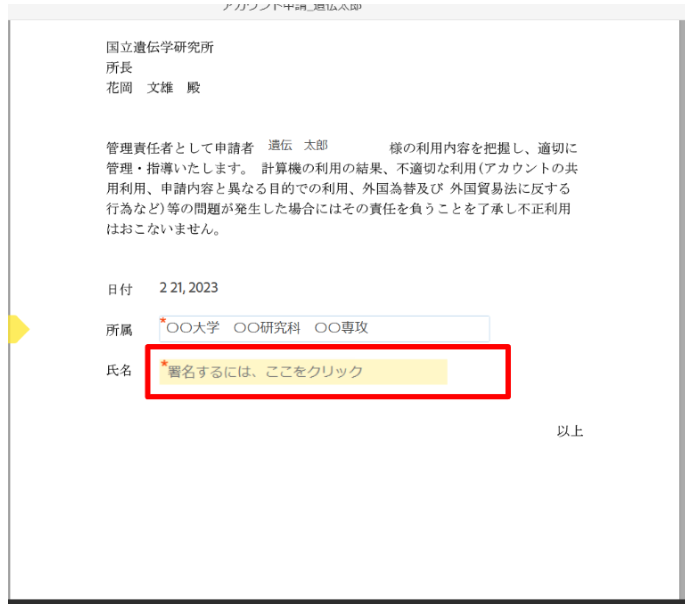
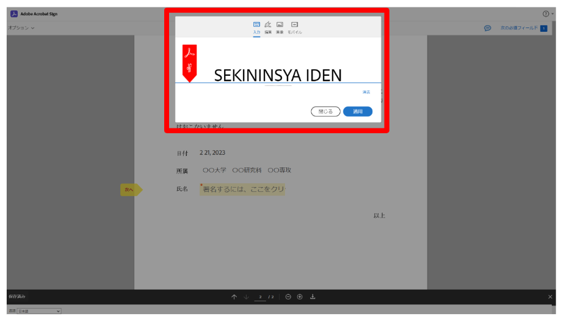
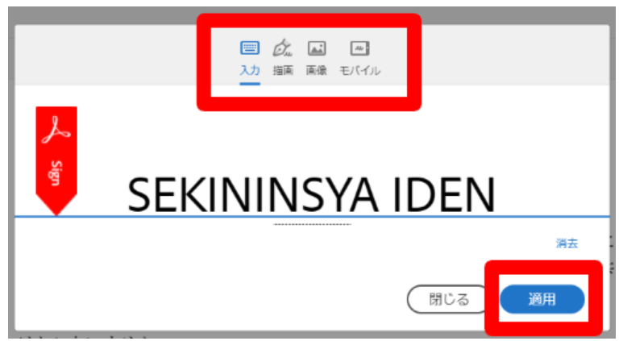
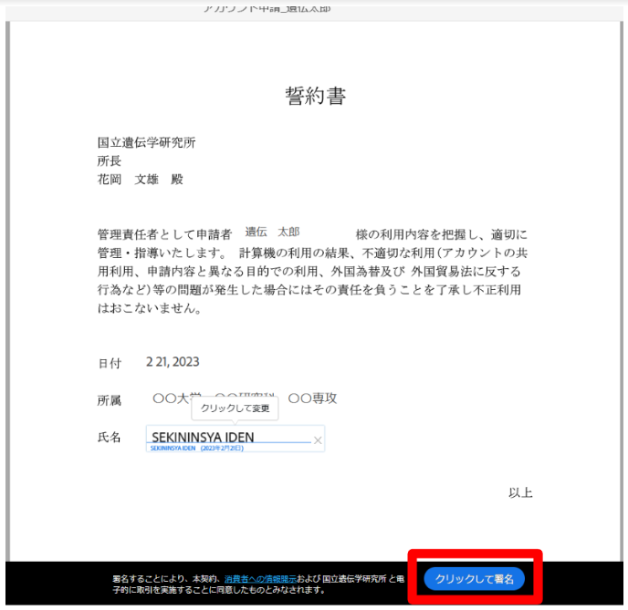
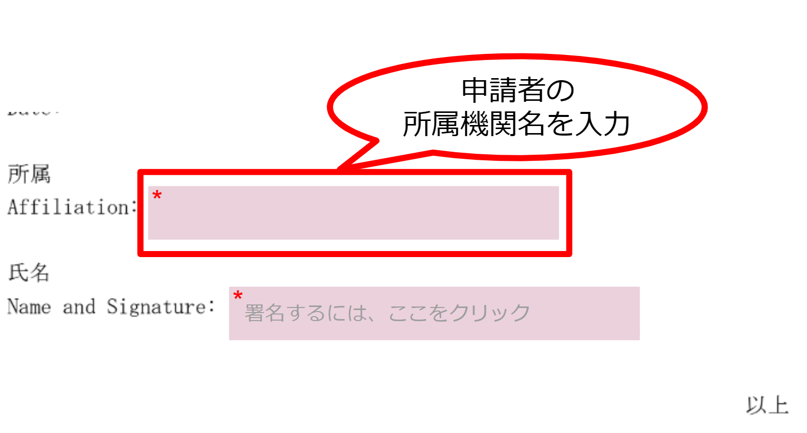
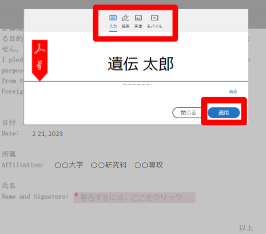
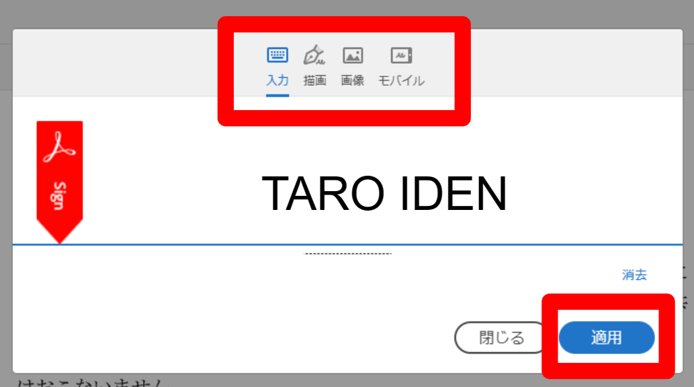

遺伝研スパコンのヘルプデスク()から、責任者と申請者へ、誓約書の署名に関するメールが届きます。

<table>
<tr>
<td width="400" valign="top">

責任者

</td>
<td width="400" valign="top">

申請者

</td>
</tr>

<tr>
<td width="400" valign="top">

[署名依頼]のメールが届きます。 

 件名の例：[署名依頼]アカウント申請_遺伝太郎

</td>
<td width="400" valign="top">

責任者が署名を完了した後に、[署名依頼]のメールが届きます。 

 件名の例：[署名依頼]アカウント申請_遺伝太郎

</td>
</tr>

<tr>
<td width="400" valign="top">

責任者がメールを開くと、下図のような画面が表示されます。

</td>
<td width="400" valign="top">

申請者がメールを開くと、下図のような画面が表示されます。 
 
</td>
</tr>

<tr>
<td width="400" valign="top">

</td>
<td width="400" valign="top">

</td>
</tr>
</table>

テキスト形式のみ受信可能なメーラーで署名できない場合は、[よくある質問(FAQ)の「誓約書に署名する方法」](/guides/FAQ/faq_application/faq_agreement_signing/)をご参照ください。

## 1．まず、責任者が署名します {#1-sign-the-responsible-person}

責任者は、「確認して署名」をクリックしてください。

クリックすると、以下のPDFが表示されます。

画面を下にスクロールして、誓約書のPDFを表示させます。

誓約書の黄色いフィールド内に必要な情報を記入してください。

・申請者名をご記入ください。

・責任者の所属機関名　例) 〇〇大学　〇〇学部　   〇〇学科 
　　　　　　　　　　　　〇〇大学　〇〇研究科　〇〇専攻

「署名するには、ここをクリック」をクリックすると、ポップアップが表示されます。

このポップアップでは、署名の入力方法を、以下の4つから選択できます。
 1. 「入力」：名前を入力する
 2. 「描写」：マウスで書く
 3. 「画像」：署名の画像をアップロードする
 4. 「モバイル」：タッチスクリーンに指またはタッチペンでサインする

いずれかの方法で署名して、「適用」をクリックしてください。すると次のような画面となります。

「クリックして署名」をクリックしてください。

クリックすると、署名が確定します。

「対応完了」の画面が表示されます。画面を閉じてください。

署名済みの誓約書PDFを、お手元に保存しておきたい場合は、「コピーをダウンロード」をクリックしてください。

責任者による誓約書PDFへの署名と返信が完了しました。

このとき、AdobeのAcrobat Signから、自動的に責任者へ、誓約書PDFの署名が完了したことを通知するメールは届きません。申請者の署名が完了したあとに、届きます。

## 2．つぎに、申請者が署名します {#2-sign-the-applicant}

責任者が署名を完了すると、AdobeのAcrobat Signから、自動的に申請者へ、誓約書への署名依頼のメールが届きます。

申請者は、「確認して署名」をクリックしてください。

クリックすると、以下のPDFが表示されます。

画面を下にスクロールして、一番最後のページにある誓約書のPDFを表示させます。

誓約書のピンク色のフィールド内に必要な情報を記入してください。

申請者の所属機関名をご記入ください。

　　例) 〇〇大学　〇〇学部　   〇〇学科 
　　　
〇〇大学　〇〇研究科　〇〇専攻

「署名するには、ここをクリック」をクリックすると、ポップアップが表示されます。

このポップアップでは、署名の入力方法を、以下の4つから選択できます。
 1. 「入力」：名前を入力する
 2. 「描写」：マウスで書く
 3. 「画像」：署名の画像をアップロードする
 4. 「モバイル」：タッチスクリーンに指またはタッチペンでサインする

いずれかの方法で署名して、「適用」をクリックしてください。すると次のような画面となります。

「クリックして署名」をクリックしてください。

クリックすると、署名が確定します。

「対応完了」の画面が表示されます。画面を閉じてください。

署名済みの誓約書PDFを、お手元に保存しておきたい場合は、「コピーをダウンロード」をクリックしてください。

申請者による誓約書PDFへの署名と返信が完了しました。

AdobeのAcrobat Signから、自動的に責任者と申請者へ、誓約書PDFの署名が完了し、返信されたことを通知するメールが届きます。

## 3．責任者と申請者の署名が完了しました {#3-completed-e-sig}

アカウント登録証の到着をお待ちください。
