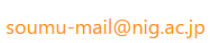

当施設のスーパーコンピューター利用に際して提供された個人情報（ユーザ名、連絡先情報等）は、以下の目的でのみ使用されます。

- 計算機システムへのアクセス管理：ユーザのアイデンティティの確認およびセキュリティの維持を目的として、ログイン認証に利用します。

- 利用統計の算出：スーパーコンピューターの効率的な運用及びリソースの適切な配分を目的として、利用データを集計し統計情報として利用します。

これらの情報は、上記目的に必要な範囲内でのみ利用され、それ以外の目的での使用はいたしません。また、個人情報の適切な管理を行い、第三者への無断提供や漏洩がないよう厳重に対応いたします。

個人情報の取り扱いについてご質問やご不明点がございましたら、下記までお問い合わせください。

```
〒411-8540　
静岡県三島市谷田 1111
情報・システム研究機構 国立遺伝学研究所
総務企画課 個人情報苦情相談窓口 総務・企画係
```

連絡先: 

