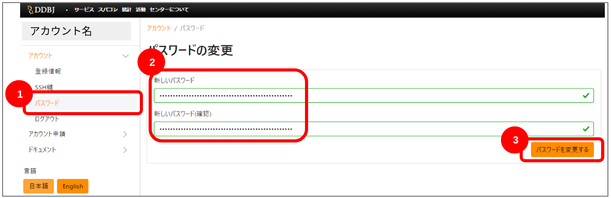

## 手順 {#procedure}

1. [こちらのページをクリックし、ログインページに移動します。](/blog/2024-10-25-account_system_maintenance) <!-- (https://sc-account.ddbj.nig.ac.jp/auth/realms/master/protocol/openid-connect/auth?client_id=sc&scope=openid&response_type=code&redirect_uri=https%3A%2F%2Fsc-account.ddbj.nig.ac.jp%2Fapi%2Fauth%2Fcallback%2Fkeycloak&state=6ygcuJParJ3i8ZlDMnKicXvW3MxkWp4t06IBKOVAbIE&code_challenge=hDLDfyOsqUc58Z-xzzz1g5ybLDycWgY7UV8e-qu1jd8&code_challenge_method=S256) -->

2. 以下のログイン画面が表示されますので、アカウント名とパスワードを入力し、「Sign In」をクリックします。

「Sign In」をクリックすると、以下の画面になります。
「パスワード」をクリックします。

3. 新しいパスワードを登録します。

「パスワード」をクリックすると、以下の画面になります。
新しいパスワードを入力し、「パスワードを変更する」をクリックします。

以上でパスワード変更が完了します。

