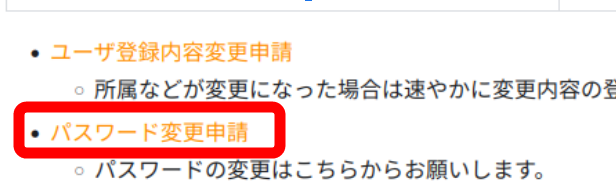
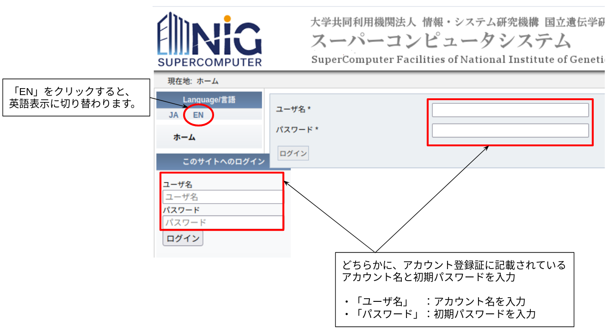
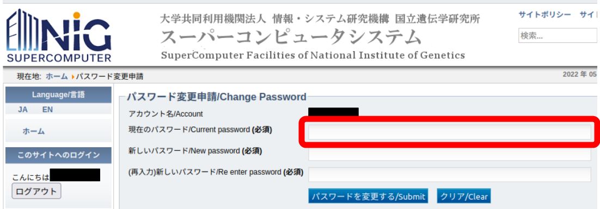
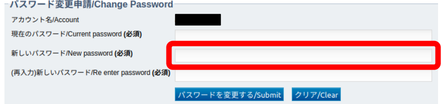
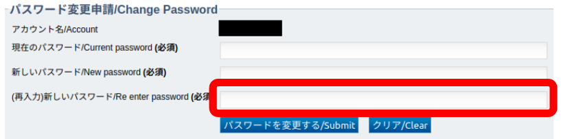
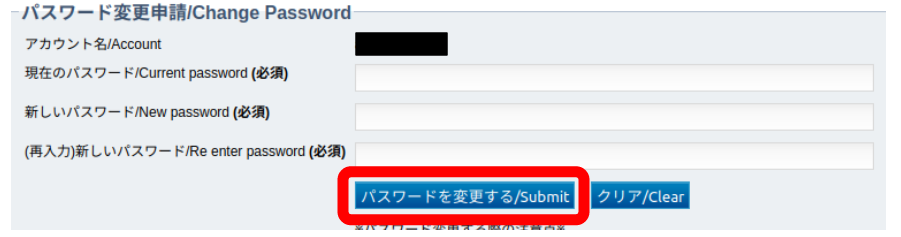

不正なアクセスを防ぎ、より安全にご利用いただくために、初期パスワードの変更と定期的なパスワードの変更を強くお勧めします。

## 手順

1. [ユーザー登録・変更 > ユーザ登録・変更申請](/application/registration)のページで「パスワード変更申請」をクリックします。

2. ユーザ名とパスワードを入力し、ログインボタンをクリックします。

3. 「現在のパスワード」の入力欄に、初期パスワードまたは現在ご使用中のパスワードを入力します。

4. 「新しいパスワード」の入力欄に、使用したいパスワードを入力します。

5. 「(再入力)新しいパスワード」の入力欄に、使用したいパスワードをもう一度、 4. で入力したパスワードと同じパスワードを入力します。

6. 「パスワードを変更する/Submit」をクリックします。

