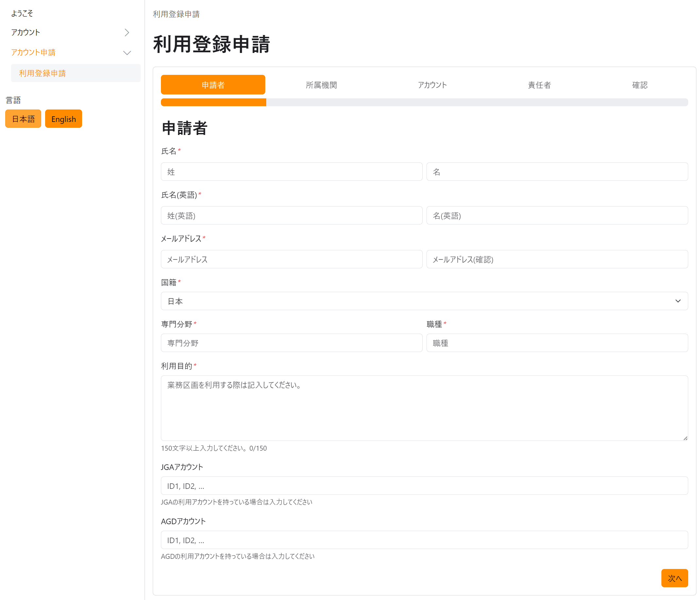
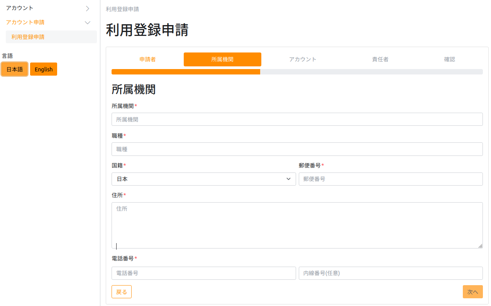
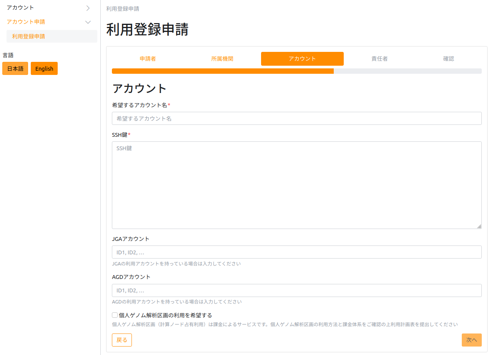
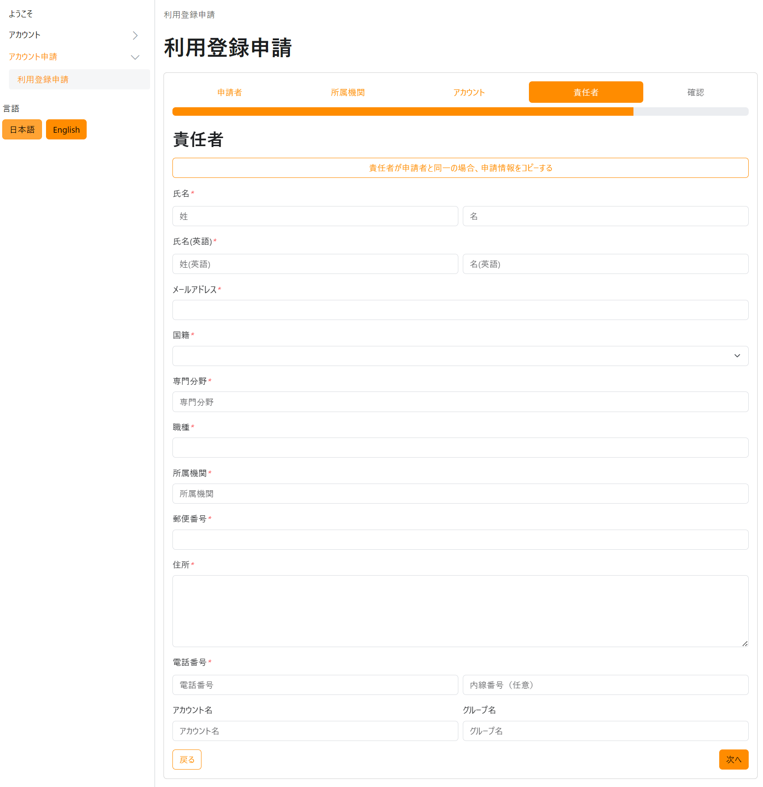
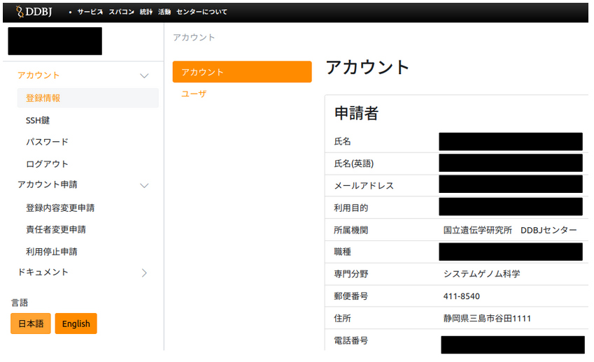

&#x26A0;現在、個人ゲノム解析区画および一般解析区画大規模ユーザの新規利用申請の受付を停止しております。詳細は<a href="https://sc.ddbj.nig.ac.jp/blog/2022-05-13-suspension-of-applications">こちらのお知らせをご参照ください</a>。

既に利用申請を終えているが、SSH公開鍵の登録をしないまま利用申請をしてしまった場合は、[<u>FAQ : Application/Billing > FAQ(新規利用申請)</u>](/faq/faq_NewUser_registration#新規利用申請の際利用登録申請フォームにssh公開鍵を入力しないまま利用申請をしてしまいました既に利用申請を終えていますがssh公開鍵の登録をしないまま利用申請をしてしまった状態ですどうしたらよいでしょうか)をご参照ください。

## 利用申請

[利用申請はこちらのページから](https://sc-account.ddbj.nig.ac.jp/application/registration)随時受け付けています。
利用申請が受理されると高速ストレージ 1TB が利用可能となります。

- 利用可能なストレージ領域を拡張したい場合や課金サービスを利用したい場合は、
  利用申請が受理されたあとで[利用計画表を提出](/application/resource_extension)してください。

<table>
<tr>
<td width="400" valign="top">

</td>
<td width="400" valign="top">

[利用登録申請のページ](https://sc-account.ddbj.nig.ac.jp/application/registration)にアクセスすると左図のような画面が表示されます。

- メールアドレスは誤送信対策のためフリーメールではなく所属機関のメールアドレスを記載してください。
- 利用目的は正確に記載してください。ここで記載した利用目的以外でのスパコンの利用は禁止しています。

</td>
</tr>

<tr>
<td>

</td>
<td>

- 本人確認のために所属機関に郵送でアカウント証をお送りします。所属機関の住所を記入してください。

</td>
</tr>

<tr>
<td>

</td>
<td>

- SSH 公開鍵を作成してフォームにコピー・ペーストで貼り付けてください。
[SSH 公開鍵の作成方法はこちらのページ](/application/ssh_keys)を参照してください。
- JGA や AGD のアカウントをすでにお持ちの場合はここに入力してください。
持っていない場合は何も入力しないでください。
- 個人ゲノム解析区画を利用したい場合は、一番下のチェックボックスにチェックを入れてください。

</td>
</tr>

<tr>
<td>

</td>
<td>

セキュリティー上のトレーサビリティーの観点から利用申請に際して責任者を指定していただいております。
[責任者の指定方法の詳細についてはこちらのページ](/application/#責任者について)を参照してください。

- 責任者のアカウント名とグループ名の両方がわかる場合は、上部のフォームに入力してください。
これにより責任者名の詳細データの入力を省略することができます。

- わからない場合は、チェックボックスをクリックして左図のようにフォームを表示し、責任者情報の詳細を入力してください。

</td>
</tr>

<tr>
<td>

</td>
<td>
利用申請完了後、通常一週間以内に DDBJ から申請者本人と責任者にメールで連絡差し上げます。
</td>
</tr>

</table>

## 申請内容の変更

所属などが変更になった場合は速やかに[こちらのページから申請内容の変更](https://sc-account.ddbj.nig.ac.jp/login)をお願いいたします。

<table>
<tr>
<td width="400" valign="top">

</td>
<td width="400" valign="top">

申請内容の変更ページにアクセスすると、最初にページへのログイン画面が表示されます。

</td>
</tr>

<tr>
<td>

</td>
<td>

申請内容の変更ページから、所属、SSH 公開鍵、パスワードなどの変更やアカウントの利用終了の申請などができます。

もし、左図の申請内容の変更ページではなく、以下の画面が表示された場合は、「Sing in with Keycloak」をクリックします。

</td>
</tr>
</table>

「Sing in with Keycloak」をクリックすると、2.の申請内容の変更ページが表示されます。

