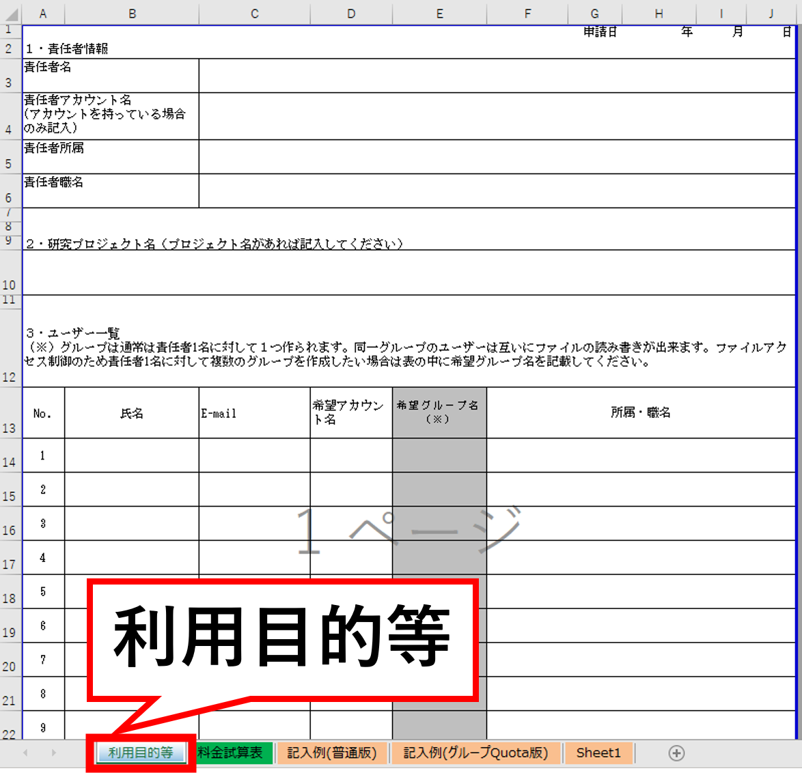
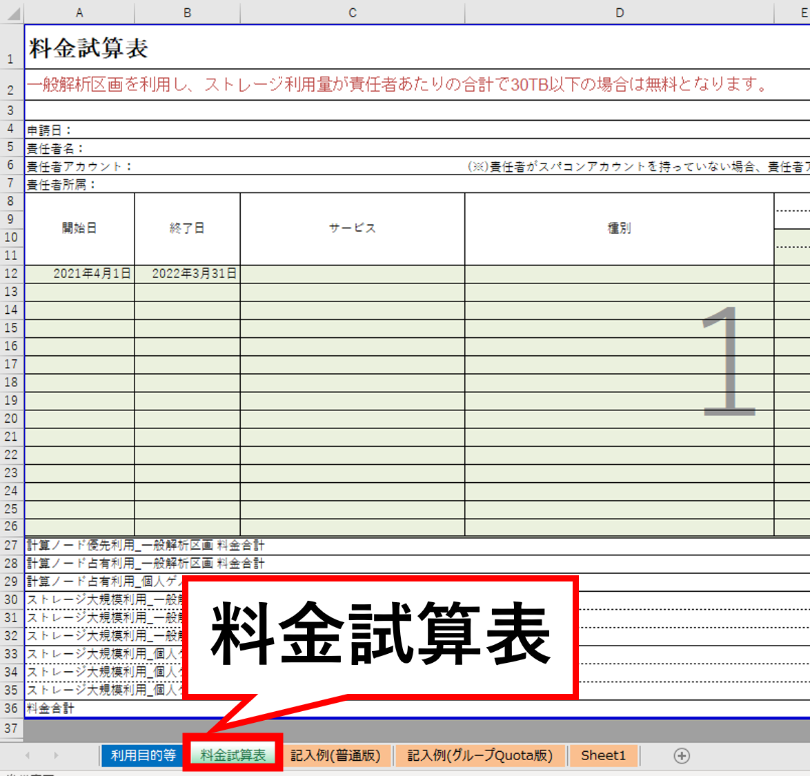
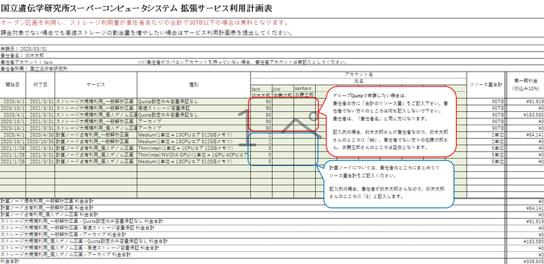

## 利用計画表

- 利用可能な高速ストレージ領域の拡張を希望する場合、および、課金サービスの利用を希望する場合は、利用計画表をダウンロードし、「利用目的等」と「料金試算表」へご記入頂いた上、[問い合わせ先](/application/reference)までご送付ください。

- 30TBを超える高速ストレージの利用、個人ゲノム解析環境など、課金サービスの詳細については「[課金サービスの利用方法](/application/billing_service)」のページをご参照ください。

- 「利用目的等」および「料金試算表」は、責任者あたりそれぞれ１つ作成して提出してください。リソースの拡張を申請するたびに別の申請書を作る必要はありません。申請内容が変更になったら、以前の申請書および計画表を変更して提出してください。作成にあたりましては研究責任者のもとでスパコンを使う全員について記載していただくようお願いいたします。

### 利用計画表をダウンロードする
- [2021年度版](/files/usage_plan-ver2.3.0-2021.xlsx)
- [2022年度版](/files/usage_plan-ver2.3.0-2022.xlsx) (クォータの設定方法はグループクォータに統一しました）

<b>！！</b> 申請の際には、<b>「利用目的等」と「料金試算表」の両方</b>に記入し、ご提出下さい。<b>！！</b> 
<table>
<tr>
<td width="400" height="400" align="center">

利用目的等
</td>
<td valign="top">
ダウンロードした利用計画表の1シート目に、「利用目的等」があります。
</td>
</tr>
<tr>
<td width="400" height="400" align="center">

料金試算表
</td>
<td valign="top">
ダウンロードしたの2シート目に、「料金試算表」があります。
</td>

</tr>
</table>

## ストレージに対するグループクォータについて

責任者単位の合計で高速ストレージ30TB以下は無料であり、 責任者単位でグループが作られます。その際クォータの設定を責任者単位で設定されまる。

### 料金試算表の書き方

## 2次グループの設定等によるグループ間のデータ共有について

グループ間でのデータ共有を可能にする設定についてもご要望を承ります。その際、束ねたグループの合計で30TBを超えると課金対象となります。料金は責任者間においてクォータ量で按分となります。（この場合には請求金額は利用計画表では計算出来ませんのでご注意願います。）

