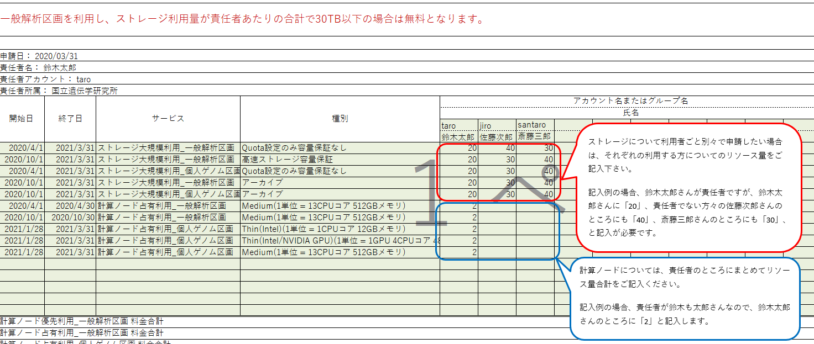

## 利用計画表

- 利用可能な高速ストレージ領域の拡張を希望する場合、および、課金サービスの利用を希望する場合は、利用計画表をダウンロードし、ご記入頂いた上、[問い合わせ先](/application/reference)までご送付ください。
- 30TBを超える高速ストレージの利用、個人ゲノム解析環境など、課金サービスの詳細については「[課金サービスの利用方法](/application/billing_service)」のページをご参照ください。

### 利用計画表をダウンロードする

<table>
<tr>
<td width="400" height="400" align="center">

</td>
<td valign="top">
以下をクリックします。

<a href="https://github.com/nig-sc/usage_plan_table/blob/main/usage_plan_table2023_v1.2.1.xlsx"><ul><li>利用計画表(2023年度版)</li></ul></a>

<a href="https://github.com/nig-sc/usage_plan_table/blob/main/usage_plan_table2024_v1.0.0.xlsx"><ul><li>利用計画表(2024年度版)</li></ul></a>

&#x26A0;現在、大規模利用ユーザおよび一般解析区画大規模ユーザのアカウントの新規登録の受付を停止しております。詳細は<a href="https://sc.ddbj.nig.ac.jp/blog/2022-05-13-suspension-of-applications">こちらのお知らせをご参照ください</a>。

</td>
</tr>
<tr>
<td width="400" height="400" align="center">

</td>
<td valign="top">
すると、左図のように画面が表示されるので、「↓」をクリックします。クリックすると、利用計画表がダウンロードされます。

</td>
</tr>
</table>

うまくダウンロードされない場合は、[<u>FAQをご参照ください</u>](/faq/faq_billing_service#利用計画表をダウンロードしようとするとwebブラウザが起動して以下の画面が表示されます)。

### 利用計画表の記入方法

- 利用計画表には、<b>「利用目的等」と「料金試算表」の2つのシートが含まれています。2つのシート両方とも記入</b>し、提出してください。
- 利用計画表は、責任者あたり１つ作成して提出してください。

<table>
<tr>
<td width="400" height="400" align="center">
利用目的等

</td>
<td valign="top">
ダウンロードした利用計画表の1シート目に、「利用目的等」があります。

1〜6について、必要事項をご記入ください。
</td>
</tr>
<tr>
<td width="400" height="400" align="center">
料金試算表

</td>
<td valign="top">
ダウンロードした利用計画表の2シート目に、「料金試算表」があります。
</td>

</tr>
</table>

リソースの拡張を申請するたびに別の申請書を作る必要はありません。申請内容が変更になったら、以前の利用計画表を変更して提出してください。作成にあたりましては研究責任者のもとでスパコンを使う全員について記載していただくようお願いいたします。

## ストレージに対するグループクォータについて

責任者単位の合計で高速ストレージ30TB以下は無料であり、 責任者単位でグループが作られます。その際クォータの設定を責任者単位で設定することを希望される場合はその旨をお知らせください。

### アカウント別の利用計画表の書き方

### グループクォータ別の利用計画表の書き方

## 2次グループの設定等によるグループ間のデータ共有について

グループ間でのデータ共有を可能にする設定についてもご要望を承ります。その際、束ねたグループの合計で30TBを超えると課金対象となります。料金は責任者間においてクォータ量で按分となります。（この場合には請求金額は利用計画表では計算出来ませんのでご注意願います。）

## ストレージ容量変更について

[FAQ(ストレージ容量変更について)](/faq/faq_change_StorageCapacity)をご参照ください。
