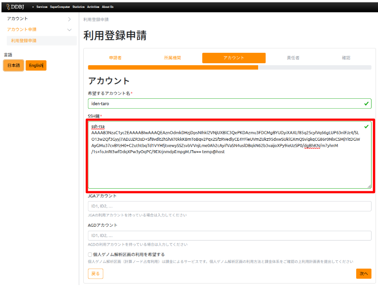

&#x26A0;既に利用申請を終えているが、SSH公開鍵の登録をしないまま利用申請をしてしまった場合は、[<u>FAQ : Application/Billing > FAQ(新規利用申請)</u>](/faq/faq_NewUser_registration#新規利用申請の際利用登録申請フォームにssh公開鍵を入力しないまま利用申請をしてしまいました既に利用申請を終えていますがssh公開鍵の登録をしないまま利用申請をしてしまった状態ですどうしたらよいでしょうか)をご参照ください。


## 公開鍵・秘密鍵の生成

安全なユーザー認証のために必要となる SSH 公開鍵・秘密鍵をユーザーの計算機上で作成します。
作成には Mac, Linux の場合ターミナルエミュレータ(Windows の場合は PowerShell など)を使います。

作業前にユーザーの計算機に OpenSSH がインストールされていることを確認して下さい。Windows PowerShell への OpenSSH のインストール方法はたとえば[Microsoft 社の該当ページ](https://docs.microsoft.com/en-us/windows-server/administration/openssh/openssh_install_firstuse)などを参照してください。


SSH 公開鍵・秘密鍵を生成するには、`ssh-keygen`コマンドを使用します。

```
$ cd ~/.ssh
$ ssh-keygen -t rsa -b 3072                                                      (1)
Generating public/private rsa key pair.
Enter file in which to save the key (/home/temp/.ssh/id_rsa):                    (2)
Enter passphrase (empty for no passphrase):                                      (3)
Enter same passphrase again:                                                     (4)
Your identification has been saved in /home/temp/.ssh/id_rsa.
Your public key has been saved in /home/temp/.ssh/id_rsa.pub.
The key fingerprint is:
e5:23:f0:fc:b7:60:70:80:79:91:f2:f1:6d:a8:ae:90 temp@host
```

- (1) RSA バージョン 2 で、3072 ビットの鍵を生成する。
- (2) 公開鍵・秘密鍵の保存先：変更する場合のみここでパスを指定する。変更しない場合は Enter を押す。
- (3) パスフレーズを入力する。
- (4) パスフレーズを再入力する。


SSH では秘密鍵ファイルを所有していることが本人であることの根拠として扱われます。
秘密鍵ファイルを盗まれてしまうとなりすましが可能となります。
パスフレーズの設定は省略することが可能ですが秘密鍵の盗難時の被害を軽減するため設定することを強く推奨します。


## 遺伝研スパコンゲートウェイへの公開鍵の設置


```
$ ls ~/.ssh
id_rsa  id_rsa.pub
$ cat ~/.ssh/id_rsa.pub
ssh-rsa AAAAB3NzaC1yc2EAAAABIwAAAQEAznOdmkDHzjDpsNIhkl2VNjUXBlC3QePKDAzmu3FDCMgBYUDyiXAXLf85q25cylVq66gLUP63nlFJz4/SLO13w2Qf3Gyyj7ADJJZR3sD+Sf8vdlt2hShAT0kkKBmToBqv2Pqx2SfzRVedlyCE4YFieUVmZUkz95dxwSUklGXmQSvigkqCG86r0NlxCSMjYitDGWAyGMu37cvBYzH0+C2uthtbqTd1VYHfjtvewySSZsvbVVnjLme0Ah2cAyifVaSN4uslDBqkN62b3vaijoXPy9ieUzSP0/dgBhKN/m7yhnM/1s+foJnRI3wfDdqXPw3yOqPC/9EXrjnmdpEmpgMJTw== temp@host
$ 
```


鍵ペアの保存先を確認すると、`id_rsa`, `id_rsa.pub`の２つのファイルが作成されています。
`id_rsa.pub`が公開鍵になりますので、ファイルの内容を、先頭文字列"ssh-rsa"から全部コピーし下記の赤枠部分「SSH鍵」にペーストすることで、公開鍵の登録が出来ます。



 

## 遺伝研スパコンゲートウェイへの接続確認

ssh コマンドにてスーパーコンピュータシステムに接続します。

```
$ ssh youraccount@gw2.ddbj.nig.ac.jp
Enter passphrase for key '/home/youraccount/.ssh/id_rsa':
Last login: Fri Sep 19 13:28:19 2014 from gw2.ddbj.nig.ac.jp
---------------------------------------------------------------------
Thank you for using supercomputer system.
This node is in use for login service only. Please use 'qlogin'.
---------------------------------------------------------------------
[youraccount@gw2 ~]$
```

パスフレーズの入力プロンプトが表示されたら鍵生成に指定したパスフレーズを入力します。

認証後、スーパーコンピュータシステムへのログインが完了します。

秘密鍵の格納場所が`~/.ssh/id_rsa`以外の場合は以下のように秘密鍵のパスを指定します。

```
ssh -i ~/yourpath/id_rsa youraccount@gw2.ddbj.nig.ac.jp
```

公開鍵などの設定直後は`gw2.ddbj.nig.ac.jp`からログインしてください。

2022年7月7日現在、新しい利用申請システムへの移行作業を行っております。([「2022 年 7 月 5 日(火) 新規利用申請システムが新しくなりました」](/blog/2022-07-05-news_NewApp)) そのため、新しいゲートウェイ`gw2.ddbj.nig.ac.jp`への公開鍵登録については即時設定が反映されますが、古い方のゲートウェイ`gw.ddbj.nig.ac.jp`へ設定が反映されるまでに１日程度かかります。 次回の定期メンテナンス（12月）の際に、古いゲートウェイにも即時設定が反映されるようシステムを改修する予定です。


うまく接続できない場合は[よくある質問(FAQ)](/faq/faq_login)もご参照ください。

