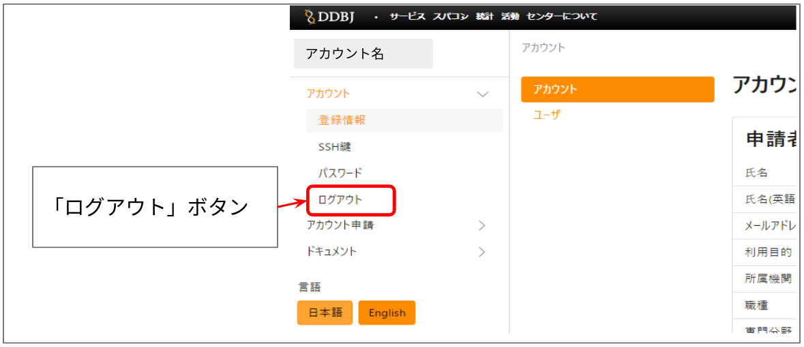
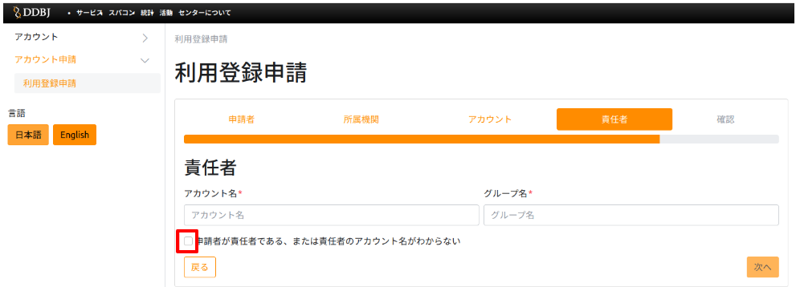
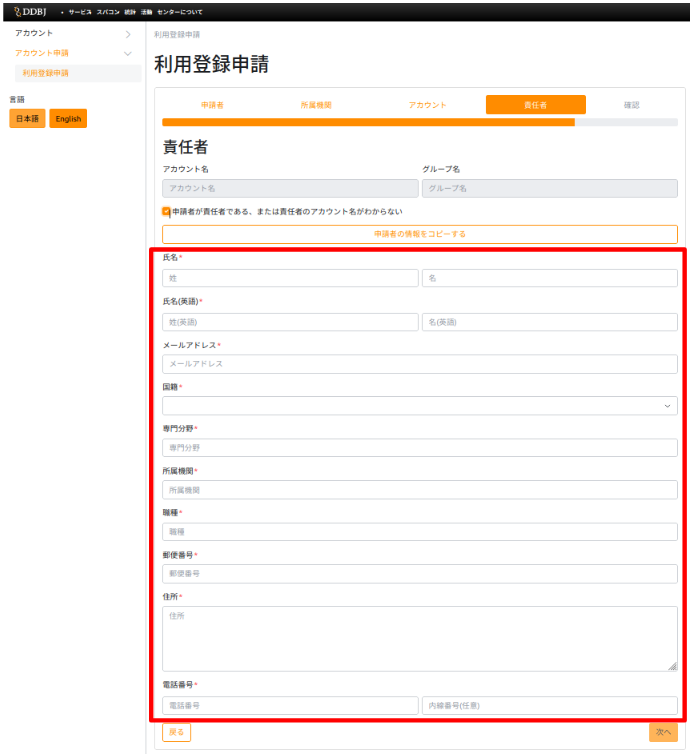

## &#x1F180; アカウント登録フォームからログアウトしたいが、ログアウトボタンが見つかりません。

&#x1F150; 以下の赤枠部分がログアウトボタンです。

クリックすると、ログアウトできます。

## &#x1F180; 責任者のアカウント名とグループ名に何を入力したら良いのかわかりません。

&#x1F150; 責任者のアカウント名やグループ名が分からない場合は、以下の手順で入力を行ってください。 

<table>
<tr>
<td>1.</td>
<td width="300">「申請者が責任者である、または責任者のアカウント名がわからない」にチェックを入れます。</td>
<td height="400">

</td>
</tr>
<tr>
<td>2.</td>
<td width="300">責任者の情報を入力します。</td>
<td height="400">

</td>
</tr>
<tr>
<td>3.</td>
<td width="300">「次へ」ボタンをクリックします。クリックすると、次ページの「確認」に進みます。</td>
<td height="400">

</td>
</tr>
</table>

## &#x1F180; アカウントの新規登録のときに、SSH公開鍵の登録をしないまま登録を完了してしまいました。SSH公開鍵を登録したいのですが、どうしたらよいでしょうか。

&#x1F150; 登録申請フォームにSSH公開鍵を入力しないままアカウントの新規登録を完了した場合、再度、登録申請を行う必要はありません。

そのままアカウント登録証の到着をお待ちください。

後日アカウント登録証がお手元に届きましたら、下記からログインして、SSH公開鍵の登録作業を行ってください。

[<u>申請内容の変更 > アカウント > SSH公開鍵</u>](/application/registration)

