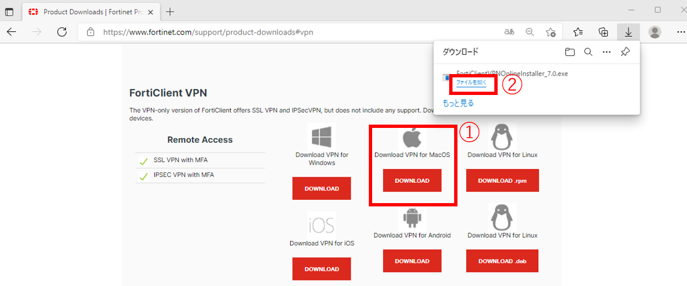

## &#x1F180; 公開鍵による認証ができません。 {#error-pubkey-auth}

&#x1F150; ホームディレクトリの group,other に write 権限が付与されている場合、公開鍵による認証は失敗します。
また、`~/.ssh`および`~/.ssh/authorized_keys`に、owner 以外の権限が付与されている場合も公開鍵認証に失敗します。
以下の 3 つのディレクトリ・ファイルのパーミッションをご確認願います。

パーミッションは `chmod` コマンドで変更できます。

```
（例）
chmod 750 ~/
chmod 700 ~/.ssh
chmod 600 ~/.ssh/authorized_keys
chmod 600 ~/.ssh/id_rsa.pub
```


## &#x1F180; 新スパコンに SSH ログインできない場合の対応がわかりません。 {#error-ssh-login}

&#x1F150; 遺伝研スパコンにログインしようとした際、下記のようなメッセージが表示されてログインできない場合があります。

```
$ ssh gw.ddbj.nig.ac.jp
@@@@@@@@@@@@@@@@@@@@@@@@@@@@@@@@@@@@@@@@@@@@@@@@@@@@@@@@@@@
@       WARNING: POSSIBLE DNS SPOOFING DETECTED!          @
@@@@@@@@@@@@@@@@@@@@@@@@@@@@@@@@@@@@@@@@@@@@@@@@@@@@@@@@@@@
The RSA host key for gw.ddbj.nig.ac.jp has changed,
and the key for the corresponding IP address 133.39.228.101
is unknown. This could either mean that
DNS SPOOFING is happening or the IP address for the host
and its host key have changed at the same time.
@@@@@@@@@@@@@@@@@@@@@@@@@@@@@@@@@@@@@@@@@@@@@@@@@@@@@@@@@@@
@    WARNING: REMOTE HOST IDENTIFICATION HAS CHANGED!     @
@@@@@@@@@@@@@@@@@@@@@@@@@@@@@@@@@@@@@@@@@@@@@@@@@@@@@@@@@@@
IT IS POSSIBLE THAT SOMEONE IS DOING SOMETHING NASTY!
Someone could be eavesdropping on you right now (man-in-the-middle attack)!
It is also possible that a host key has just been changed.
The fingerprint for the RSA key sent by the remote host is
SHA256:xkyH37QZowWjidMSCIbOZa7Vw1p46Dxt4nF9nFJG+hk.
Please contact your system administrator.
Add correct host key in /home/username/.ssh/known_hosts to get rid of this message.
Offending RSA key in /home/username/.ssh/known_hosts:X
RSA host key for gw.ddbj.nig.ac.jp has changed and you have requested strict checking.
Host key verification failed.
```

遺伝研スパコンのゲートウェイノードは `gw.ddbj.nig.ac.jp`, `gw2.ddbj.nig.ac.jp` の２つがありますが、それぞれ `ssh-keygen -R gw.ddbj.nig.ac.jp` , `ssh-keygen -R gw2.ddbj.nig.ac.jp` を実行することでこのエラーが出なくなります。**実行するときは、スパコン上ではなく、<font color="red">ユーザの計算機上で実行します</font>。**

実行すると、エラーは出なくなりますが、`Are you sure you want to continue connecting (yes/no)?` と聞かれます。「yes」を入力します。<br/>この確認メッセージは、ユーザの計算機から遺伝研スパコンのサーバに初めて接続する場合に、接続先がなりすまされた偽のサーバではなく正規のサーバであるかどうかの確認のために、表示されます。最初の1回だけ聞かれて、次回以降は表示されません。


## &#x1F180; SSH のコネクションが頻繁に切れます。 {#disconnect-ssh}

&#x1F150; `~/.ssh/config` に以下を追記してください。

```
Host *
    ServerAliveInterval 20
    TCPKeepAlive no
```

詳しくは以下ご参照ください。

&#x1f517;<u>https://unix.stackexchange.com/questions/602518/ssh-connection-client-loop-send-disconnect-broken-pipe-or-connection-reset</u>


## &#x1F180; SSL-VPNクライアントソフトウェア FortiClientのダウンロード方法がわかりません。{#how-to-DL-VPN}

&#x1F150; 

以下のURLをクリックして、ForiClientの公式サイトのページにアクセスしたら、表示されたページの下の方にある「FortiClient VPN」から、Windows用またはMac用のFortiClient VPNクライアントソフトウェアをダウンロードします。下図の①、②の順にクリックすると、ダウンロードできます。

- FortiClient公式サイト: [https://www.fortinet.com/support/product-downloads](https://www.fortinet.com/support/product-downloads)

＜Windowsの場合＞


＜Macの場合＞



## &#x1F180; 個人ゲノム解析区画に対する VPN 接続ができません。{#error-vpn-connection}

&#x1F150; Windows 10, 11 の FortiClient で個人ゲノム解析区画にアクセスしたときに、`Credential or ssl vpn configuration is wrong (-7200)`というエラーが出る場合、

コントロールパネル => インターネットオプション => セキュリティータブ => 信頼済みサイト

ここに SSL-VPN のアドレスを登録します。


## &#x1F180; FortiClientにログインするときに、「セキュリティの警告」のダイアログボックスが表示されずに、ステータス 40％ぐらいから先に進みません。{#dialogbox_disappear}


&#x1F150; 40%ぐらいから先に進まずうまくつながらないときは、

1. まず、ダイアログボックスが、他の画面やウィンドウの後ろに表示されていないか、確認してください。

2. それでも解決できない場合は、[<u>「SSL-VPNクライアントのインストール」を参照して</u>](/personal_genome_division/pg_login#1-ssl-vpn%E3%82%AF%E3%83%A9%E3%82%A4%E3%82%A2%E3%83%B3%E3%83%88%E3%81%AE%E3%82%A4%E3%83%B3%E3%82%B9%E3%83%88%E3%83%BC%E3%83%AB)、最新のFortiClientをインストールしなおしてください。


## &#x1F180; 個人ゲノム解析区画に対してSSL-VPN接続を行うために、FortiClientにアカウント名とパスワードを入力しても、VPNアカウントに紐付くメールアドレスへワンタイムパスワードが送られてきません。{#no-onetime-pw-received}

&#x1F150; 
- Googleが2022年3月1日からセキュリティを強化した影響により、gmailに遺伝研スパコンVPNからのワンタイムパスワードのメールが飛ばない事象が発生しています。
- メール誤送信を防ぐためにも、フリーメールではなく所属機関のメールアドレスのご登録を推奨しています。


## &#x1F180; Windows PowerShellからはログインできましたが、WSL2 (Windows Subsystem for Linux)上のUbuntu Linuxからはログインできないのでしょうか？  {#wls2-login}

&#x1F150; ログインできます。

現在のWindowsはWSL2を使うために最初から仮想マシンの上で動いており、WSL2上のUbuntu
Linuxは別の仮想マシンとして動作します。(例えば以下のリンク&#x1f517;<u>
https://www.thomasmaurer.ch/2019/06/install-wsl-2-on-windows-10/</u>)

つまり一台の物理計算機の中に２台の完全に独立な仮想計算機が入っている状態で動作しています。
ディスク領域も独立になっており、この２台の仮想計算機が一台の物理計算機の中でネットワーク接続している状態で動作します。

外見上そっくりですが、PowerShellはWindows OSがのった仮想マシン上で動いており、
Ubuntuのプロンプトが表示される画面はUbuntu LinuxOSがのった仮想マシン上で動いています。

ですからPowerShellで作った秘密鍵をUbuntu Linuxの方にコピーする必要があります。

例えば以下の通りです。

```
you@wsl2:~$ cp /mnt/c/Users/you/.ssh/id_rsa .ssh
you@wsl2:~$ ssh your_account@gw2.ddbj.nig.ac.jp
Enter passphrase for key '/home/you/.ssh/id_rsa':
Last login: Thu Dec  1 15:33:59 2022 from XXX.XXX.XXX.XXX
---------------------------------------------------------------------
Thank you for using NIG supercomputer system.
This is the gateway node, do not run program here.
Please use 'qlogin' to login to a login node.
---------------------------------------------------------------------
your_account@gw4:~ (2022-12-01 15:34:50)
$
```
