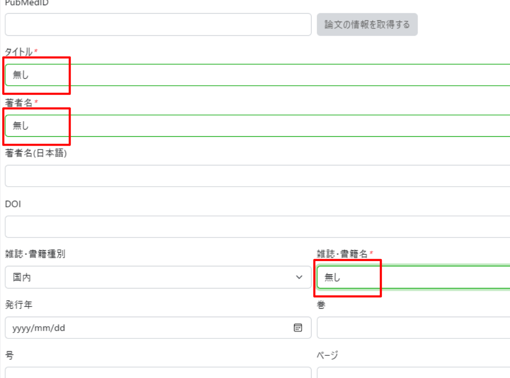

## &#x1F180; 現状論文等の成果物についてはまだ出ておりません。論文発表などに至っていないのですが、どのようにしたら良いでしょうか？

&#x1F150; 成果報告がない場合は、下記のように「無し」と記入していただけば手続きは可能です。

## &#x1F180; 以下ような画面が表示され、年末アカウント継続申請を行うことができません。どのようにしたら、行えるようになるのでしょうか？

&#x1F150; [<u>「アカウント申請・変更」ページの「申請内容の変更」に掲載されている手順に沿って、ログインしてください。</u>](/application/registration#申請内容の変更)ログイン後、年度末アカウント継続申請を行ってください。

