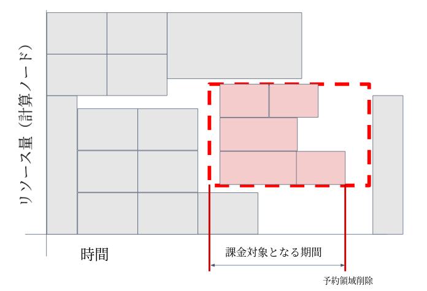

## 概要


アドバンスリザベーションは予めGrid Engineキューのある範囲のリソースを予約しておき、その予約領域を専有して利用できるサービスです。
なお、本サービスは課金サービスであり、使用には事前に利用計画書の提出が必要です。




赤い点線の四角がアドバンスリザベーションで取られたリソース（計算ノードのスロット数✕利用時間）
他の四角がジョブが専有するリソース（計算ノードの利用スロット数✕計算時間）となっています。
領域を予約したユーザーは赤い四角の領域に対してジョブを投入することが出来ます。

（アドバンスリザベーションサービスを使用しているユーザーも、アドバンスリザベーションサービスを使用していないユーザーと同様に、
普通に`qsub`コマンドを利用することにより計算資源の予約枠を利用せずにジョブを投入することは可能です。）


課金対象期間について

- 計算資源の予約枠を取得し、予約枠の開始時刻後、予約枠の終了時刻前までに予約枠の削除を行った場合、計算資源の予約枠の開始時刻から予約枠の削除を実施した時刻までが課金対象となります。（通常はこのパターン）
- 予約枠の削除を実施しなかった場合、計算資源の予約枠の開始時刻から予約枠の終了時刻まですべてが課金対象となります。
    - 予約枠の終了時間が来るとジョブが実行中であっても強制終了されます。
    - 予約枠の中でジョブを実行しなかったとしても予約枠の全てが課金の対象となります。
- 計算資源の予約枠を取得し、予約枠の開始時刻前までに予約枠の削除を実施した場合、計算資源の予約枠は無効となり、課金対象外となります。


## アドバンスリザベーションサービス使用手順

アドバンスリザベーションサービスを使用する場合は、以下の手順で実施してください。

1. 利用計画表の提出
    - 本サービスは課金サービスであり、使用には事前に利用計画表の提出が必要です。手続きの詳細は[課金サービスの利用方法](/application/billing_service)をご参照ください。
2. 計算資源の予約枠の取得
    - 計算資源の予約枠の取得は`QRSUB`コマンドで実施します。
3. 計算資源の予約枠の確認
    - 取得した計算資源の予約枠の確認は`qrstat`コマンドで実施します。
4. ジョブの実行
    - 計算資源の予約枠の取得後のジョブ実行は、`qsub`コマンドに`-ar`オプションで`ar-id`(予約番号)を指定して実施します。
5. 計算資源の予約枠の削除
    - 取得した計算資源の予約枠の削除は`QRDEL`コマンドで実施します。

`QRSUB`コマンドおよび`QRDEL`コマンドは遺伝研スパコン上での課金金額の計算のために作成した、Grid Engineの`qrsub`, `qrdel`コマンドのラッパープログラムです。
`QRSUB`,`QRDEL`ともコマンドオプションは、それぞれ`qrsub`コマンド、`qrdel`コマンドのオプションが使用可能です。
各コマンドのオプションについては、Grid Engineユーザーズマニュアル(英語のみ)を参照してください。


  
 
## 計算資源の予約枠の取得方法


予約枠は、スパコンSEに依頼して確保することも出来ますし、コマンドを使ってユーザー自身で確保することも可能です。


実行中のジョブによりリソースに空きがなく`QRSUB`で計算資源の予約枠の取得ができないことがあります。
その場合は、確保する日時をさらに未来の日時にずらしていただき、再度`QRSUB`コマンドを実施していただくようお願いいたします。
 

下記の実行例の意味については[Grid Engineのページ](/software/grid_engine)もご参照ください。


### 実行例(1)

medium.qを1ノードで、メモリ量4GB、スロット数3、使用期間2020年4月2日13時15分から2020年5月4日10時00分までの
予約枠を取得する場合
この場合に確保されるメモリ量は12GB(メモリ4GB×3スロット)となり、計算資源の予約枠を取得する際は
その分の空き容量が必要となります。

```
QRSUB -l medium -l mem_req=4G -l s_vmem=4G -pe def_slot 3 -a 202004021315 -e 202005041000
```

- `-l medium`：medium.qを指定
- `-l mem_req=4G -l s_vmem=4G`：メモリ量4Gを指定
- `-pe def_slot 3`：スロット数3を指定(要求スロット数は1ノードで確保される) 
- `-a 202004021315`：使用開始時刻2020年4月2日13時15分を指定
- `-e 202005041000`：使用終了時刻2020年5月4日10時00分を指定
 

### 実行例(2)

medium.qを複数ノードに跨るmpiジョブ(並列数は2~5)で、使用期間10月10日00時00分から10月20日7時5分までの予約枠を取得する場合
この場合に確保される最大メモリ量は、40GB（8GB(デフォルト値)×10スロット）となり、計算資源の予約枠を取得する際はその分の空き容量が必要となります。

```
QRSUB -l medium -pe mpi 2-10 -a 10100000 -e 10200705
```

- `-pe mpi 2-5`  : mpiジョブで最小並列数2、最大並列数5を指定
- `-a 10100000`  : 使用開始時刻10月10日00時00分を指定
- `-e 10200705` : 使用終了時刻10月20日7時5分を指定

＊メモリ量は指定されていないので、デフォルト値が指定されたとみなされます。
 
### 実行結果

QRSUBコマンドが正常終了した場合は、以下のメッセージが出力され、ar-id(4桁の予約番号)が発行されます。

```
Your advance reservation XXXX has been granted
```

ここでXXXXにはar-id(予約番号)が入ります。
 

`QRSUB`コマンドが正常終了しなかった場合は、指定オプションを見直し、再度実行してください。

### 予約開始時刻、予約終了時刻の指定方法

`QRSUB`コマンドの以下の引数で予約開始時刻、終了時刻を指定します。

- `-a start-time` 	予約開始時刻を指定します。 	start-timeを以下の形式で指定します。
- ``-e end-time` 	予約終了時刻を指定します。 	end-timeを以下の形式で指定します。

時刻は以下の形式で指定できます。

- CCYYMMDDhhmm.SS
- CCYYMMDDhhmm
- YYMMDDhhmm.SS
- YYMMDDhhmm
- MMDDhhmm.SS
- MMDDhhmm 	-

＊CC：西暦の上2桁　YY：西暦の下2桁　MM：月　DD：日　hh：時　mm：分　SS：秒

 
## 予約枠取得状況の確認方法


### 予約枠取得状況の一覧表示

```
qrstat
```

実行結果

```
ar-id      name       owner        state start at             end at               duration
------------------------------------------------------------------------------------------
      0001            test-user　  w     10/10/2017 00:00:00  10/20/2017 07:05:00  247:05:00
      0002            test-user　  r     01/10/2017 00:00:00  10/20/2017 00:00:00  6792:00:00
```

- ar-id：予約番号
- state：予約枠の状態 
    - w：エラーなしで待機中、W：警告(エラー付きで待機中)、r：実行中、E：エラー(エラー状態で実行中)
- start at：予約枠開始時刻
- end at：予約枠終了時刻
- duration：予約時間
 
 
### 予約枠取得状況の詳細表示

```
qrstat -ar ar-id[,ar-id,ar-id・・・・]
```

- ar-id：予約番号
    - 複数の計算資源の予約枠の取得状況を確認する場合は、予約番号をカンマ(,)で区切って指定します。
 
実行結果

```
--------------------------------------------------------------------------------
id                             0001
name
owner                          test-user
state                          w
start_time                     10/10/2017 00:00:00.000
end_time                       10/20/2017 07:05:00.000
duration                       247:05:00.000
project
message                        XXXXXXXXXX
submission_time                03/22/2017 14:56:47.314
group                          test
account                        sge
resource_list                  month=TRUE, medium=TRUE, mem_req=3.1G, s_vmem=3.1G
free_resources                 false
reserve_available_only         true
granted_slots_list             month_medium.q@nm5i=1,month_medium.q@nm6i=1,month_medium.q@nm7i=1
granted_parallel_environment   mpi slots 2-3
--------------------------------------------------------------------------------
id                             0002
name
owner                          test-user
state                          r
start_time                     01/10/2017 00:00:00.000
end_time                       01/20/2017 00:00:00.000
duration                       6792:05:00.000
project
message                        XXXXXXXXXX
submission_time                01/05/2017 13:23:20.001
group                          test
account                        sge
resource_list                  mem_req=3.1G, s_vmem=3.1G
free_resources                 false
reserve_available_only         true
granted_slots_list             month_hdd.q@nt013i=1
--------------------------------------------------------------------------------
id                             0003
name
owner                          test-user1
state                          w
start_time                     01/01/2018 00:00:00.000
end_time                       01/02/2018 00:00:00.000
duration                       24:00:00.000
project
message                        XXXXXXXXXX
submission_time                04/03/2017 10:50:10.285
group                          test
account                        sge
resource_list                  mem_req=10G, s_vmem=10G
free_resources                 false
reserve_available_only         true
granted_slots_list             month_ssd.q@nt060i=3
granted_parallel_environment   def_slot slots
```

- id：ar-id(予約番号)
- state：予約枠の状態
    - w：エラーなしで待機中、W：警告(エラー付きで待機中)、r：実行中、E：エラー(エラー状態で実行中)
- start_time：予約枠開始時刻
- end_time：予約枠終了時刻
- duration：予約時間
- message：エラーメッセージ(steteがWおよびEの場合のみ表示される)
- resource_list ：予約取得キュー名、メモリ量など
- granted_slots_list：予約済みのキュー名、ノード名およびスロット数
- granted_parallel_environment：スロット数(-peオプション指定時のみ表示される)
 
 

 
## ジョブの実行方法

`qsub`コマンドに`-ar`オプションで`ar-id`（予約番号）を指定し、ジョブを実行してください。

それ以外のオプションについては[Grid Engineのページ](/software/grid_engine)と同様です。
 

計算資源の予約枠の開始時刻前にar-idを指定してqsubコマンドを実行しジョブ投入を行った場合、
予約枠の開始時刻になり次第ジョブが実行されます。

なお、取得した予約枠の終了時刻を過ぎた時点で実行中のジョブは強制終了されますので、ご注意ください。


 
## 計算資源の予約枠の削除

計算資源の予約枠の削除するには、`QRDEL`コマンドに`ar-id`(予約番号)を指定して実行してください。

 
実行例

```
QRDEL ar-id
```

 
ジョブ実行中に⑤計算資源の予約枠の削除(QRDELコマンド)を実施した場合は、
実行中のジョブも終了しますので、ご注意ください。
	

