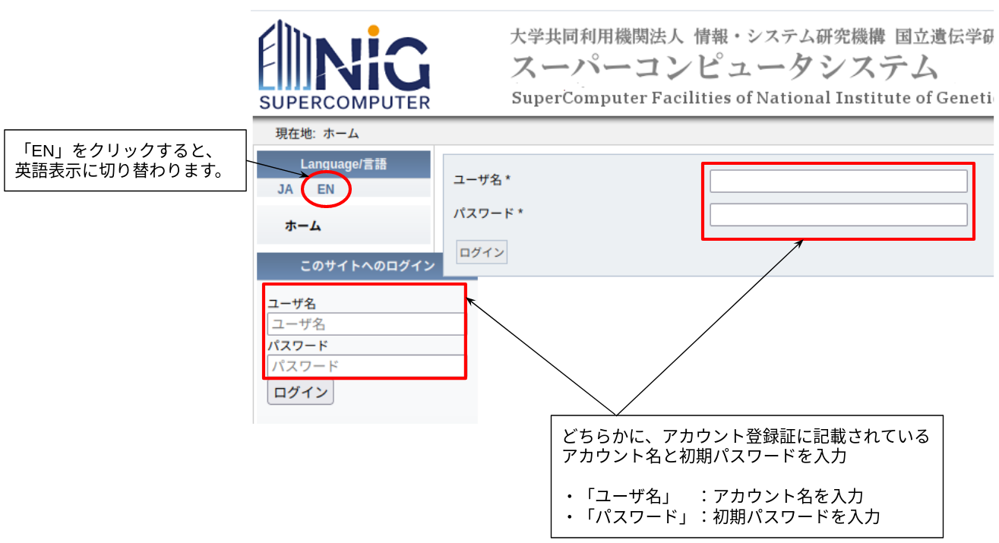

## ユーザーの計算機の用意

遺伝研スパコンの一般解析区画はSSHクライアントおよびWebブラウザが動作する計算機があれば利用できます。
16GB以上のメインメモリを持ったWindows, Mac, Linuxの計算機を推奨します。

- Mac, Linuxについては標準のターミナルエミュレータを使ってアクセス利用可能です。
- WindowsについてはPowerShellのSSHクライアントまたはWindows Subsystem for Linux version 2(WSL2)等によりアクセス可能です。

## ユーザーアカウント申請から利用開始までの流れ

ユーザーアカウント発行基準につきましては、[こちら](../application/application.md)をご参照下さい。

1. [新規ユーザ登録申請フォーム](https://sc2.ddbj.nig.ac.jp/index.php/ja-new-application)をご入力ください。
    - 事前に「[ユーザーアカウント発行基準](../application/application.md)」及び「[利用規定](/application/use_policy)」をご確認ください。
    - メールアドレスは、フリーメールアドレスではなく、所属機関のメールアドレスをご入力ください。(特別な場合を除く)
    - 遺伝研スパコンでは利用申請時に外為法の定める国内居住者でありかつ大学あるいは国公立研究機関の教員を責任者として指名する必要があります。責任者のアカウント毎にUNIXグループが作られます。
2. [責任者](../application/application.md#責任者について)にメールが送信されるので、それに沿って、誓約書PDFをご返信ください。
    - 受付後、数日程度でメールを送信いたします。
3. アカウント登録証の到着をお待ちください。
    - 受付後、 1週間程度で発送いたします。
    - 外為法関係など機構にて審査が必要な場合はもう少し時間がかかります。
4. アカウント登録証が到着しましたら、下記の「ログインページ」をクリックしてください。
    - クリックするとログイン画面が表示されますので、アカウント登録証に記載されているアカウント名と初期パスワードを入力し、ログインボタンをクリックしてください。

<a href="https://sc2.ddbj.nig.ac.jp/index.php/ja-change-passwd-application-sc">　 　ログインページ</a>

ログイン画面

英語表示をご希望の場合、左上の「EN」をクリックし、言語を変更してください。変更すると、以下の画面に切り替わります。

5. ログインすると、パスワード変更画面が表示されますので、初期パスワードを変更してください。
    - 不正なアクセスを防ぎ、より安全にご利用いただくために、初期パスワードの変更を強くお勧めします。
    - パスワードの変更方法は、[「ログインパスワード変更申請方法」ページの「手順」](../application/change_loginpwd.md)」に沿って行ってください。
6. ログインしたままの状態で、SSH公開鍵をご登録ください。詳細は[SSH公開鍵の登録](../application/ssh_keys.md)をご参照ください。
7. 利用リソースの拡張や[課金サービスの利用](../application/billing_service.md)を希望する場合は[利用計画表をダウンロード](../application/resource_extension.md)し、記入の上ご提出ください。
    -  提出先は[問い合わせ先](../application/reference.md)をご参照ください。

## 団体での利用申請について

講習会やコンソーシアムでの利用など、多数のユーザーの登録をご希望の場合は以下の手順に従ってください。

1. 責任者に該当する方がまだ遺伝研スパコンのアカウントをお持ちでない場合、上記の手順に従いアカウントを取得してください。
2. [利用計画表をダウンロード](../application/resource_extension.md)し、そこにユーザーの情報をまとめて書いて提出してください。（その際に利用目的、利用するリソース量についてもご記載ください。）
