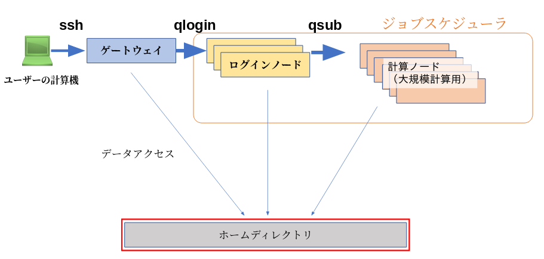

## 一般解析区画のシステム構成

遺伝研スパコン一般解析区画は多数の計算機（これらをノードと呼びます）を束ねたクラスタ構成となっています。

ユーザーからの計算要求に対してクラスタ計算機システム上の適切な計算機を割り当てる仕事をするのがジョブスケジューラと呼ばれるプログラムです。
遺伝研スパコンでは、バイオインフォマティックス系で広く用いられてきたSun Grid Engineの後継であるUniva Grid Engine (UGE)をジョブスケジューラとして使っています。

UGEで管理された全てのノードは大容量高速ストレージシステム (Lustre FS)をマウントしており、ユーザーのホームディレクトリは全てのノードから同じようにアクセスできます。

## UGEキューの種類

UGEで管理されたノードはログインノードと計算ノードに大別されます。

- ログインノード(login node)はユーザがプログラム開発や、小規模で短時間で終わる計算をその場で対話的に行うための計算機です。
- 計算ノード(compute node)は、長時間かかる計算、大量のCPUやメモリを使う計算を行うための計算ノードです。

ログインノード、計算ノードに対する計算要求（これをジョブと呼びます）はUGEでは待ち行列（キュー）を用いて管理されます。計算要求量が計算機のリソース量を超えている場合は、ジョブは待ち行列の中で待ち、計算機が空き次第UGEにより自動的に実行されます。

遺伝研スパコン一般解析区画では、ノードを構成する計算機の種類ごとにUGEキューが設けられています。

<table>
<tr>
  <th>ノードの種別</th>
  <th>UGEキューの名称</th>
  <th>ハードウェア種別</th>
  <th>台数・合計コア数</th>
</tr>
<tr>
  <td rowspan="2">ログインノード</td>
  <td>login</td>
  <td>Thinノード Type1b 
  (AMD EPYC7702, 128 CPU cores/node, 
  4GB memory/CPU core)
  </td>
  <td>3台・384コア</td>
</tr>
<tr>

  <td>login_gpu</td>
   <td>Thinノード Type2b  
   (Intel Xeon Gold 6136, 24 CPU cores/node,  
   16GB memory/CPU core)
   </td>
  <td>2台・48コア</td>
</tr>

<tr>
  <td rowspan="5">計算ノード</td>
  <td>epyc</td>
    <td>Thinノード Type1b 
  (AMD EPYC7702, 128 CPU cores/node,  
  4GB memory/CPU core) 
    Thinノード Type1a 
  (AMD EPYC7501, 64 CPU cores/node,  
  8GB memory/CPU core) 
  </td>
  <td>
1b 25台、3200コア 1a 11台、704コア</td>

</tr>
<tr>
  <td>intel</td>
  <td>Thinノード Type2a  
  (Intel Xeon Gold 6130, 32 CPU cores/node,  
  12GB memory/CPU core)
  </td>
  <td>21台・672コア</td>
</tr>
<tr>
  <td>gpu</td>
     <td>Thinノード Type2b  
   (Intel Xeon Gold 6136, 24 CPU cores/node,  
   16GB memory/CPU core)
   </td>
  <td>7台・168コア</td>
</tr>
<tr>
  <td>short</td>
     <td>Thinノード Type2b  
   (Intel Xeon Gold 6136, 24 CPU cores/node,  
   16GB memory/CPU core)
   </td>
  <td>7台・168コア</td>
</tr>
<tr>
  <td>medium</td>
  <td>Mediumノード  
  (Intel Xeon Gold 6148, 80 CPU cores/node,  
  38.4GB moemory/CPU core)
  </td>
  <td>9台・720コア</td>
</tr>

</table>

