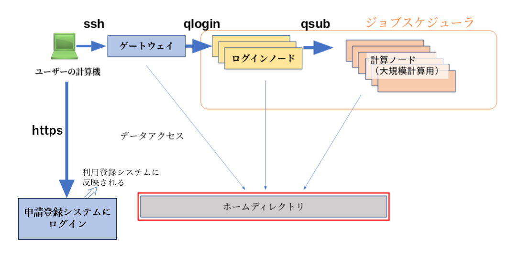

## 概要

遺伝研スパコンの一般解析区画へのログインには ssh 接続を用います。




## ゲートウェイノードは ２つあります {#two-gateways}

遺伝研スパコンの一般解析区画のゲートウェイノードは、以下の 2 つがあります。

- `gw.ddbj.nig.ac.jp`
- `gw2.ddbj.nig.ac.jp`


## ログインの手順


1, ターミナルエミュレータを開き、`ssh アカウント名@ゲートウェイノード名` を入力し、enter を押下します。
（Windows PowerShell の SSH クライアントの場合も同じです。）

```
$ ssh youraccount@gw.ddbj.nig.ac.jp
```

または

```
$ ssh youraccount@gw2.ddbj.nig.ac.jp
```

秘密鍵の格納場所が`~/.ssh/id_rsa`以外の場合は以下のように秘密鍵のパスを指定します。

```
ssh -i ~/yourpath/id_rsa youraccount@gw.ddbj.nig.ac.jp
```

2, "Enter passphrase for key ..."のプロンプトに対し、SSH 鍵ペアのパスフレーズを入力し、enter を押下します。

※ 鍵のパスフレーズ入力後に以下のメッセージが出力された場合は、yes を入力してください。
```
Are you sure you want to continue connecting (yes/no)?
```


3, `qlogin` コマンドを実行し、ログインノードにログインします。

```
$ qlogin
```

パスワード入力後に以下のメッセージが出力された場合は、yes を入力してください。
```
Are you sure you want to continue connecting (yes/no)?
```


### 実行例

以下のように表示されれば成功です。

```
$ ssh youraccount@gw.ddbj.nig.ac.jp
Enter passphrase for key '/home/youraccount/.ssh/id_rsa': 
Last login: Sun Sep 26 15:03:33 2021 from XXX.XXX.XXX.XXX
---------------------------------------------------------------------
Thank you for using NIG supercomputer system.
This is the gateway node, do not run program here.
Please use 'qlogin' to login to a login node.
---------------------------------------------------------------------
$ qlogin
Your job 13867668 ("QLOGIN") has been submitted
waiting for interactive job to be scheduled ...
Your interactive job 13867668 has been successfully scheduled.
Establishing /home/geadmin/UGER/utilbin/lx-amd64/qlogin_wrapper session to host at138 ...
Last login: Sun Sep 26 15:29:09 2021 from gw1
$ 
```

うまく行かない場合は、[よくある質問(FAQ)](/faq/faq_login_general)を参照してください。


## 利用可能メモリに関する注意


ログインノードで利用可能なメモリはデフォルトでは 4GB です。
これを増やすには以下のように`qlogin`時にメモリ量を指定してください。

```
qlogin -l s_vmem=10G -l mem_req=10G
```

### 参考

- [Java の使い方](/software/java) > 注意事項 Java プログラムを起動するとメモリが足りないとのエラーが出る
- [Singularity の使い方](/software/Apptainer/) > [スパコン上でのイメージのビルド : Docker コンテナイメージから Singularity イメージを生成する](/software/Apptainer/#スパコン上でのイメージのビルド--docker-コンテナイメージから-apptainer-sigularity-イメージを生成する)


## GPU ノードの利用方法


GPU を用いたプログラムの開発や動作テストの目的で、GPU を搭載したログインノードを１台用意しています。
このログインノードを使うには、`-l gpu`オプションを付けて`qlogin`してください。


```
qlogin -l gpu
```


