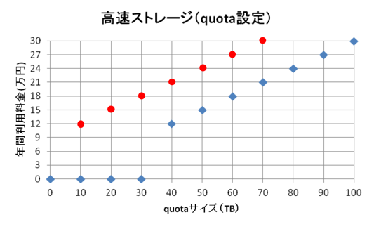
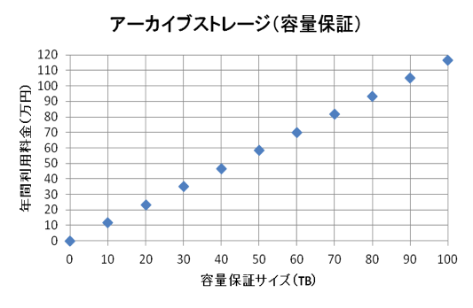

サービス利用の際は、利用規程および利用規程別表（料金表）をご確認いただき、拡張サービス利用計画表をダウンロードし必要事項を記入の上、までメールにてお送りください。利用目的を審査の上、課金サービス利用許可の案内をお送りします。遺伝研スパコンの混雑状況によってはご利用できない場合がありますのでご了承願います。

 

遺伝研スパコンの計算ノード及びストレージは一般解析区画と個人ゲノム解析区画 の２つの区画に大別されます。以下のストレージ大規模利用サービスは両方の区画から利用可能です。

 
##  高速ストレージの大規模利用(Quota設定のみ)

 

 

◯赤点が個人ゲノム解析区画の価格　◆青点が一般解析区画の価格です。

- 一般解析区画では責任者単位のquota設定良の合計で30TBまで無料です。30TBまでは各ユーザは1TB単位で申請可能です。30TBを超える場合は10TB単位で申請してください。
- 10TB単位で申請してください。10TB単位で端数が出た場合は切り上げとなります。
- 利用可能容量はクオータ設定のみのベストエフォートです。

 
 
## アーカイブストレージの大規模利用（容量保証）

- 一般解析区画、個人ゲノム解析区画の両方とも同じ価格です。
- 10TB単位で申請してください。10TB単位で端数が出た場合は切り上げとなります。

 
## その他特記事項

### ストレージに対するグループクォータについて

 責任者単位の合計で高速ストレージ30TB以下は無料であり、 責任者単位でグループが作られるためクォータの設定を責任者単位で設定して欲しいという要望があります。その際にはその旨を までご連絡ください。

### 2次グループの設定等によるグループ間のデータ共有について

グループ間でのデータ共有を可能にする設定についてもご要望を承ります。その際、束ねたグループの合計で30TBを超えたら課金対象となります。料金はグループのクォータ量で按分となります。（この場合には請求金額は「拡張サービス利用計画表」では計算出来ませんのでご注意願います。）

- 課金の金額は例えばグループAの高速ストレージクォータ設定が25TB, グループBの高速ストレージクォータ設定が10TBなら、35TBは40TBに切り上げられるため40TBの料金 11万1112円（税抜き)を25:10に按分します。
