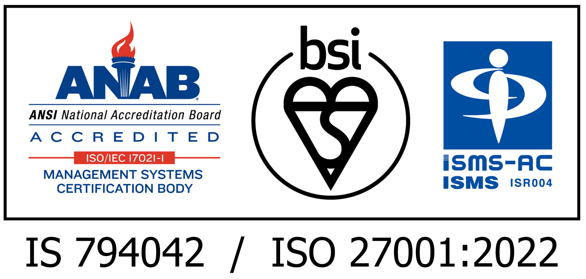

国立遺伝学研究所　生命情報・ DDBJ センター　システム管理部門及び国内連携部門は、遺伝研スーパーコンピュータ　個人ゲノム解析区画の構築・運用を対象範囲として、2023 年 11 月 19 日付けで、ISO（国際標準化機構）の認証基準である ISMS（ISO27001: 2013、情報セキュリティ管理システム）の認証を取得しました。また、2024 年 12 月 15 日付けで、最新版である ISMS（ISO27001: 2022、情報セキュリティ管理システム）の認証を取得しました。

&nbsp;&nbsp;<a class="box-link" href="/pdf/ISMS_2022.pdf" target="_blank">ISMS 認証証書(PDF)</a>

