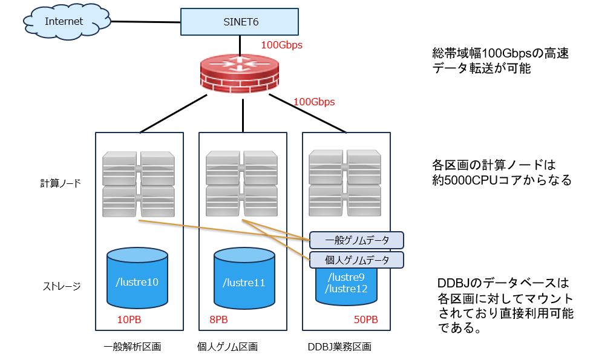

遺伝研スーパーコンピュータシステムは 2025年3月より第六期の稼働を開始しました。

同システムは、国際塩基配列データベースの構築のための計算基盤として用いられるとともに、遺伝学を中心としたライフサイエンス系の研究・教育のための計算基盤として広く学内外の研究者に提供され、我が国の生命･医学系研究の基盤強化と新たな学術研究の展開に貢献します。
 
- システムは一般解析区画と個人ゲノム解析区画、およびDDBJ業務区画からなります。個人ゲノム解析区画は高いセキュリティ基準を満たした有料サービスとなっています。(遺伝研スパコンは基本的には無料で利用できることを原則としていますが、一部の付加的なサービスについては有料となっています。)
<!-- [詳細はこちらを参照ください](/application/billing_services)。）  -->

- 国際塩基配列データベースを含む生命・医学系データベースの運用・解析のために合計68PBの大容量ストレージシステムを備え、高速なネットワークを介して国内外との大量のデータ転送が可能です。(一般解析区画10PB, 個人ゲノム解析区画8PB, DDBJデータベース用 50PB)

- SINET6とのネットワーク接続帯域は以前の40Gbpsから100Gbpsに増強されました。

- GPU搭載ノードでは最先端のAI解析を可能とするNVIDIA DGX B200が、国内で最も早く導入されます。さらにゲノム解析用に費用対効果の高いNVIDIA L40SおよびPEZY-SC3を搭載した計算ノードを導入しました。
 (DGX B200は2025年6月1日稼働開始。L40Sは2025年4月1日稼働開始。L40SはGATK互換のゲノム解析パイプライン性能でH100と同等であり、値段は1/3程度）。

- ゲノム解析ソフトウェアのインストールを容易にし解析の再現性を担保する目的でSingularityコンテナの運用をしています。現在約2,000種類を超えるゲノム解析ソフトウェアがSingularityコンテナで利用可能です。

