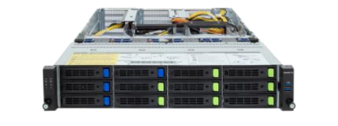
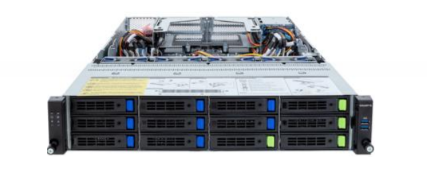
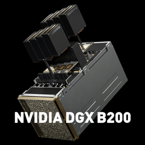
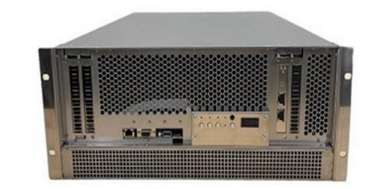

## システム全体 {#overview}

<table>
<tbody>
<tr>
<th colspan="3">機器分類</th>
<th>機器諸元</th>
</tr>
<tr>
  <td rowspan="7">
  計算ノード
  </td>	
  <td rowspan="2">
  HPC CPU最適化ノード

  総 CPU コア数: 13,184 
  合計演算性能  241.644TFLOPS 
  総メモリ容量 91.136 TB
  </td>
    <td>
    Type 1 
    CPU に AMD EPYC 9654 を搭載 
    </td>
    <td>
    ノード数: 50 台 
    総 CPU コア数: 9600  
    合計演算性能: 368.6 TFLOPS 
    総メモリ容量 76.8 TB（コアあたり 8GB）  
    </td>
    </tr>
    <tr>
    <td>
    Type 2 
    CPU に AMD EPYC 7702 を搭載（旧Thin計算ノードType 1b）
    </td>
    <td>
    ノード数: 28 台 
    総 CPU コア数: 3,584 
    合計演算性能: 57.344 TFLOPS 
    総メモリ容量 14.336 TB（コアあたり 4GB）
    </td>
    </tr>
      <tr>
  <td rowspan="2">

  メモリ最適化ノード 

  総CPUコア数: 960 
  合計演算性能: 36.0TFLOPS 
  総メモリ容量: 21TB

  </td>
  <td>
  Type 1 
  6TBメモリ搭載
  </td>
  <td>

  ノード数: 2 台 
  総 CPU コア数: 384 
  合計演算性能 14.4 TFLOPS 
  総メモリ容量 12 TB (コアあたり 32GB)

  </td>
  </tr>
  <tr>
  <td>
  Type 2 
  3TBメモリ搭載
  </td>
  <td>

  ノード数: 3 台 
  総 CPU コア数: 576 
  合計演算性能  21.6 TFLOPS 
  総メモリ容量 9 TB (コアあたり 16GB)

  </td>

  </tr>

    
  <tr>
  <td rowspan="3">
  アクセラレータ最適化ノード
    </td>

      <td>
      Type 1 
      GPUにNVIDIA B200を搭載 
      AI計算用
      </td>
      <td>
      ノード数: 4 台 
      総CPUコア数: 448 
      CPUの合計演算性能: 30.08TFlops 
      総メモリ容量: 8TB (CPUコアあたり17.9GB) 
       
      総GPU数: NVIDIA B200 32基 
      </td>
      </tr>

      <tr>
      <td>

      Type 2 
      ゲノム解析用GPUノード
      </td>
      <td>
      ノード数: 3台 
      総CPUコア数: 192 
      CPUの合計演算性能: 8.28TFlops 
      総メモリ容量: 2.3TB (CPUコアあたり12GB) 
       
      総GPU数: NVIDIA L40S 24基
      </td>
      </tr>
      <tr>
      <td>

      Type 3 
      アクセラレータとしてPEZY ZettaScaler3を搭載 
      ゲノム解析用
      </td>
      <td>
      
      ノード数: 2 台 
      総CPUコア数: 128 
      CPUの合計演算性能: 2.76TFlops  
      総メモリ容量: 4TB  
       
      総アクセラレータ数: PEZY-SC3 4基 

      </td>
</tr>

<tr>
<td width="120" rowspan="3">
ストレージ

</td>
<td colspan="2">
大容量高速ストレージ  
一般解析区画および個人ゲノム解析区画におけるユーザホーム領域
</td>
<td>
Lustre ファイルシステム 
合計容量：13.3PB
</td>
</tr>
<tr>
<td colspan="2">
DB 用ストレージ 
DRA 等の DDBJ データベースを格納している領域
</td>
<td>
Lustre ファイルシステム 
合計容量：40.5PB
</td>
</tr>
<tr>
<td colspan="2">
テープ装置 
DDBJ データベースのバックアップ用
</td>
<td> 
合計容量：15PB
</td>
</tr>

<tr>
<td colspan="3">
ノード間相互結合網
</td>
<td>
InfiniBand HDR100 100Gbps fat tree  
ストレージに対しては full bi-section 
計算ノードに対しては、full bi-sectionの1/2, 
ただしアクセラレータ最適化ノード Type1同士は400Gbps full bi-section 
</td>
</tr>
</tbody>
</table>

## HPC CPU最適化ノード {#cpu-optimized-nodes}

### HPC CPU最適化ノード Type 1 (50 台) {#cpu-optimizied-type-1}

AMD EPYC 9654 プロセッサ(コードネームGenoa) を搭載した計算ノードです。

**GIGABYTE R283-Z94** 

| 構成要素  | 型番                                               | 員数 | ノードあたりの性能など         |
|----------|---------------------------------------------------|------|--------------------------------|
| CPU      | AMD EPYC 9654 (96 cores)  Base 2.4GHz, Max 3.7GHz, 1.8TFlops |    2 | 合計 192 コア, 7.2TFlops |
| Memory   | 64GB DDR5-4800                                    |   24 | 合計 1536GB (CPU コアあたり 8GB) |
| Storage (OS)  | 1TB NVMe SSD                                 |    1 |                                |
| Storage (Data) | 30TB NVMe SSD                               |    1 |                                |
| Network  | InfiniBand HDR100                                 |    1 | 100Gbps                        |

 
### HPC CPU最適化ノード Type 2 (28 台) {#cpu-optimized-type-2}

AMD EPYC 7702 プロセッサ(コードネームRome)を搭載した計算ノードです。(旧Thin計算ノードType 1bと同じものです。)

**DELL PowerEdge R6525** 

| 構成要素 | 型番                                               | 員数 | ノードあたりの性能など         |
|----------|----------------------------------------------------|------|--------------------------------|
| CPU      | AMD EPYC 7702 (64 cores)  Base 2.0GHz, Max 3.35GHz, 1.024TFlops |    2 | 合計 128 コア, 2.048TFlops     |
| Memory   | 32GB DDR4-2666                                     |   16 | 合計 512GB (CPU コアあたり 4GB) |
| Storage (OS)  | 1.6TB NVMe SSD                                |    1 |                                |
| Storage (Data) | 900GB SAS HDD                                |    1 |                                |
| Network  | InfiniBand 4xEDR                                   |    1 | 100Gbps                        |

## メモリ最適化ノード {#memory-optimized-nodes}

### メモリ最適化ノード Type 1 (2台) {#memory-optimized-type-1}

1台にメモリを6TB搭載した計算ノードです。

**GIGABYTE R283-ZK0-AAL1** 

| 構成要素 | 型番                                                     | 員数 | ノードあたりの性能など              |
|----------|---------------------------------------------------------|------|-------------------------------------|
| CPU      | AMD EPYC 9654 (96 cores) Base 2.4GHz, Max 3.7GHz, 1.8TFlops  |    2 | 合計 192 コア, 7.2TFlops          |
| Memory   | 128GB DDR5-4800                                         |   48 | 合計 6.144 TB (CPU コアあたり 32GB) |
| Storage  | 30TB SATA HDD                                           |    1 | 30TB                                |
| Network  | InfiniBand HDR100                                       |    1 | 100Gbps                             |

### メモリ最適化ノード Type 2 (3台) {#memory-optimized-type-2}

1台にメモリを3TB搭載した計算ノードです。

**GIGABYTE R203-Z94-AAD2** 

| 構成要素 | 型番                                                    | 員数 | ノードあたりの性能など              |
|----------|---------------------------------------------------------|------|-------------------------------------|
| CPU      | AMD EPYC 9654 (96 cores) Base 2.4GHz, Max 3.7GHz, 1.8TFlops  |    2 | 合計 192 コア, 7.2TFlopw          |
| Memory   | 128GB DDR5-4800                                         |   24 | 合計 3.072TB (CPU コアあたり 16GB) |
| Storage  | 30TB SATA HDD                                           |    1 | 30TB                                |
| Network  | InfiniBand HDR100                                       |    1 | 100Gbps                             |

## アクセラレータ最適化ノード {#accelerator-optimized-nodes}

### アクセラレータ最適化ノード Type 1 (4台) {#accelerator-optimized-type-1}

NVIDIA B200 GPU を各ノードに 8基搭載した計算ノードです。AI用の計算に適したGPU搭載計算ノードです。

**NVIDIA DGX B200** 

<table border="0">
<tr><td width="300">

</td></tr>
</table>

| 構成要素 | 型番                                                    | 員数 | ノードあたりの性能など          |
|----------|---------------------------------------------------------|------|---------------------------------|
| CPU      | Intel Xeon Platinum 8570 (56 cores) Base 2.1GHz, Max 4.0GHz, 1.97TFlops |    2 | 合計 112 コア, 3.94TFlops      |
| Memory   | 合計2TB                                                   |    | 合計 2TB (CPU コアあたり 17.9GB) |
| GPU      | NVIDIA Blackwell B200                                     |    8 |                                 |
| Storage (OS) | 1.9TB NVMe SSD                                        |    2 | 合計3.8TB                        |
| Storage (Data) | 3.84TB NVMe SSD                                     |    8  | 合計30.7TB                       |
| Network  | InfiniBand NDR                                            |    1 | 400Gbps                         |

### アクセラレータ最適化ノード Type 2 (3台) {#accelerator-optimized-type-2}

費用対FP32性能が高いNVIDIA L40Sを各ノードに8基搭載した計算ノードです。ゲノム解析に適したGPU搭載計算ノードです。

**GIGABYTE G293-Z42-AAP1** 

| 構成要素 | 型番                                                    | 員数 | ノードあたりの性能など          |
|----------|---------------------------------------------------------|------|---------------------------------|
| CPU      | AMD EPYCTM 9334 (32 cores) Base 2.7GHz, Max 3.9GHz, 1.38TFlops |    2 | 合計 64 コア, 2.76TFlops      |
| Memory   | 合計768GB                                                   |    | 合計 768GB (CPU コアあたり 12GB) |
| GPU      | NVIDIA Ada Lovelace L40S                                     |    8 |                                 |
| Storage (OS) | 480GB SATA SSD                                        |    2 | 合計960GB (ノード当たり 480GB (RAID1))                        |
| Storage (Data) | 3.84TB NVMe SSD                                     |    4  | 合計15.36TB                       |
| Network  | InfiniBand NDR200  200Gbps                                            |    2 | 400Gbps                         |

### アクセラレータ最適化ノード Type 3 (2台) {#accelerator-optimized-type-3}

アクセラレータとしてPEZY-SC3を搭載したノードです。ゲノム解析の計算に適した計算ノードです。

**PEZY ZettaScaler3.0** 

| 構成要素 | 型番                                                    | 員数 | ノードあたりの性能など          |
|----------|---------------------------------------------------------|------|---------------------------------|
| CPU      | AMD EPYC 7713P (64 cores) Base 2.0GHz, Max 3.67GHz, 1.02TFlops      |    1 | 合計 64 コア, 1.02TFlops   |
| Memory   | 128GB DDR4 3200MHz                                      |   16 | 合計 2TB (CPU コアあたり 32GB) |
| Accelerator | PEZY-SC3                                             |    4 |                                 |
| Storage (OS) | 0.256TB NVMe SSD                                      |    2 | 合計0.512TB                        |
| Storage (Data) | 4TB NVMe SSD                                   |    4  | 合計16TB                       |
| Network  | InfiniBand HDR100                                        |    1 | 100Gbps                         |

### (参考）GPU, アクセラレータの性能比較 {#gpu-and-accel-perf-comparison}

| Accerelater  | NVIDIA V100 | NVIDIA A100 | NVIDIA L40S | NVIDIA H100 | NVIDIA B200 | PEZY-SC3 | 
|--------------|-------------|-------------|-------------|-------------|-------------|----------|
| GATK互換ソフトのベンチマーク実行時間 [hh:mm:ss] | 3:07:29 | 2:06:14 | 1:45:05 | 1:56:24 | N/A    | 1:02:55      |
| Architecture | Volta       | Ampere      | Ada Lovelace| Hopper      | Blackwell   | PEZY     |
| Memory size [GB]       | 16 or 32 | 40 or 80 | 40         | 80 or 94   | 192         |  32      | 
| Memory bandwidth [GB/s] | 900 | 2039 | 864         | 3352        | 8,000         | 1200     |
| FP64 [TFlops]        | 7.8   | 9.7       | N/A         | 33.5        | 40         | 19.66    |
| FP32 [TFlops]        | 15.7  | 19.5      | 91.6        | 66.9        | 80         | 39.32    |
| FP16,BF16 [TFlops]   | 112   | 624       | 733         |  1979       | 2,250      | 78.64    |
| FP8 [TFlops]         | N/A | N/A         |  1466       |  3958       | 9,000         | N/A      |
| TF32 tensor core [TFlops] | 125     | 312         | 366         | 989         | 2,200         | N/A      |
| FP16 tensor core [TFlops] | N/A     | 624         | 733         | 1979        | 4,500         | N/A      |
| FP8  tensor core [TFlops] | N/A     | N/A         | 1466        | 3958        | 9,000         | N/A      |
| FP4  tensor core [TFlops] | N/A     | N/A         | N/A        | N/A        | 18,000         | N/A      |
| INT8 tensor core [TOPS] | N/A     |  1248 | 1466       | 3958        | 9,000         | N/A      |

- N/A : Not Available, N/D : Not Disclosed
- GATK互換ソフトのベンチマーク実行時間は1KGP 30xデータセット(https://www.internationalgenome.org/data-portal/data-collection/30x-grch38) のNA18945サンプルを使った時の計算時間。ベンチマーク詳細はこちらのページ (https://sc.ddbj.nig.ac.jp/advanced_guides/benchmark_parabricks) をご参照ください。

## ストレージ {#storage}

### 大容量高速ストレージ {#analysis-storage}

| 用途                      | 容量  |  ピーク性能 | 構成                                             |
|--------------------------|-------|-----------|--------------------------------------------------|
| 一般解析区画のホーム領域      | 10PB | read 60GB/sec, write 70GB/sec | DDN ES400NVX2 + DDN SS9024 |
| 個人ゲノム解析区画のホーム領域 | 8PB  | read 40GB/sec, write 40GB/sec | DDN ES400NVX2 + DDN SS9024 |

### DB 用ストレージ {#database-storage}

| 用途             | 容量               | ピーク性能 | 構成                                             |
|------------------|-------------------|------------|--------------------------------------------------|
| DDBJ データベース格納用         |  40PB             | read 150GB/sec, write 150GB/sec   | DDN ES400NVX2 + DDN SS9024 |
| DDBJ データベース格納用         |  10PB             | read 60GB/sec, write 70GB/sec | DDN ES400NVX2 + DDN SS9024 |

