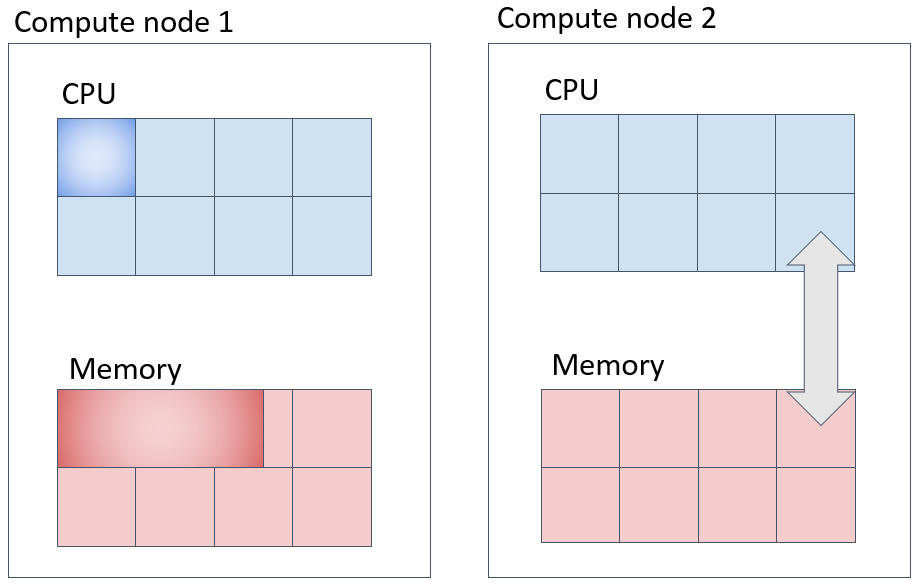
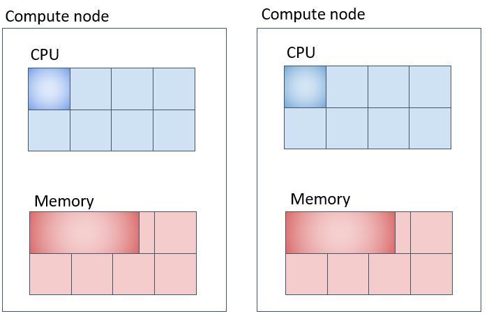
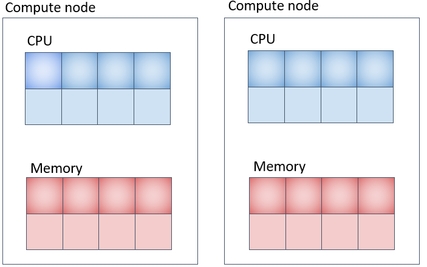

 CPU コアを複数同時に使用し、長時間実行するプログラムを少数実行する場合は、並列ジョブ(parallel job)として実行してください（多数実行する場合は並列ジョブのアレイジョブを使ってください。）。投入コマンドはsbatchコマンドを利用します。

 SlurmにはAGEでのPE(Parallel Environment)に対応する機能はありません。ほぼ同等のコアのわり付け方をすると考えられるオプションの指定の仕方についてご紹介します。
 
 参考情報

 - [Support for MultiCore/Multi-Thread Architecture(開発元の詳細ドキュメント)](https://slurm.schedmd.com/mc_support.html)
 - [CPU Management User and Administrator Guide](https://slurm.schedmd.com/cpu_management.html)


## パラレルジョブの種類（概要） {#types-of-parallel-jobs-overview}

AGEのPEで用意されている環境に沿って、Slurmで、それに対応するコアの割り付け方をほぼ実現する為のSlurmでのオプション群を示します。

|AGEで用意していたPE環境名|PE環境の意味| 同様の資源確保をするために指定するSlurmオプション群(例)|
|-----------------|----------------------------|---------|
|def_slot  |同一計算ノード上にNTASK個のCPUコアを確保する(NTASKが計算ノード上のCPUコアを超えている場合はジョブは開始されない|`-N 1-1 --n NTASK`|
|mpi |複数の計算ノードに渡ってNTASK個のCPUコアを用意する。その際に計算ノードはより分散して計算ノードを使用するようにしてラウンドロビンでタスクを割り当てる| `[-N NODES] -n NTASK --spread-job` |
|mpi-fillup  |複数の計算ノードにわたって NTASK 個の CPU コアを確保する。その際に計算ノードの台数がなるべく少なくなるようコアが確保される。|`[-N NODES] -n NTASK`|
|pe_n  |複数の計算ノードにわたって NTASK_1個の CPU コアを確保する。その際に計算ノード1台あたりNTASK_2個のCPUコアを割り当てる|[-N NODES] `-n NTASK_1 --ntasks-per-node=NTASK_2`|

AGEのPEの場合と異なり、上記のNTASK数で範囲指定はできません。上記のNODESについては範囲指定が可能で、`-N MINNODES-MAXNODES`と最小ノード数と最大ノード数を範囲指定することが可能です。

Slurmの場合は、`-N`で指定するノード数と `--ntasks-per-node`で指定するノード単位で割り当てるタスク数を調整することで並列ジョブを実行することが一般的です。この際に、ノード数とノード単位のタスク数の積が全体のタスク数（並列数）になる点に注意してください。

### 並列ジョブに対して、メモリ要求量を指定する際の注意事項 {#memory-parallel-job}

並列ジョブに対して`--mem`(1ノードあたりでそのジョブに割り当てるメモリ量)、`--mem-per-cpu`(1CPUコアあたりでそのジョブに割り当てるメモリ量)を指定する場合、指定したノード数、またはCPUコア数と指定したメモリ量が掛け合わされた容量のメモリをシステムに要求してジョブが投入されますので、その点に留意してください。

## パラレルジョブの種類（詳細） {#types-of-parallel-jobs-details}

### CPUとメモリ確保の様子 {#cpu-and-memory-alloc}

sbatch、srunコマンド実行時にオプションで明示的にメモリ量を指定しない場合、システム側の設定により、CPUコアあたり8GBのメモリが割り当てられます。（計算機の種類、キューの種類によって異なります。）

例えば、下記のように指定した場合、並列ジョブが使用するメモリ総量として 計算ノード1台上に16×8=128GB を指定したことになります。 その点について注意した上で指定する要求メモリ量を決定してください。

```
-N 1-1 -n 16 --mem-per-cpu 8G 
```


### 並列ジョブ(1)（def_slotに対応) 　同一の計算ノードに指定したコア数を充填して確保する実行方法 {#parallel-job-def-slot-same-node-method}

一台の計算ノード上でNTASK個のコアを取得してジョブを投入する方法は以下のようになります。この際、`--mem-per-cpu`オプションを指定して、1CPUコアあたりのメモリ量を指定すると、CPUコア数とタスク数の積のメモリ量が計算ノード上で確保されるのでご注意ください。


```
#!/bin/bash
#SBATCH -N 1-1 
#SBATCH -n 2　
#SBATCH --mem-per-cpu=20G
#SBATCH -t 0-00:10:00
#SABATCH -J an_example

make -j 2
```


上図の例では、メモリは1タスクあたり20GB、20GB×2コア=40GBが一台の計算機の中に確保されます。

### 並列ジョブ(2) (mpiに対応) 　なるべく別の計算ノード上に指定したコア数を確保する。 {#parallel-job-mpi-core-diff-node-method}
```
#!/bin/bash
#SBATCH -N 2 
#SBATCH -n 8　　
#SBATCH --spread-job
#SBATCH --mem-per-cpu=10G
#SBATCH -t 0-00:10:00
#SABATCH -J an_example

your_program
```



上記の場合、`-N`が確保するノード数、`-n` がジョブ全体のタスク数、`--spread-job`と指定するとなるべくノード間に均等な数のタスクを割り当てようとします。

### 並列ジョブ(3)(mpi-fillupに対応) なるべく同一の計算ノード上に詰めて指定したコア数を確保する。 {#parallel-job-mpi-fillup-same-node-method}

Slurmは、極力計算ノード上に充填してタスクを割り当てていくように設定されています。

```
#!/bin/bash
#SBATCH -N 2
#SBATCH -n 4
#SBATCH -t 0-00:10:00
#SBATCH --mem-per-cpu=20G
#SABATCH -J an_example

your_program
```


Slurmのデフォルト動作として、タスクを計算ノードに充填しながら割り当てていきます。入りきらない場合は、別の計算機にリソースを確保しようとします。上図の例だとメモリは1CPUコア当たり20GB、2台の計算機のうち、どちらか一方の計算機に 3コア×20GB = 60GB、もう1台に1コア × 20GB = 20GB、合計 20GB × 4コア = 80GB 確保されます。

### 並列ジョブ(４) (pe_nに対応) 各計算ノード上に指定したコア数を確保して複数計算ノードを使用する方法 {#parallel-job-pe_n-each-nodes-method}

```js
#!/bin/bash
#SBATCH -N 2
#SBATCH -n 8
#SBATCH -t 0-00:10:00
//highlight-start
#SBATCH --ntasks-per-node=4
#SBATCH --mem-per-cpu=8G
//highlight-end
#SABATCH -J an_example

your program
```



メモリの取られ方は上図の通りだと１CPUコア当たり8GB、各計算機に 4コアx8GB = 32GB ずつ、合計 32GB x 2台 = 64GB 取られます。


### MPIプログラムを実行する場合 {#executing-mpi-programs}

遺伝研スパコンでは、OpenMPIをMPI処理系の実装としてインストールしています。
以下のような形で、OpenMPIのmpirunコマンドを利用してMPIプログラムの実行モジュールを起動してください。mpirunとslurmの組み合わせでは、mpirunコマンドの`-np`等のオプション指定は必要ありません。

```
#!/bin/bash
#SBATCH --job-name mpi-test
#SBATCH -N 1-1
#SBATCH -n 8
#SBATCH -o %x.%J.out

mpirun mpi_test

```

上記のように記述すれば、sbatch側でSlurmに必要計算資源を要求して`-n`オプションで指定された8並列でmpirunでプロセスを起動していくという動作になります。


### OpenMPで記述されたプログラムを実行する場合 {#executing-programs-openmp}

OpenMPを利用したプログラムのバイナリモジュールを実行する際には、ランタイム変数としてOMP_NUM_THREADSを環境変数として指定して
ノード内のスレッド並列実行数を指定することが可能です。以下のような記述でOMP_NUM_THREADSを設定してプログラムを実行してください。

OMP_NUM_THREADS指定を省略することは可能ですが、その場合はデフォルト動作としては環境が認識するCPUコア数全てを利用しようとしてプログラムは動作します。
計算ノードを１台占有してジョブを実行する場合は、OMP_NUM_THREADSを指定しなくても問題ありませんが１台の計算ノードを複数ジョブで共有する場合や、環境に働きかけるオプションが複数指定されていて、どの数値が設定されるかわからない場合は、明示的にOMP_NUM_THREADSを設定することを推奨します。

```js
#!/bin/bash
//highlight-start
#SBATCH -N 1-1
#SBATCH -n 1
#SBATCH -c 10
export OMP_NUM_THREADS=${SLURM_CPUS_PER_TASK}
//highlight-end
./omp_sample
exit $?

```
上記のように指定した場合、以下の意味になります。

- `-N 1-1` ジョブで利用するノード数を指定
- `-n 1`  ジョブで起動するタスク数を指定
- `-c 10` ジョブで使用するCPUコア数を指定。この数が、SLURM_CPUS_PER_TASK環境変数に代入される。

#### 計算ノードを１台占有する場合　 {#occupying-single-compute-node}
```js
#!/bin/bash
//highlight-start
#SBATCH -N 1-1
#SBATCH -n 1
#SBATCH --exclusive
//highlight-end
./omp_sample
exit $?

```

### 並列ジョブで利用するSlurmの環境変数 {#slurm-env-var-for-parallel-jobs}

ジョブの実行時に、以下の環境変数が、起動されたジョブの環境変数に渡されています。これを利用して内部の並列動作を上の例の様に指示します。利用可能な環境変数の詳細については、オンラインマニュアルを参照してください。

[オンラインマニュアルの環境変数の記述](https://slurm.schedmd.com/srun.html#SECTION_OUTPUT-ENVIRONMENT-VARIABLES)

|Slurm環境変数名|変数の説明|
|--------------|---------|
|SLURM_NTASKS | `-n` で指定したタスク数|
|SLURM_CPUS_PER_TASK|`-c`　で指定したCPUコア数|
|SLURM_JOB_ID | ジョブID |
|SLURM_MEM_PER_CPU | `--mem-per-cpu` で設定したメモリ量 |

### 並列ジョブでどの計算ノードが確保されたかを知る方法 {#allocate-one-compute-node}

squeueでジョブが投入されたことを確認します。表示された項目の中でNODESは確保されたノード数、NODELISTがノード名のリストを示します。

```
xxxxx-pg@at022vm02:~$ squeue
             JOBID PARTITION     NAME     USER ST       TIME  NODES NODELIST(REASON)
               642 parabrick  test.sh xxxxx-pg  R       0:23      3 igt[010,015-016]

```
または、pestatコマンドでジョブの計算ノードへの投入状況を確認することが可能です。

```
yxxxx-pg@at022vm02:~/parabricks$ pestat
Hostname       Partition     Node Num_CPU  CPUload  Memsize  Freemem  Joblist
                            State Use/Tot  (15min)     (MB)     (MB)  JobID User ...
igt009            igt009   down*    0  48    0.03    386452   366715   
igt010        parabricks     mix    4  48    0.24*   386462   377973  780 yxxxx-pg  
igt015            igt015    idle    0  48    0.00    386458   380937   
igt016       parabricks*    idle    0  48    0.17    386462   379696   
```


## 個人ゲノム解析区画での並列プログラム実行に関する注意事項 {#note-execute-parallel-programs-personal-genome}

個人ゲノム解析区画で、GPUを搭載した計算ノードを利用していて、搭載したGPUを全て占有してジョブが稼働していても、CPU、メモリが
空いていると、GPUを利用しないジョブが同じ計算ノードに投入される可能性があります。それを防いで占有状態で並列ジョブを動作させたい
場合の実行方法について説明します。

###  MPI並列プログラムを実行する場合  {#executing-mpi-parallel-programs}

```js
#!/bin/bash
//highlight-start
#SBATCH -N 1-1
#SBATCH --exclusive
#SBATCH -n 8
#SBATCH --gres=gpu:4
//highlight-end
#SBATCH -o %x.%J.out
#SBATCH --job-name my_program

mpirun mpi_test
```
以上の指定では、以下をSlurmに対して要求しています。

- `-N 1-1` で、ノードを１台割り当て要求
- `--exclusive` で割り当てられたノードを排他的に割り当てることを要求
- `-n 8`で、ノード内で8並列動作を要求。mpirunはこの数値をMPI並列数として認識する。（並列数は必要に応じて変えてください）

`--exclusive`を指定しても、-nは指定してください。そうでないと並列数が正しく認識されません。
`--exclusive`オプションを指定するとCPUコアは48コア、メモリは192GB割り当てられます。
MPIプログラムとしての並列数は`-n`で指定した8として認識されます。

#### MPIサンプルプログラム（GPUを利用しているプログラムではなく並列数の確認用です） {#mpi-sample-program-for-parallel-check}
```js
#include <mpi.h>
#include <stdio.h>

int main(int argc, char** argv) {
    MPI_Init(NULL, NULL);

    int world_size;
    MPI_Comm_size(MPI_COMM_WORLD, &world_size);

    int world_rank;
    MPI_Comm_rank(MPI_COMM_WORLD, &world_rank);

    char processor_name[MPI_MAX_PROCESSOR_NAME];
    int name_len;
    MPI_Get_processor_name(processor_name, &name_len);

    printf("Hello world from processor %s, rank %d out of %d processors\n",
           processor_name, world_rank, world_size);

    MPI_Finalize();
}
```

上記プログラムを上記のジョブ投入スクリプトで実行した際の、CPUコアの割り当てられ方を以下に示します。

```js
yxxxx-pg@at022vm02:~/mpitest$ pestat
Hostname       Partition     Node Num_CPU  CPUload  Memsize  Freemem  Joblist
                            State Use/Tot  (15min)     (MB)     (MB)  JobID User ...
igt009            igt009   down*    0  48    0.03    386452   366715   
//highlight-next-line
igt010        parabricks   alloc   48  48    0.25*   386462   377564  1663 yxxxx-pg  
igt015            igt015    idle    0  48    0.00    386458   380819   
igt016            igt016    idle    0  48    0.05    386462   379490   
```

上記では、計算ノードigt010上で、`-n`で指定した並列数8ではなく、igt010上で利用可能なCPUコア48コア全てを割り当てられた形で
ジョブが動作していることがわかります。サンプルプログラムの出力結果を以下に示します。

```
Hello world from processor igt010, rank 0 out of 8 processors
Hello world from processor igt010, rank 6 out of 8 processors
Hello world from processor igt010, rank 1 out of 8 processors
Hello world from processor igt010, rank 4 out of 8 processors
Hello world from processor igt010, rank 2 out of 8 processors
Hello world from processor igt010, rank 3 out of 8 processors
Hello world from processor igt010, rank 7 out of 8 processors
Hello world from processor igt010, rank 5 out of 8 processors
```
8並列で実行されていることがわかります。

### OpenMPスレッド並列プログラムを実行する場合 {#openmp-thread-parallel-execution}

計算ノードを１台占有するかたちでOpenMPスレッド並列プログラムを実行する場合は、以下のように指示行を記述してください。

#### ジョブスクリプトでの指定内容 {#openmp-job-script-config}

```js
#!/bin/bash
//highlight-start
#SBATCH -N 1-1
#SBATCH -n 1
#SBATCH --gres=gpu:4
#SBATCH --exclusive
//highlight-end

omp_sample

```

- `-N 1-1` で計算ノード１ノードを指定。
- `-n 1` で１タスクを指定。
- `--exclusive` で計算ノード１台を排他的に利用することを指定。

`--exclusive`を指定すると、物理計算ノード1台上の全コア数(48コア)が環境として認識され、ノードが占有されます。メモリは設定上、192GBが割り当てられます。

#### スレッド並列のサンプルプログラム(GPUを利用しているプログラムではなく並列数の確認用です） {#thread-parallel-sample}

```js
#include <stdio.h>
#include <omp.h>
int main()
{
printf("hello openmp world \n");
//highlight-start
#pragma omp parallel
{
printf("processing thread num= %d \n", omp_get_thread_num());
}
//highlight-end
printf("good by \n");
return 0;
}
```

ラインマークされている部分がスレッド並列で動作します。

#### サンプルプログラムの出力結果(長いので中略部分あり) {#sample-output-results}

```
hello openmp world 
processing thread num= 27 
(中略)
processing thread num= 8 
processing thread num= 47 
processing thread num= 41 
processing thread num= 11 
(中略)
processing thread num= 0 
(中略)
processing thread num= 10 
good by
```


48スレッド並列で実行されていることがわかります。

ノードを占有してかつスレッド並列数を明示的に指定したい場合は、以下のように`-c`を指定して、かつ環境変数`OMP_NUM_THREADS`を設定してください。

#### ジョブスクリプトでの指定内容 {#thread-parallel-job-script-config}

```js
#!/bin/bash
#SBATCH -N 1-1
#SBATCH -n 1
//highlight-start
#SBATCH --exclusive
#SBATCH -c 8
export OMP_NUM_THREADS=${SLURM_CPUS_PER_TASK}
//highlight-end
omp_sample

```

`--exclusive`を指定すると、ジョブが動作する計算ノードのCPUコア全てを割り当られてジョブが動作しています。

```js
yxxxx-pg@at022vm02:~/openmp$ pestat
Hostname       Partition     Node Num_CPU  CPUload  Memsize  Freemem  Joblist
                            State Use/Tot  (15min)     (MB)     (MB)  JobID User ...
igt009            igt009   down*    0  48    0.03    386452   366715   
//highlight-next-line
igt010        parabricks   alloc   48  48    0.10*   386462   377612  1684 yxxxx-pg  
igt015            igt015    idle    0  48    0.00    386458   380808   
igt016            igt016    idle    0  48    0.00    386462   379467   
```

一方スレッド並列プログラムは、`-c`で指定されたコア数で動作します。以下にサンプルプログラムの出力結果を示します。

```
hello openmp world 
processing thread num= 0 
processing thread num= 7 
processing thread num= 6 
processing thread num= 2 
processing thread num= 1 
processing thread num= 5 
processing thread num= 4 
processing thread num= 3 
good by 
```
8並列で動作していることがわかります。


### ジョブ数制限を超えてコアを使いたい場合 {#exceeding_32_jobs_limit}

Slurmマスターデーモン側で何も設定しないと、一人のユーザがジョブをたくさん流した場合すべての計算ノードのすべてのコアを埋めようとすることを避けることは不可能となります。

そこでパーティションあたり一人最大32ジョブだけしか流れない設定にしています。
この状態で例えば128コアを並列で使いたい場合は、並列ジョブを使うことによって実現できます。

実現方法は、下記リンクのFAQをご覧ください。例として、128コアを使用するためのジョブスクリプト例と設定方法を記載しています。

- [Q: 128コアを使用したいと申し込みましたが、実際に使われているのは32コアに見えます。](/guides/FAQ/faq_software/faq_slurm/)

