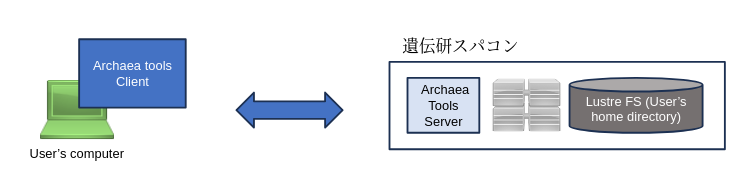

遺伝研スパコンに対してファイルのアップロード、ダウンロードを行うには、一般的に広く用いられているファイル転送ソフトウェアである`scp`や`sftp`をつかうことができますが、これらは遠距離間で大量のファイルを転送する際に転送速度が遅くなる性質があります。

株式会社クレアリンクテクノロジーが開発した
Archaea toolsは遠距離通信の際にも100Gbpsクラスの高速通信が可能です。


参考資料

- 公式マニュアルは、[&#x1f517;Bytix 公式ページ「ドキュメント」のページをご参照ください](https://support.bytix.tech/document/)。
- 最新バージョンは、[&#x1f517;Bytix 公式ページ「ダウンロード【最新版】」のページをご参照ください](https://support.bytix.tech/latest/)。
- [FAQ Archaea tools(旧HCPtools)](/guides/FAQ/faq_software/faq_archaea_tools/)


## 利用手順の概要

Archaea toolsを用いてデータ転送を行うには以下の作業を行ってください。

1. クライアントソフトウェアのインストール
2. 設定ファイルの設置
3. データ転送コマンドの実行


## クライアントソフトウェアのインストール {#install-client-software}

遺伝研スパコンではユーザの計算機とスパコンとの間のデータ転送のためにArchaea toolsを使うことができます。

Archaea toolsを利用するためにはクライアントソフトウェアをクライアント計算機(遺伝研スパコンと通信する計算機。典型的にはユーザのパソコンなど)にインストールする必要があります。



お使いの計算機の環境に応じて以下の文書をご参照ください。(公式ドキュメントのインストール手順の説明)

- [&#x1f517;Mac OS の場合](https://support.bytix.tech/docs/archaea/tools/1.5/B_setup_client/B02_macOS/)
- [&#x1f517;Windows の場合](https://support.bytix.tech/docs/archaea/tools/1.5/B_setup_client/B01_Windows)
- Linux の場合 (Windows の WSL2 環境の場合も含む)
    - [&#x1f517;Ubuntu Linux](https://support.bytix.tech/docs/archaea/tools/1.5/B_setup_client/B04_Ubuntu)
    - [&#x1f517;RedHat Linux 7](https://support.bytix.tech/docs/archaea/tools/1.5/B_setup_client/B03_RHEL)


## 設定ファイルの設置方法 {#setup-configfile}


遺伝研スパコンとのデータの受送信を行うためにはクライアント計算機のホームディレクトリに Archaea tools(旧 HCPtools)の設定ファイルを設置する必要があります。

:::info
公式ドキュメントによる設定ファイルの書き方の説明は以下のリンクにあります。
最新情報は公式ドキュメントをご確認ください。

- https://support.bytix.tech/docs/archaea/tools/1.5/G_configurationRef/G03_conffile_client

:::

設定ファイルがたくさんあり設定が面倒なので、設定を簡略化するために
遺伝研スパコン用の設定ファイルをgithub からクライアント計算機のホームディレクトリに`git clone`により取得してください。
(遺伝研スパコンのホームディレクトリに設定ファイルを置くのではありません。)


Linux (Windows の WSL2 環境の場合も含む)
```
cd $HOME
git clone https://github.com/nig-sc/Bytix_Archaea/ .hcp
```

Mac OS の場合
```
cd $HOME
git clone https://github.com/nig-sc/Bytix_Archaea/ .hcp
```

Windows (PowerShell)の場合
```
cd $HOME
git clone https://github.com/nig-sc/Bytix_Archaea/ _hcp
```

git clone すると以下のファイルが作られます。

```
$ tree .hcp
.hcp
├── README.md
├── hchmod.conf
├── hchown.conf
├── hcp-common.conf
├── hcp-ls.conf
├── hcp.conf
├── hln.conf
├── hmkdir.conf
├── hmv.conf
├── hpwd.conf
├── hrm.conf
└── hsync.conf

1 directory, 12 files
```


次に遺伝研スパコンにログインするときに使う、ユーザの秘密鍵の**絶対パス**を設定ファイル `hcp-common.conf` の中に以下のように書いてください。


`hcp-common.conf` の中身 (Macの場合)
```
PrivateKeyFile /Users/youraccount/.ssh/id_ed25519 # 秘密鍵の絶対パス 
AcceptableCryptMethod   PLAIN                # 暗号化:なし
AcceptableDigestMethod  SHA256               # ダイジェスト方式: SHA256
DisableDataIntegrityChecking yes             # ダイジェスト方式なしを許可
```


`hcp-common.conf` の中身 (Windows PowerShellの場合)
```
PrivateKeyFile C:\Users\youraccount\.ssh/id_ed25519 # 秘密鍵の絶対パス
AcceptableCryptMethod   PLAIN                # 暗号化:なし
AcceptableDigestMethod  SHA256               # ダイジェスト方式: SHA256
DisableDataIntegrityChecking yes             # ダイジェスト方式なしを許可
```

`hcp-common.conf` の中身 (Linuxの場合)
```
PrivateKeyFile /home/youraccount/.ssh/id_ed25519 # 秘密鍵の絶対パス
AcceptableCryptMethod   PLAIN                # 暗号化:なし
AcceptableDigestMethod  SHA256               # ダイジェスト方式: SHA256
DisableDataIntegrityChecking yes             # ダイジェスト方式なしを許可
```


## ファイル転送 {#filetransfer-archaeatools}

### アップロード {#upload}

ユーザの計算機からスパコンにファイルを転送する場合は
ユーザのクライアント計算機でターミナルエミュレータを起動し以下のようにコマンドを実行します。


```
hcp --user youraccountname --hpfp \
   your_file.txt \
   dtn1.ddbj.nig.ac.jp:/home/your_account/
```


### ダウンロード {#download}

スパコンからユーザの計算機にファイルを転送する場合は
ユーザのクライアント計算機でターミナルエミュレータを起動し以下のようにコマンドを実行します。

ユーザの計算機のカレントディレクトリ(下記コマンド中の最後のコンマ`.`で表される)に、スパコンと同じ名前でファイルを転送する場合

```
hcp --user youraccountname --hpfp  \
    dtn1.ddbj.nig.ac.jp:/home/your_account/your_file.txt \
    .
```

スパコン上の特定のディレクトリ全体をユーザの計算機のカレントディレクトリ(下記コマンド中の最後のコンマ`.`で表される)に再帰的にコピーしたい場合は`-R`オプションをつけます。

```
hcp -R --user youraccountname --hpfp  \
    dtn1.ddbj.nig.ac.jp:/home/your_account/data_dir \
    .
```


### 注意 {#note}

初めてデータ転送を行う時に以下のメッセージが表示されます。ここは yes と入力してください。

```
Are you sure you want to continue connecting [yes/no] ?
```


## ファイル転送でよく使うオプション {#options}

オプションの詳細については、[&#x1f517;公式マニュアルのコマンドリファレンス](https://support.bytix.tech/document/)をご参照下さい。


- `--hpfp` : UDP(HpFP2)通信の指定で、遠距離間の通信を高速化します
    - このオプションを省略すると、通常広く用いられている TCP 通信を行います。
- `-p` : 転送元のパーミッションを保持します。
- `-R` : ディレクトリごと再帰的にファイルを転送します。
- `-r` : ファイル転送の再開処理（リジューム）を行う。
    - レジューム機能の詳細については、[公式マニュアルのコマンドリファレンス内の「通信再開機能   r, resume」](https://support.bytix.tech/docs/archaea/tools/1.5/D_commandRef/D01_hcp/#r-resume)をご参照ください。
- `-y` : データの完全性（転送途中でエラーや改ざんがないか）の確認を行います。
- `-z` : 転送時にデータの圧縮を行います。


## その他のコマンド {#other-commands}


| コマンド | 機能                                     |
|----------|------------------------------------------|
| `hrm`    | サーバ上のファイルを削除                 |
| `hcp-ls` | サーバ上のファイル一覧を表示             |
| `hmkdir` | サーバ上にディレクトリ作成               |
| `hpwd`   | サーバ上のワーキングディレクトリ表示     |
| `hmv`    | サーバ上のファイルを移動                 |
| `hlm`    | サーバ上にシンボリックリンク等を作成     |
| `hchmod` | サーバ上のファイルのパーミッションを変更 |
| `hchown` | サーバ上のファイルの所有者を変更         |
| `hsync`  | サーバ上のファイルと同期                 |

詳細については、[&#x1f517;公式マニュアル](https://support.bytix.tech/document/)をご参照下さい。


[def]: https://support.bytix.tech/docs/archaea/tools/1.5/D_commandRef/D01_hcp#r-resume
