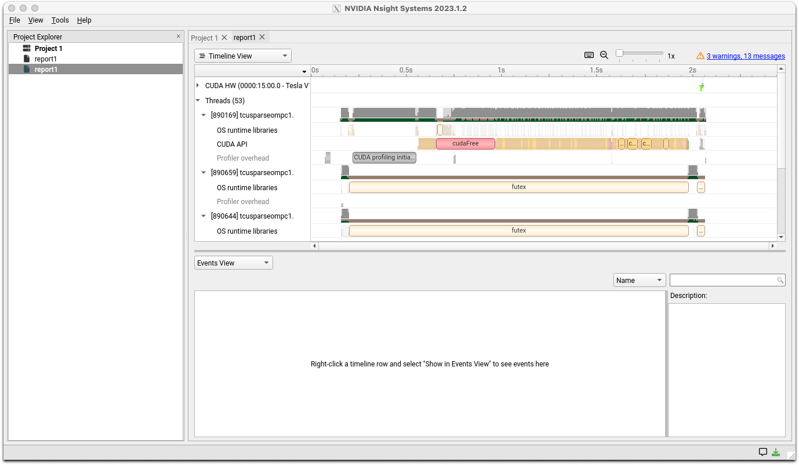

2024年2月現在、遺伝研スパコンシステムではNVIDIA HPC SDK 23.7をシステムに導入しています。旧PGI Compilerは、NVIDIA HPC SDK内のNVIDIA HPC Compilerとして開発が継続されています。

バージョン23.7の各コンポーネントのバージョン等は[23.7 リリースノード](https://docs.nvidia.com/hpc-sdk/archive/23.7/hpc-sdk-release-notes/index.html)を参照してください。制限事項等については[日本語のリリースノート](https://hpcworld.jp/nvsdk_releasenotes/version-23-7/)を参照してください。

NVIDIA HPC SDKの利用を検討した方が良い場合としては、以下が考えられます。

- NVIDIA社製GPUを利用した各種最適化、高速化を図りたい場合。
- NVIDIA社製GPUの利用が前提となった各種オープンソースソフトウェアを最適化も考慮しつつビルドする場合
- OpenACCを利用したソースコードを利用し、GPUオフロードコードを生成したい場合
- 各種CPU(Intel,AMD,Arm,OpenPOWER)向けに最適化されたオブジェクトコードを生成して性能比較したい場合
- NVIDIA社製GPUを利用して高速化が図られたNVIDIAが開発する各種数値計算ライブラリを利用したい場合
- 分散深層学習のライブラリでNCCLを利用したい場合(ソースコードをダウンロードして自分でビルドした方が簡単な場合もあるとは思われる）
- InfiniBandのSHARPを利用したMPI集合通信のハードウェアオフロードが可能なMPIを利用したい場合（大規模MPI並列の場合）
- CUDAを利用したアプリケーション開発、デバッグを行いたい場合

遺伝研スパコンで利用可能なのは以下のコンポーネントです。

***NVIDIA HPC SDKのコンポーネント概要***
|コンポーネント名 |概要 |
|--------------|-----|
|NVIDIA HPC Compiler|(旧)PGIコンパイラ。NVIDIAが現在開発。OpenMP,OpenACCに対応し、CPU(Intel,AMD,Arm,OpenPOWER)、NVIDIA GPUに対応した最適化コードを生成可能|
|MPI |OpenMPIベースでSHARPのハードウェアオフロードに対応したhpc-xとOpenMPIが同梱されている。 |
|CUDA Toolkit|NVIDIA GPU対応のCUDAコンパイラ、ライブラリ、ヘッダファイルなど開発環境一式|
|NSight Systems|CPU,GPUのプロファイラ |
|NSight Compute| CUDAカーネルのプロファイラ。GPU内のハードウェアカウンタを参照した詳細なプロファイリングが可能 |
|NCCL|分散深層学習用のコミュニケーションライブラリ|
|NVSHMEM|OpenSHMEMをマルチGPU、マルチノード対応に拡張したソフトウェア |
|cuBLAS|CUDA上のGPU対応BLAS|
|cuFFT,cuFFTMp|GPU対応のFFT、マルチGPU対応のFFTライブラリ|
|cuRAND|GPU対応の乱数生成ライブラリ|
|cuSOLVER|cuBLASとcuSPARSEをベースにしたCUDA上の線形代数関数のパッケージ|
|cuSPARSE |CUDA上の疎行列計算ライブラリ|
|cuTENSOR,cuTENSORMg|CUDA上でテンソル計算を高速化する為のライブラリ MgはマルチGPU対応|
|NVPL ScalaPack |NVIDIAがエンハンスするScaLAPACK|
|Thrust,CUB,libcu++|CUDA対応C++テンプレートライブラリ群|

また、NVIDIA HPC SDKは、以下のサイトからダウンロード可能です。

- [NVIDIA HPC SDK Download](https://developer.nvidia.com/hpc-sdk-downloads)
- [HPC Worldの解説(例は少し古い)](https://hpcworld.jp/nvidia-hpc-sdk-install/)

お手持ちの計算機で開発、デバッグを行い、大規模計算を遺伝研スパコンで行うといった利用方法も可能と考えます。また、NSight Systemsなどの
GUIを利用するシステムを利用する場合は、解析情報を遺伝研スパコンで取得し、その結果を転送して手元の計算機上のNSight SystemsのGUIで表示すると
いった利用形態をとることも可能です。


## NVIDIA HPC Compiler

遺伝研スパコンでは、NVIDIA HPCコンパイラについてはデフォルトでコンパイラにパスが通っています。パスが通っていることを確認します。

```
which nvc
/opt/pkg/nvidia/hpc_sdk/Linux_x86_64/23.7/compilers/bin/nvc
which nvc++
/opt/pkg/nvidia/hpc_sdk/Linux_x86_64/23.7/compilers/bin/nvc++
which nvfortran 
/opt/pkg/nvidia/hpc_sdk/Linux_x86_64/23.7/compilers/bin/nvfortran
```

### コマンドライン形式 {#command-line-usage}

利用可能なコンパイラは以下になります。

|言語  | コマンド |	コマンドライン |言語規格・機能|
|------|---------|---------|----------|
|C| nvc|nvc [オプション] ファイル名 |ISO/ANSI C11 OpenMP,OpenACCサポート|
|C++|nvc++| nvc++ [オプション] ファイル名 |ISO/ANSI C++17  OpenMP,OpenACCサポート|
|fortran|nvfortran|nvfortran [オプション]　ファイル名 ||


### 利用可能なコンパイラオプション {#available-compiler-options}

汎用的な最適化オプションとしては-fastオプションを指定しておくことがベンダ推奨になっています。また-Minfoオプションはコンパイル時の最適化メッセージを出力する為のオプションで、これも状況を確認する為につけておくことを推奨します。また、プログラム内のグローバル最適化を有効にする為には、Interprocedual Analysisの機能を有効にします。
以上を纏めると、ベンダにより推奨されるオプション指定は以下のようになります。

```
nvc -fast -Mipa=fast,inline -Minfo test.c (Cコンパイラ)
nvc++ -fast -Mipa=fast,inline -Minfo test.cpp (C++コンパイラ)
```

プログラムによっては、さらにオプションを調整すると性能が向上する場合もありますが、専門的かつ大部な話題になりますのでここでは説明を省略します。詳細については[開発元のドキュメント](https://docs.nvidia.com/hpc-sdk/archive/23.7/compilers/hpc-compilers-user-guide/index.html#cmdln-options-use)をご参照ください。

- [HPC SDK Documentation](https://docs.nvidia.com/hpc-sdk/archive/23.7/compilers/hpc-compilers-user-guide/index.html)

その他、よく利用される主なオプションについては以下のようになります。（下記は基本的に出典外部サイトの意訳です。用語等についても参照をお願いします。）

- [出典外部サイト](https://docs.nvidia.com/hpc-sdk/archive/23.7/compilers/hpc-compilers-user-guide/index.html#freq-used-options)

|オプション |  機能 |
|----------|-------|
|-⁠acc	| OpenACC ディレクティブを使用して並列化を有効にします。|
|-⁠fast	|SIMD 機能をサポートするターゲットに対して一般的に最適なフラグのセットを作成します。ベクトルストリーミング SIMD 命令、キャッシュ・アライメント、flushz を使用できるようにする最適化オプションが組み込まれています。|
|-⁠g | オブジェクト・モジュールにシンボリック・デバッグ情報を含めるようコンパイラに指示します。コマンドラインに-Oオプションがない限り、最適化レベルをゼロに設定します。逆に、[DWARF](https://ja.wikipedia.org/wiki/DWARF)情報を生成しないようにするには、-Mnodwarfオプションを使用します。|
|-⁠gpu | コードが生成されるGPUの種類、対象となるCUDAのバージョン、その他GPUコード生成のいくつかの側面を制御します。|
|-⁠help|利用可能なオプションの情報を提供します。|
|-⁠mcmodel=medium|64ビットターゲット用のコード生成を有効にし、プログラムのデータ容量が4GBを超える場合に有効です。|
|-⁠mp|OpenMPディレクティブを使用した並列化を有効にします。-mp=gpuはNVIDIA GPUを利用してOpenMP領域をオフロードする為に利用します。|
|-⁠Mconcur|ループの自動並列化を有効にするようコンパイラに指示します。指定された場合、コンパイラは並列化可能であると判断したループを複数のCPUコアを使用して実行するため、ループの反復はマルチスレッド実行コンテキストで最適に実行されるように分割されます。|
|-⁠Minfo|標準エラーに情報を出力するようコンパイラに指示します。|
|-⁠Minline | 関数のインライン化を可能にします。|
|-⁠Mipa=fast,inline| プロシージャ間のグローバル解析と最適化を可能にします。|
|-⁠Munroll | ループアンローラーを起動してループを展開し、各反復の間にループの複数のインスタンスを実行します。また、最適化レベルが 2 未満に設定されている場合、または -O や -g オプションが指定されていない場合、最適化レベルが 2 に設定されます。|
|-⁠o|出力する実行可能ファイル名を指定します。|
|-⁠O level | コード最適化レベルを指定します。levelは0、1、2、3、4です。|


### OpenMPの利用 {#using-openmp}

NVIDIA HPC CompilerではOpenMPが利用可能です。OpenMP4.0以降ではCPU以外へのオフロードにも対応しGPU、FPGAなどのアクセラレータ用の汎用並列規格にもなっています。現在OpenMPはIntel、AMD、NVIDIAがサポートしておりベンダ間での汎用的な並列規格になっています。
使用方法詳細については以下のサイトを参照してください。

- [HPC SDK Documentation Using OpenMP](https://docs.nvidia.com/hpc-sdk/archive/23.7/compilers/hpc-compilers-user-guide/index.html#openmp-use)

- [The OpenMP Specification(OpenMP Organizationのサイト)](https://www.openmp.org/)


### OpenACCの利用 {#using-openacc}

NVIDIA HPC Compilerでは、OpenACCが利用可能です。使用方法については以下のサイトをご参照ください。

- [OpenACC Getting Started(NVIDIA)(利用方法についての概説があります)](https://docs.nvidia.com/hpc-sdk/archive/23.7/compilers/openacc-gs/index.html)

OpenACC organizationにより仕様が策定されており、オープンな仕様になっています。かつてPGIがOpenACC organizationの主要なメンバとして仕様策定を行っていました。以下の外部サイトが参考になります。

- [OpenACC Organization ](https://www.openacc.org/)

- [OpenACC Programming and Best Practices Guide](https://openacc-best-practices-guide.readthedocs.io/en/latest/)


Intel/AMD/NVIDIAのGPU間でのポータビリティを重視する場合OpenMPが利用される傾向があるようです。しかしNVIDIA GPU向けであれば、NVIDIAがOpenACCのサポートにより積極的ではあるため、OpenMPよりOpenACCのほうがより高性能のコードを生成できる傾向があるようです。

## MPIの利用 {#using-mpi}
NVIDIA HPC-SDK23.7では、以下の2つのMPI処理系がインストールされています。

- HPC-X
- OpenMPI 4.1.5

HPC-Xは、NVIDIAがOpenMPIをベースにして一部の集団通信をハードウェアオフロードできるようにしたものです。HPC-XはNVIDIAによってHPC-SDKに同梱されているソフトウェアの前提MPI処理系に指定されている場合があります。遺伝研スパコンでのインストール位置は以下の場所になります。

|MPI処理系|インストールディレクトリ|
|--------|--------------------|
|HPC-X|/opt/pkg/nvidia/hpc_sdk/Linux_x86_64/23.7/comm_libs/12.2/hpcx/hpcx-2.15|
|OpenMPI 4.1.5|/opt/pkg/nvidia/hpc_sdk/Linux_x86_64/23.7/comm_libs/12.2/openmpi4/openmpi-4.1.5|

ただし、システム側で設定したデフォルトのパスでは他のMPI実装(Intel MPI)にパスが通っている為、利用したい場合は、
以下のようにしてください。

HPC-Xを利用したい場合は、以下のようにhpcx-init.shを読み込んだ後に、hpc_loadを入力してください。
```js
$ which mpirun
/lustre7/software/intel_ubuntu/oneapi/mpi/2021.11/bin/mpirun
//highlight-start
$ . /opt/pkg/nvidia/hpc_sdk/Linux_x86_64/23.7/comm_libs/12.2/hpcx/hpcx-2.15/hpcx-init.sh 
$ hpcx_load
//highlight-end
$ which mpirun
/opt/pkg/nvidia/hpc_sdk/Linux_x86_64/23.7/comm_libs/12.2/hpcx/hpcx-2.15/ompi/bin/mpirun
$ env |grep HPC
HPCX_HCOLL_DIR=/opt/pkg/nvidia/hpc_sdk/Linux_x86_64/23.7/comm_libs/12.2/hpcx/hpcx-2.15/hcoll
HPCX_CLUSTERKIT_DIR=/opt/pkg/nvidia/hpc_sdk/Linux_x86_64/23.7/comm_libs/12.2/hpcx/hpcx-2.15/clusterkit
HPCX_OSU_CUDA_DIR=/opt/pkg/nvidia/hpc_sdk/Linux_x86_64/23.7/comm_libs/12.2/hpcx/hpcx-2.15/ompi/tests/osu-micro-benchmarks-5.8-cuda
HPCX_OSU_DIR=/opt/pkg/nvidia/hpc_sdk/Linux_x86_64/23.7/comm_libs/12.2/hpcx/hpcx-2.15/ompi/tests/osu-micro-benchmarks-5.8
HPCX_MPI_DIR=/opt/pkg/nvidia/hpc_sdk/Linux_x86_64/23.7/comm_libs/12.2/hpcx/hpcx-2.15/ompi
HPCX_OSHMEM_DIR=/opt/pkg/nvidia/hpc_sdk/Linux_x86_64/23.7/comm_libs/12.2/hpcx/hpcx-2.15/ompi
HPCX_UCC_DIR=/opt/pkg/nvidia/hpc_sdk/Linux_x86_64/23.7/comm_libs/12.2/hpcx/hpcx-2.15/ucc
HPCX_UCX_DIR=/opt/pkg/nvidia/hpc_sdk/Linux_x86_64/23.7/comm_libs/12.2/hpcx/hpcx-2.15/ucx
HPCX_IPM_DIR=/opt/pkg/nvidia/hpc_sdk/Linux_x86_64/23.7/comm_libs/12.2/hpcx/hpcx-2.15/ompi/tests/ipm-2.0.6
HPCX_SHARP_DIR=/opt/pkg/nvidia/hpc_sdk/Linux_x86_64/23.7/comm_libs/12.2/hpcx/hpcx-2.15/sharp
HPCX_IPM_LIB=/opt/pkg/nvidia/hpc_sdk/Linux_x86_64/23.7/comm_libs/12.2/hpcx/hpcx-2.15/ompi/tests/ipm-2.0.6/lib/libipm.so
HPCX_DIR=/opt/pkg/nvidia/hpc_sdk/Linux_x86_64/23.7/comm_libs/12.2/hpcx/hpcx-2.15
HPCX_NCCL_RDMA_SHARP_PLUGIN_DIR=/opt/pkg/nvidia/hpc_sdk/Linux_x86_64/23.7/comm_libs/12.2/hpcx/hpcx-2.15/nccl_rdma_sharp_plugin
HPCX_MPI_TESTS_DIR=/opt/pkg/nvidia/hpc_sdk/Linux_x86_64/23.7/comm_libs/12.2/hpcx/hpcx-2.15/ompi/tests
```

元に戻したい場合は、hpcx_unloadを入力してください。HPC-X用の環境設定が解除されます。

```
$ hpcx_unload
$ env |grep HPCX
$ which mpirun
/lustre7/software/intel_ubuntu/oneapi/mpi/2021.11/bin/mpirun
```
呼び出していた、mpirunがIntelのパスに戻ります。

OpenMPI 4.1.5の場合

PATHにCompiler Wrapperのパスを以下のように加え、MPIプログラムのコンパイルを実施してください。

```
export PATH=/opt/pkg/nvidia/hpc_sdk/Linux_x86_64/23.7/comm_libs/12.2/openmpi4/openmpi-4.1.5/bin:$PATH
mpicc ソースコードファイル -o オブジェクトファイル
```
また、LD_LIBRARY_PATHに以下を加えてください。

```
/opt/pkg/nvidia/hpc_sdk/Linux_x86_64/23.7/comm_libs/12.2/openmpi4/openmpi-4.1.5/lib
```


参考　[using MPI(NVIDIA SDK Documantation)](https://docs.nvidia.com/hpc-sdk/archive/23.7/compilers/hpc-compilers-user-guide/index.html#mpi-use)

## CUDAの利用 {#using-cuda}

CUDAはNVIDIAが開発するNVIDIA GPU用の並列プログラミングモデルです。OpenMP/OpenACCよりさらに低レイヤーでのGPUプログラミングを行うことが可能で、計算性能を重視するプログラマ向けのプログラミングモデルになります。NVIDIA HPC CompilerではCUDAコンパイラドライバnvccが同梱されています。

|言語  | コマンド |	コマンドライン |言語規格・機能|
|------|---------|---------|----------|
|NVCC|nvcc|nvcc [オプション] ファイル名|CUDA C/C++ Compiler driver|

### 遺伝研スパコンでのCUDA関連の環境について {#env-related-cuda}

|コンポーネント|バージョン|備考|
|-------------|---------|----|
|CUDA Driver |12.1 ||
|nvccコンパイラ|V12.2.91、V12.1.66|

遺伝研スパコンではnvccコンパイラについては、事情によりOS付属のnvcc、CUDA付属のnvcc、HPC-SDK付属のnvccがインストールされていますので
ご注意ください。nvccのインストール場所は以下になります。

HPC-SDKに付属のnvccコンパイラドライバ

```
/opt/pkg/nvidia/hpc_sdk/Linux_x86_64/23.7/cuda/12.2/bin/nvcc --version
nvcc: NVIDIA (R) Cuda compiler driver
Copyright (c) 2005-2023 NVIDIA Corporation
Built on Tue_Jun_13_19:16:58_PDT_2023
Cuda compilation tools, release 12.2, V12.2.91
Build cuda_12.2.r12.2/compiler.32965470_0
```
CUDA12.1に付属のnvccコンパイラドライバ

```
/usr/local/cuda-12.1/bin/nvcc --version
nvcc: NVIDIA (R) Cuda compiler driver
Copyright (c) 2005-2023 NVIDIA Corporation
Built on Tue_Feb__7_19:32:13_PST_2023
Cuda compilation tools, release 12.1, V12.1.66
Build cuda_12.1.r12.1/compiler.32415258_0
```
ubuntu22.04のOSパッケージ内のnvccコンパイラドライバ

```
/usr/bin/nvcc --version
nvcc: NVIDIA (R) Cuda compiler driver
Copyright (c) 2005-2021 NVIDIA Corporation
Built on Thu_Nov_18_09:45:30_PST_2021
Cuda compilation tools, release 11.5, V11.5.119
Build cuda_11.5.r11.5/compiler.30672275_0
```

基本的にはCUDA付属のnvccを利用してください。何らかエラーが発生する場合は、HPC-SDK付属のnvccを利用して
切り分けてください。OS付属のものは導入しているCUDAドライバとバージョンが合わない為、利用しないでください。
また、cmakeなどのmakeの生成ツールを使用する場合、OSデフォルトの設定を参照してしまっている場合があります。指定したつもりが
ないのに、Ver11.5との整合性エラーが出る場合は、OS付属のnvccが参照されてしまっていることを疑って、明示的に他の
nvcc環境が参照されるようにcmakeのオプションを立てて指定してください。

環境変数としてCUDA_HOME（ソフトウェアによってはdeprecatedと表示される場合があります）、NVHPC_CUDA_HOMEを
指定する必要がある場合は、下記を指定してください。

```
/usr/local/cuda-12.1
```

現状、NVIDIA HPC-SDK付属のnvccにパスが通っている為、必要な場合、ドライバ付属のnvccに切り替えてください。

```
$ which nvcc
/opt/pkg/nvidia/hpc_sdk/Linux_x86_64/23.7/compilers/bin/nvcc
export PATH=/usr/local/cuda-12.1/bin:$PATH
which nvcc
/usr/local/cuda-12.1/bin/nvcc
```
また、LD_LIBRARY_PATHに以下のパスが入っているかを確認します。

```
/usr/local/cuda-12.1/lib64
```
入っていない場合は、以下の手順で追加してください。
```
export LD_LIBRARY_PATH=/usr/local/cuda-12.1/lib64:$LD_LIBRARY_PATH
```

nvccでのコンパイル方法含めての情報については以下のNVIDIAのサイトを参照してください。

[NVIDIA CUDA Compiler Driver NVCC](https://docs.nvidia.com/cuda/cuda-compiler-driver-nvcc/index.html)

### CUDAプログラミング情報について {#cuda-programming-info}

以下のNVIDIAのサイトの情報を参照してください。ここでは詳細は省略します。

[CUDA C Programming Guide (NVIDIA)](https://docs.nvidia.com/cuda/cuda-c-programming-guide/index.html)


## NVIDIA Nsight Systems

NVIDIA Nsight Systemsはプロファイラです。CPU/GPUの利用率、メモリ使用量、データ転送量等で、プログラムの性能評価を行う際に利用します。

[NVIDIA社のドキュメントサイト](https://docs.nvidia.com/nsight-systems/index.html)
[NVIDIA社のユーザガイド](https://docs.nvidia.com/nsight-systems/UserGuide/index.html#gpu-metric-sampling)

基本的な利用方法としては、まず、遺伝研スパコン上でバッチジョブとしてプロファイルを取り、そのプロファイル情報をインタラクティブノード上で評価するという形になります。

### プロファイルの取得 {#capturing-a-profile}

まずスパコン上でプロファイルを取得します。基本的なコマンドラインは以下のようになります。ジョブスクリプトとしての指示行の書き方はジョブスケジューラの項を参照してください。

- シリアルジョブの場合
```
nsys profile your_program [アプリケーションのオプション]
```
- パラレルジョブの場合

また、並列のMPIプログラムの場合は以下のようになります。
```
nsys profile -o result mpirun [mpi option] mpi_program
```
nsys profileが対象プログラムのトレースをとることを指示するコマンドになります。MPIの場合、上記のように指定することで
各プロセスの解析結果を一つのファイルにまとめることができます。

### プロファイルの確認 {#review-profile}

取得したプロファイルデータを参照するには、nsys(CLI)、nsys-ui(GUI)を用いて分析します。

### CLIでの確認 {#check-with-cli}

以下のコマンドで確認します。

```
nsys stats レポートファイル名
```

### GUIでの確認 {#check-with-gui}

ここではスパコン内でnsys-uiを利用して、手元のPCに画面転送を行う方法について記述します。
sshのXフォワード機能を利用します。また手元のPCでは、X-Window SystemまたはXサーバエミュレータが動作しているものとします。
また、インタラクティブノードとしてはGPUを搭載しているインタラクティブノードを使用してください。

`ssh -CX`を利用してX11フォワーディングを有効にしてゲートウェイノードにログインします。
```
yxxxxkat@yxxxxkat bin % ssh -l yxxxx -CX gw.ddbj.nig.ac.jp
Enter passphrase for key '/Users/yxxxxkat/.ssh/id_rsa': 
Last login: Thu Feb 29 23:00:10 2024 from 27.82.201.175
---------------------------------------------------------------------
Thank you for using NIG supercomputer system.
This is the gateway node, do not run program here.
Please use 'qlogin' to login to a interactive node.
---------------------------------------------------------------------
(base) yxxxx@gw1:~$ 
```
DISPLAY変数の設定状況を確認します。
```
(base) yxxxx@gw1:~$ env |grep DISPLAY
DISPLAY=localhost:12.0
```
次に別ターミナルを開いて、ゲートウェイノードにログインし、qloginでインタラクティブノードにログインします。
ログインしたインタラクティブノードのホスト名を確認し、先ほどのターミナルから、以下のコマンドを投入します。
```
yxxxx@gw1:~$ ssh -CX 確認したインタラクティブノード名
```
`ssh -CX`でログインしたターミナルはそのままにしておきます。このターミナルは閉じないでください。閉じると
X11のフォワーディングができなくなります。

先ほど、qloginでログインしたターミナルで、nsys-uiを起動します。
```
(base) yxxxx@at137:~$ nsys-ui
OpenGL version is too low (0). Falling back to Mesa software rendering.
OpenGL version: "3.1 Mesa 18.1.9 (git-f57f37f3ba)"
```
NSight Systemsのロゴ画面が表示され、次に以下の画面が表示されます。


メニューのFile>Openで生成されたレポートファイルを開いてください。以下のような画面が表示されます。



詳細な分析方法についてはドキュメントサイトのユーザガイドを参照してください。

## NVIDIA Nsight Compute

NVIDIAが提供するCUDAカーネルのプロファイラツールです。

- [Nsight Computeのドキュメンテーションサイト](https://docs.nvidia.com/nsight-compute/2022.3/index.html)
- [Nsight Computeのクイックスタートガイド](https://docs.nvidia.com/nsight-compute/NsightCompute/index.html#quick-start)

またシステムの以下のディレクトリの下にドキュメント（PDF形式）がありますので参照してください。

```
/opt/pkg/nvidia/hpc_sdk/Linux_x86_64/23.7/profilers/Nsight_Compute/docs/pdf
@at137:/opt/pkg/nvidia/hpc_sdk/Linux_x86_64/23.7/profilers/Nsight_Compute/docs/pdf$ ls
Archives.pdf              CustomizationGuide.pdf  NsightComputeCli.pdf  ReleaseNotes.pdf
CopyrightAndLicenses.pdf  NsightCompute.pdf       ProfilingGuide.pdf    Training.pdf

```

CLIとGUIのツールがあります。GUI版はX11ベースのGUIのソフトウェアなので、遺伝研スパコンで利用する場合`ssh -X`でのXポートフォワーディングの
設定がNsight Systems同様に必要です。
ポートフォワードの設定手順についてはNsightSystemsと同様なのでそちらを参照してください。CUDAのプロファイリングツールなので、GPUを
搭載したインタラクティブノード上で起動する必要があります。

遺伝研スパコンでは、解析の為のプロファイルはCLIで取得し、結果確認についてはGUIでという使用方法を想定して説明します。

### 解析情報の取得 {#capture-analysis-info}

以下のコマンドラインをジョブスクリプトに記述して計算ノード上で実行します。ジョブスクリプトの指示行部分については、ジョブスケジューラの
解説を参考にしてください。

```
ncu -o profile your_program
```
実行時に以下のようなメッセージがジョブの標準出力に出力されます。（あくまで例です）
```
[Vector addition of xxxxxx elements]
==PROF== Connected to process xxxxx
Copy input data from the host memory to the CUDA device
CUDA kernel launch A with 4471 blocks of 256 threads
==PROF== Profiling "vectorAdd_A" - 0: 0%....50%....100% - 46 passes
CUDA kernel launch B with 4471 blocks of 256 threads
==PROF== Profiling "vectorAdd_B" - 1: 0%....50%....100% - 46 passes
Copy output data from the CUDA device to the host memory
Done
==PROF== Disconnected from process xxxxx
==PROF== Report: profile.ncu-rep
```
ジョブの指示行での指定に依存しますがジョブを起動したCWDに、profile.ncu-repというファイルが出力されます。

また、上記の ncuコマンドでは、基本的な情報しか取得を指示していません。より詳細な情報が取得することを指示したい場合は
[ドキュメント中のProfileing Guide](https://docs.nvidia.com/nsight-compute/ProfilingGuide/index.html#sets-and-sections)を
参照してください。取得情報を多くすればその分オーバーヘッドも大きくなりますのでそこは試行錯誤してください。

### 解析結果の表示 {#display-analysis-result}
ここでは、出力されたレポートファイルをGUIで表示させる手順を示します。
ユーザの端末にXをフォワードさせる為のポートフォワード設定（nsight systemsの手順と同じ）後に、以下のコマンドで起動します。
```
ncu-ui
```
ロゴが表示された後、以下の画面が表示されます。


メニューのFile>Openで、先ほどのレポートファイルをオープンしてください。以下のような画面が表示されます。


## NCCL（NVIDIA Collective Communication Library)
NCCLはNVIDIA GPU、RDMAネットワーク用のマルチGPU、マルチノード用コミュニケーションライブラリです。

- [NVIDIAのNCCLのドキュメントサイト](https://docs.nvidia.com/deeplearning/nccl/user-guide/docs/index.html)

遺伝研スパコンで利用する場合は、LD_LIBRARY_PATHに以下が含まれていることを確認してください。

```
/opt/pkg/nvidia/hpc_sdk/Linux_x86_64/23.7/comm_libs/nccl/lib
/usr/local/cuda-12.1/lib64
```
NCCLの動作確認として、nccl-testsのビルド手順と実行結果を示します。

- [NCCL-tests](https://github.com/nvidia/nccl-tests)

**ビルドログ**
```
(base) yxxxx@igt003:~/NCCL/nccl-tests$ make MPI=1 MPI_HOME=/lustre7/software/intel_ubuntu/oneapi/mpi CUDA_HOME=/usr/local/cuda-12.1/ NCCL_HOME=/opt/pkg/nvidia/hpc_sdk/Linux_x86_64/23.7/comm_libs/nccl
make -C src build BUILDDIR=/lustre7/home/yxxxx/NCCL/nccl-tests/build
make[1]: Entering directory '/lustre7/home/yxxxx/NCCL/nccl-tests/src'
Compiling  timer.cc                            > /lustre7/home/yxxxx/NCCL/nccl-tests/build/timer.o
Compiling /lustre7/home/yxxxx/NCCL/nccl-tests/build/verifiable/verifiable.o
Compiling  all_reduce.cu                       > /lustre7/home/yxxxx/NCCL/nccl-tests/build/all_reduce.o
Compiling  common.cu                           > /lustre7/home/yxxxx/NCCL/nccl-tests/build/common.o
Linking  /lustre7/home/yxxxx/NCCL/nccl-tests/build/all_reduce.o > /lustre7/home/yxxxx/NCCL/nccl-tests/build/all_reduce_perf
Compiling  all_gather.cu                       > /lustre7/home/yxxxx/NCCL/nccl-tests/build/all_gather.o
Linking  /lustre7/home/yxxxx/NCCL/nccl-tests/build/all_gather.o > /lustre7/home/yxxxx/NCCL/nccl-tests/build/all_gather_perf
Compiling  broadcast.cu                        > /lustre7/home/yxxxx/NCCL/nccl-tests/build/broadcast.o
Linking  /lustre7/home/yxxxx/NCCL/nccl-tests/build/broadcast.o > /lustre7/home/yxxxx/NCCL/nccl-tests/build/broadcast_perf
Compiling  reduce_scatter.cu                   > /lustre7/home/yxxxx/NCCL/nccl-tests/build/reduce_scatter.o
Linking  /lustre7/home/yxxxx/NCCL/nccl-tests/build/reduce_scatter.o > /lustre7/home/yxxxx/NCCL/nccl-tests/build/reduce_scatter_perf
Compiling  reduce.cu                           > /lustre7/home/yxxxx/NCCL/nccl-tests/build/reduce.o
Linking  /lustre7/home/yxxxx/NCCL/nccl-tests/build/reduce.o > /lustre7/home/yxxxx/NCCL/nccl-tests/build/reduce_perf
Compiling  alltoall.cu                         > /lustre7/home/yxxxx/NCCL/nccl-tests/build/alltoall.o
Linking  /lustre7/home/yxxxx/NCCL/nccl-tests/build/alltoall.o > /lustre7/home/yxxxx/NCCL/nccl-tests/build/alltoall_perf
Compiling  scatter.cu                          > /lustre7/home/yxxxx/NCCL/nccl-tests/build/scatter.o
Linking  /lustre7/home/yxxxx/NCCL/nccl-tests/build/scatter.o > /lustre7/home/yxxxx/NCCL/nccl-tests/build/scatter_perf
Compiling  gather.cu                           > /lustre7/home/yxxxx/NCCL/nccl-tests/build/gather.o
Linking  /lustre7/home/yxxxx/NCCL/nccl-tests/build/gather.o > /lustre7/home/yxxxx/NCCL/nccl-tests/build/gather_perf
Compiling  sendrecv.cu                         > /lustre7/home/yxxxx/NCCL/nccl-tests/build/sendrecv.o
Linking  /lustre7/home/yxxxx/NCCL/nccl-tests/build/sendrecv.o > /lustre7/home/yxxxx/NCCL/nccl-tests/build/sendrecv_perf
Compiling  hypercube.cu                        > /lustre7/home/yxxxx/NCCL/nccl-tests/build/hypercube.o
Linking  /lustre7/home/yxxxx/NCCL/nccl-tests/build/hypercube.o > /lustre7/home/yxxxx/NCCL/nccl-tests/build/hypercube_perf
make[1]: Leaving directory '/lustre7/home/yxxxx/NCCL/nccl-tests/src'

```
**ビルドしたモジュール群**

```
all_gather_perf  alltoall_perf   gather_perf     reduce_perf sendrecv_perf  verifiable
all_reduce_perf  broadcast_perf  hypercube_perf  reduce_scatter_perf  scatter_perf  timer.o

```
**ジョブスクリプト**

```
#!/bin/bash
#$ -cwd
#$ -V
#$ -l gpu 
#$ -l cuda=2 
#$ -l d_rt=192:00:00
#$ -l s_rt=192:00:00
#$ -l s_vmem=20G
#$ -pe mpi 2
#$ -l mem_req=20G
#$ -N example
export LD_LIBRARY_PATH=/opt/pkg/nvidia/hpc_sdk/Linux_x86_64/23.7/comm_libs/nccl/lib:$LD_LIBRARY_PATH
mpirun ./alltoall_perf -b 2 -e 128M -f 2 -g 2
```
**実行結果**

```
# nThread 1 nGpus 2 minBytes 2 maxBytes 134217728 step: 2(factor) warmup iters: 5 iters: 20 agg iters: 1 validation: 1 graph: 0
#
# Using devices
#  Rank  0 Group  0 Pid 3020421 on     igt002 device  0 [0x15] Tesla V100-SXM2-16GB
#  Rank  1 Group  0 Pid 3020421 on     igt002 device  1 [0x16] Tesla V100-SXM2-16GB
#  Rank  2 Group  0 Pid 1788088 on     igt007 device  0 [0x15] Tesla V100-SXM2-16GB
#  Rank  3 Group  0 Pid 1788088 on     igt007 device  1 [0x16] Tesla V100-SXM2-16GB
#
#                                                              out-of-place                       in-place          
#       size         count      type   redop    root     time   algbw   busbw #wrong     time   algbw   busbw #wrong
#        (B)    (elements)                               (us)  (GB/s)  (GB/s)            (us)  (GB/s)  (GB/s)       
           0             0     float    none      -1    24.28    0.00    0.00      0    18.51    0.00    0.00    N/A
           0             0     float    none      -1    18.34    0.00    0.00      0    18.00    0.00    0.00    N/A
           0             0     float    none      -1    17.82    0.00    0.00      0    18.03    0.00    0.00    N/A
          16             1     float    none      -1    24.52    0.00    0.00      0    24.88    0.00    0.00    N/A
          32             2     float    none      -1    24.66    0.00    0.00      0    24.57    0.00    0.00    N/A
          64             4     float    none      -1    24.31    0.00    0.00      0    24.26    0.00    0.00    N/A
         128             8     float    none      -1    24.60    0.01    0.00      0    24.38    0.01    0.00    N/A
         256            16     float    none      -1    24.36    0.01    0.01      0    24.53    0.01    0.01    N/A
         512            32     float    none      -1    24.57    0.02    0.02      0    24.52    0.02    0.02    N/A
        1024            64     float    none      -1    24.48    0.04    0.03      0    24.54    0.04    0.03    N/A
        2048           128     float    none      -1    24.82    0.08    0.06      0    24.72    0.08    0.06    N/A
        4096           256     float    none      -1    25.48    0.16    0.12      0    24.85    0.16    0.12    N/A
        8192           512     float    none      -1    25.51    0.32    0.24      0    25.48    0.32    0.24    N/A
       16384          1024     float    none      -1    27.51    0.60    0.45      0    27.11    0.60    0.45    N/A
       32768          2048     float    none      -1    30.91    1.06    0.80      0    30.95    1.06    0.79    N/A
       65536          4096     float    none      -1    41.02    1.60    1.20      0    39.79    1.65    1.24    N/A
      131072          8192     float    none      -1    54.38    2.41    1.81      0    53.40    2.45    1.84    N/A
      262144         16384     float    none      -1    82.42    3.18    2.39      0    82.07    3.19    2.40    N/A
      524288         32768     float    none      -1    107.4    4.88    3.66      0    106.5    4.92    3.69    N/A
     1048576         65536     float    none      -1    209.0    5.02    3.76      0    189.6    5.53    4.15    N/A
     2097152        131072     float    none      -1    302.5    6.93    5.20      0    298.7    7.02    5.27    N/A
     4194304        262144     float    none      -1    548.3    7.65    5.74      0    528.9    7.93    5.95    N/A
     8388608        524288     float    none      -1   1143.2    7.34    5.50      0   1118.5    7.50    5.63    N/A
    16777216       1048576     float    none      -1   1993.1    8.42    6.31      0   2178.2    7.70    5.78    N/A
    33554432       2097152     float    none      -1   4842.1    6.93    5.20      0   4511.3    7.44    5.58    N/A
    67108864       4194304     float    none      -1   8972.2    7.48    5.61      0   9271.3    7.24    5.43    N/A
   134217728       8388608     float    none      -1    17761    7.56    5.67      0    17276    7.77    5.83    N/A
# Out of bounds values : 0 OK
# Avg bus bandwidth    : 2.00499 
```

## NVSHMEM（NVIDIA OpenSHMEM Library)

NVIDIAが提供するGPU間のデータ共有をCUDAをベースにして効率的に行うAPIです。
OpenSHEMEMをGPUクラスタ対応として拡張実装されています。複数のGPUを使用して並列計算を
行う際に利用されます。

- [NVIDIAのドキュメントサイト](https://docs.nvidia.com/nvshmem/api/index.html)

動作前提のCUDAバージョン(12.2以上)の不整合があるため、現状動作確認できていません。
nvshmemのexampleをビルドする際のログを示します。

```js
(base) ymuna@igt001:~/nvshmem/examples/build$ cmake -DCMAKE_C_COMPILER=nvc -DCMAKE_CXX_COMPILER=nvc++ -DNVSHMEM_DIR=/opt/pkg/nvidia/hpc_sdk/Linux_x86_64/23.7/comm_libs/12.2/nvshmem/lib/cmake/nvshmem/ ..
-- CUDA_HOME: /usr/local/cuda
-- The CUDA compiler identification is NVIDIA 12.1.66
-- The CXX compiler identification is NVHPC 23.7.0
-- Detecting CUDA compiler ABI info
-- Detecting CUDA compiler ABI info - done
-- Check for working CUDA compiler: /usr/local/cuda/bin/nvcc - skipped
-- Detecting CUDA compile features
-- Detecting CUDA compile features - done
-- Detecting CXX compiler ABI info
-- Detecting CXX compiler ABI info - done
-- Check for working CXX compiler: /opt/pkg/nvidia/hpc_sdk/Linux_x86_64/23.7/compilers/bin/nvc++ - skipped
-- Detecting CXX compile features
-- Detecting CXX compile features - done
-- Found CUDAToolkit: /usr/local/cuda/include (found version "12.1.66") 
-- Looking for C++ include pthread.h
-- Looking for C++ include pthread.h - found
-- Performing Test CMAKE_HAVE_LIBC_PTHREAD
-- Performing Test CMAKE_HAVE_LIBC_PTHREAD - Success
-- Found Threads: TRUE  
-- Performing Test NVCC_THREADS
-- Performing Test NVCC_THREADS - Success
-- Found MPI_CXX: /lustre7/software/intel_ubuntu/oneapi/mpi/2021.11/lib/libmpicxx.so (found version "3.1") 
-- Found MPI: TRUE (found version "3.1")  
-- Configuring done
-- Generating done
-- Build files have been written to: /home/ymuna/nvshmem/examples/build
(base) ymuna@igt001:~/nvshmem/examples/build$ make
[  4%] Building CUDA object CMakeFiles/collective-launch.dir/collective-launch.cu.o
[  9%] Linking CUDA device code CMakeFiles/collective-launch.dir/cmake_device_link.o
//highlight-next-line
nvlink fatal   : Input file '/opt/pkg/nvidia/hpc_sdk/Linux_x86_64/23.7/comm_libs/12.2/nvshmem/lib/libnvshmem_device.a:gpu_coll.cu.o' newer than toolkit (122 vs 121) (target: sm_70)
make[2]: *** [CMakeFiles/collective-launch.dir/build.make:106: CMakeFiles/collective-launch.dir/cmake_device_link.o] Error 1
make[1]: *** [CMakeFiles/Makefile2:95: CMakeFiles/collective-launch.dir/all] Error 2
make: *** [Makefile:136: all] Error 2

```
`HPC-SDK`のnvshmemのライブラリ自体は、HPC-SDKに付属しているもので、`HPC-SDK`の前提CUDAバージョンのCUDA12.2を前提に
ビルドされています。この為、現在独立で導入しているCUDA12.1側のnvcc,nvlinkでリンクを取ろうとするとチェックが働きエラーに
なります。
SDKに付属しているCUDA12.2のnvcc,nvlinkでモジュールを作成するように環境設定をすれば一応オブジェクトモジュールは作成する
ことはできますが動作確認はできていません。（現状）

nvshmemは以下のディレクトリにインストールされています。

 - インストールディレクトリ:`/opt/pkg/nvidia/hpc_sdk/Linux_x86_64/23.7/comm_libs/nvshmem`

## cuBLAS
cuBLAS(CUDA Basic Linear Algebra Subroutine Library)は、NVIDIA CUDAランタイム上で動作するBLASライブラリです。

- [NVIDIAのドキュメントサイト](https://docs.nvidia.com/cuda/cublas/index.html#)

以下の４つのAPIのセットから構成されます。

- cuBLAS
- cuBLASXt：シングルノード、マルチGPUのcuBLASです。
- cuBLASLt：GEMMをサポートする軽量ライブラリです。

以下のディレクトリをLD_LIBRARY_PATHに含めてください。

```
/opt/pkg/nvidia/hpc_sdk/Linux_x86_64/23.7/math_libs/lib64
```
またインクルードファイルディレクトリは以下になります。コンパイル時にインクルードディレクトリに含めてください。
```
/opt/pkg/nvidia/hpc_sdk/Linux_x86_64/23.7/math_libs/include
```

## cuFFT,cuFFTMp
CUDA Fast Fourier Transform(FFT)ライブラリは、NVIDIA GPU上でFFTを計算する為のライブラリです。
cuFFTMpは複数ノード間でのマルチGPUでの分散計算が可能です。
- [cuFFTのドキュメントサイト](https://docs.nvidia.com/cuda/cufft/index.html#abstract)

以下のディレクトリをLD_LIBRARY_PATHに含めてください。

```
/opt/pkg/nvidia/hpc_sdk/Linux_x86_64/23.7/math_libs/lib64
```
またインクルードファイルディレクトリは以下になります。コンパイル時にインクルードディレクトリに含めてください。
```
/opt/pkg/nvidia/hpc_sdk/Linux_x86_64/23.7/math_libs/include
```

## cuRAND
cuRANDライブラリは、CPUまたはGPUで、疑似乱数または準乱数ジェネレータによる乱数生成を行うためのライブラリです。
- [cuRANDのドキュメントサイト](https://docs.nvidia.com/cuda/curand/index.html)

以下のディレクトリをLD_LIBRARY_PATHに含めてください。

```
/opt/pkg/nvidia/hpc_sdk/Linux_x86_64/23.7/math_libs/lib64
```
またインクルードファイルディレクトリは以下になります。コンパイル時にインクルードディレクトリに含めてください。
```
/opt/pkg/nvidia/hpc_sdk/Linux_x86_64/23.7/math_libs/include
```

## cuSOLVER
cuSOLVERライブラリは、cuBLASとcuSPARSEライブラリをベースにした線形代数関数のパッケージです。

- [cuSOLVERのドキュメントサイト](https://docs.nvidia.com/cuda/cusolver/index.html)

以下のディレクトリをLD_LIBRARY_PATHに含めてください。

```
/opt/pkg/nvidia/hpc_sdk/Linux_x86_64/23.7/math_libs/lib64
```
またインクルードファイルディレクトリは以下になります。コンパイル時にインクルードディレクトリに含めてください。
```
/opt/pkg/nvidia/hpc_sdk/Linux_x86_64/23.7/math_libs/include
```


## cuSPARSE
cuSPARSEは、GPUを利用した、疎行列を扱うための基本的な線形代数サブプログラムのセットを提供します。
- [cuSPARSEのドキュメントサイト](https://docs.nvidia.com/cuda/cusparse/index.html)

以下のディレクトリをLD_LIBRARY_PATHに含めてください。

```
/opt/pkg/nvidia/hpc_sdk/Linux_x86_64/23.7/math_libs/lib64
```
またインクルードファイルディレクトリは以下になります。コンパイル時にインクルードディレクトリに含めてください。
```
/opt/pkg/nvidia/hpc_sdk/Linux_x86_64/23.7/math_libs/include
```

## cuTENSOR,cuTENSORMg
cuTENSORライブラリは、テンソル線形代数ライブラリの実装です。cuTENSORMgはマルチGPU対応板です。
- [cuTENSORのドキュメントサイト](https://docs.nvidia.com/cuda/cutensor/latest/index.html)

以下のディレクトリをLD_LIBRARY_PATHに含めてください。

```
/opt/pkg/nvidia/hpc_sdk/Linux_x86_64/23.7/math_libs/lib64
```
またインクルードファイルディレクトリは以下になります。コンパイル時にインクルードディレクトリに含めてください。
```
/opt/pkg/nvidia/hpc_sdk/Linux_x86_64/23.7/math_libs/include
```

## NVPL ScaLAPACK
NVPL ScaLAPACK(NVIDIA Performance Libraries ScaLAPACK)LAPACKの分散メモリ計算対応板です。

- [Scalapackのドキュメントサイト](https://docs.nvidia.com/nvpl/_static/scalapack/index.html)

## Thrust

CUDAのSTLベースのC++テンプレートライブラリです。
- [NVIDIAのThrustドキュメントサイト](https://docs.nvidia.com/cuda/thrust/index.html)

後継としてのCUDA C++ Core Library(CCCL)というものに統合される模様です。

- [CCCLのgithub上のサイト](https://github.com/nvidia/cccl)


## CUB
CUBは、NVIDIAによって開発されたCUDA用の並列計算プリミティブを提供するライブラリです。

- [NVIDIAのCUBドキュメントサイト](https://docs.nvidia.com/cuda/cub/index.html)
- [NVIDIAのgithub上のCUBドキュメントサイト](https://nvidia.github.io/cccl/cub/)

後継としてのCUDA C++ Core Library(CCCL)というものに統合される模様です。

- [CCCLのgithub上のサイト](https://github.com/nvidia/cccl)


## libcu++

CUDAの標準C++ライブラリです。
- [NVIDIAのgithub上ドキュメントサイト](https://nvidia.github.io/cccl/libcudacxx/)

後継としてのCUDA C++ Core Library(CCCL)というものに統合される模様です。

- [CCCLのgithub上のサイト](https://github.com/nvidia/cccl)

