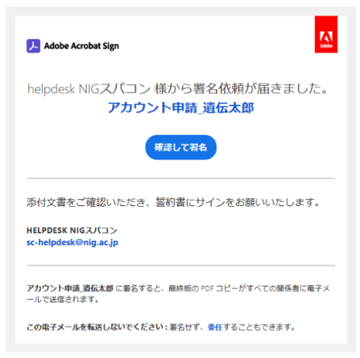

遺伝研スパコンを利用するためには、事前にアカウントの新規登録が必要です。

<table>
<tr>
<td width="400" valign="top">

</td>
<td width="400" valign="top">

利用規程等の確認 

事前に「[ユーザーアカウント発行基準](/application/terms_and_policies/user_account_issurance_criteria)」及び「利用規程」をご確認ください。

- [スパコン(2025)利用規程](/application/terms_and_policies/terms_of_use_2025/)

</td>
</tr>

<tr>
<td width="400" valign="top">

</td>
<td>

アカウントの新規登録 

[「アカウントの新規登録」のページにアクセスして](/application/registration)、手順に沿ってアカウントの新規登録を行ってください。

</td>
</tr>

<tr>
<td width="400" valign="top">

</td>
<td width="400" valign="top">

誓約書への署名 

セキュリティー上のトレーサビリティーの観点からアカウントの新規登録に際して責任者を指定していただいております。[詳細はこちらのページをご覧ください](/application/terms_and_policies/user_account_issurance_criteria/#the-responsible-persons-responsibilities)。 

[「誓約書に署名する方法」の手順に沿って](/application/agreement_signing)誓約書 PDF に署名し、ご返信ください。

</td>
</tr>

<tr>
<td width="400" valign="top">

</td>
<td width="400" valign="top">

アカウント登録証の受領 

署名済みの誓約書をご返信いただいた後、通常、1週間程度で、アカウント登録証を発行いたします。 

発行後、所属機関のご住所宛てに郵送いたします。

</td>
</tr>

<tr>
<td width="400" valign="top">

</td>
<td width="400" valign="top">

遺伝研スパコンへのログイン 

アカウント登録証が到着しましたら、遺伝研スパコンへログインできるようになります。 

遺伝研スパコンは、SSH クライアントおよび Web ブラウザが動作する一般的な計算機があれば利用できます。 16GB 以上のメインメモリを持った Windows, Mac, Linux の計算機を推奨します。 

ログイン方法は、以下をご参照ください。 
- [一般解析区画の使い方](/guides/using_general_analysis_division/)
- [個人ゲノム解析区画の使い方](/guides/using_personal_genome_division/)

</td>
</tr>

</table>
