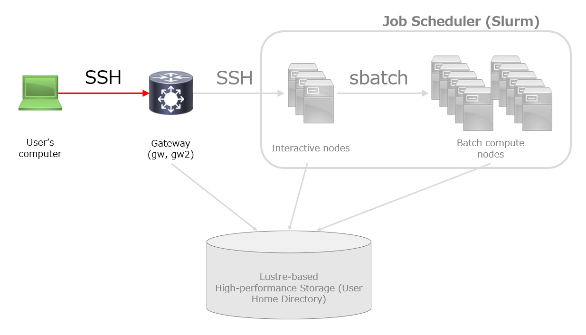

## 概要 {#overview}

遺伝研スパコンの一般解析区画へのログインには ssh 接続を用います。




## ユーザーの計算機の用意 {#preparation-computer}

遺伝研スパコンの一般解析区画は、 ターミナルエミュレータ、SSH クライアントおよび Web ブラウザが動作する計算機があれば利用できます。
16 GB 以上のメインメモリを持った Windows, Mac, Linux の計算機を推奨します。

- Mac, Linux については、標準のターミナルエミュレータを使ってアクセス利用可能です。
- Windows については、PowerShell の SSH クライアントまたは Windows Subsystem for Linux version 2 (WSL2) 等により、アクセス可能です。


## ゲートウェイは ２つあります {#two-gateways}

遺伝研スパコンの一般解析区画のゲートウェイには、以下の 2 つがあります。
どちらでも利用方法は同じです。片方が不調と思われる場合はもう片方のゲートウェイをお試しください。

- `gw.ddbj.nig.ac.jp`
- `gw2.ddbj.nig.ac.jp`


## ログインの準備 {#preparing-to-log-in}

SSHログイン時の認証方式は、公開鍵認証を採用しております。 

### 公開鍵・秘密鍵の作成 {#generate-public-and-private-key}

ログインを行うための準備としてユーザの計算機を使って公開鍵・秘密鍵を作成する必要があります。

ユーザの計算機上のターミナルエミュレータから以下のようにコマンドを実行してください。

```
ssh-keygen -t ed25519 -f ~/.ssh/id_ed25519_nigsc-gw -C "nigsc-gw:you:2025-01-15"
```

- 実行するとパスフレーズの入力を求められます。秘密鍵が盗まれた際に被害を防ぐことができます。
- youのところには自分のアカウント名を書いてください。
- `-C`オプションの後ろはコメントです。
- このコマンドにより`~/.ssh/`ディレクトリの下に秘密鍵・公開鍵が作られます。


SSH公開鍵作成の詳細な手順は、下記 URL に掲載しております。
- [SSH公開鍵の作成方法](/application/ssh_keys)


### 公開鍵の設置

ユーザの計算機上で作成した公開鍵・秘密鍵のうち、公開鍵の方だけを遺伝研スパコンに設置する必要があります。

:::caution
本来、アカウント申請システム(Web UI)から設置を行う手順となっていますが、
セキュリティー対策のため現在アカウント申請システムの作り変えを行っております。

お手数ですが、問い合わせ窓口へお問い合わせの上、公開鍵をスパコン管理者にお送りください。
:::


:::info
一度公開鍵を設置したあとは、公開鍵の追加、変更は以下のコマンドで行うことができます。

登録済みの公開鍵の名前を `~/.ssh/id_ed25519.pub`、新しく追加したい公開鍵の名前を `~/.ssh/id_ed25519_nigsc-gw.pub` としたとき、ユーザの計算機上のターミナルエミュレータで以下のようにコマンドを実行してください。

```bash
ssh-copy-id -f -i ~/.ssh/id_ed25519_nigsc-gw.pub -o IdentityFile=~/.ssh/id_ed25519 you@gw.ddbj.nig.ac.jp
```

このコマンドの意味は次のとおりです。

- `ssh-copy-id` コマンドは指定した公開鍵（ここでは `id_ed25519_nigsc-gw.pub`）をリモートホスト（`gw.ddbj.nig.ac.jp`）上のユーザ（`you`）の `~/.ssh/authorized_keys` ファイルへ登録します。
- `-f` オプションは、すでに登録済みの鍵があったとしても、指定した公開鍵を強制的に追加します。
- `-i` オプションは、新しく追加する公開鍵のファイル名を指定します。
- `-o IdentityFile=~/.ssh/id_ed25519` オプションは、ED25519秘密鍵（`id_ed25519`）を使ってリモートホストに接続します。接続時にRSA鍵を使わないようにするために、明示的にED25519鍵を指定しています。
:::


SSH公開鍵設置の詳細な手順は、下記 URL に掲載しております。
- [SSH公開鍵の設置方法](/application/ssh_copy_id)


## ログインの手順 {#login-nig-supercom}


1, ターミナルエミュレータを開き、`ssh アカウント名@ゲートウェイノード名` を入力し、enter を押下します。
（Windows PowerShell の SSH クライアントの場合も同じです。）

```
$ ssh you@gw.ddbj.nig.ac.jp
```

または

```
$ ssh you@gw2.ddbj.nig.ac.jp
```


秘密鍵の格納場所を明示する場合は`-i`オプションにて秘密鍵のパスを指定します。

```
ssh -i ~/yourpath/id_rsa you@gw.ddbj.nig.ac.jp
```

2, "Enter passphrase for key ..."のプロンプトに対し、SSH 鍵ペアのパスフレーズを入力し、enter を押下します。

※ 鍵のパスフレーズ入力後に以下のメッセージが出力された場合は、yes を入力してください。
```
Are you sure you want to continue connecting (yes/no)?
```


3, `qlogin` コマンドを実行し、インタラクティブノードにログインします。

```
$ qlogin
```

パスワード入力後に以下のメッセージが出力された場合は、yes を入力してください。
```
Are you sure you want to continue connecting (yes/no)?
```


### 実行例 {#example}

以下のように表示されれば成功です。

```
$ ssh you@gw.ddbj.nig.ac.jp
Enter passphrase for key '/home/you/.ssh/id_ed25519':
Welcome to Ubuntu 24.04.1 LTS (GNU/Linux 6.8.0-51-generic x86_64)

 * Documentation:  https://help.ubuntu.com
 * Management:     https://landscape.canonical.com
 * Support:        https://ubuntu.com/pro

 System information as of Mon Apr 14 12:01:35 JST 2025

  System load:  1.05               Processes:                     1437
  Usage of /:   7.6% of 878.15GB   Users logged in:               50
  Memory usage: 81%                IPv4 address for enp65s0f1np1: █████████████
  Swap usage:   16%                IPv4 address for enp65s0f1np1: █████████████
  Temperature:  73.0 C             IPv4 address for enp65s0f1np1: █████████████

 * Strictly confined Kubernetes makes edge and IoT secure. Learn how MicroK8s
   just raised the bar for easy, resilient and secure K8s cluster deployment.

   https://ubuntu.com/engage/secure-kubernetes-at-the-edge

Expanded Security Maintenance for Applications is not enabled.

4 updates can be applied immediately.
To see these additional updates run: apt list --upgradable

33 additional security updates can be applied with ESM Apps.
Learn more about enabling ESM Apps service at https://ubuntu.com/esm

The list of available updates is more than a week old.
To check for new updates run: sudo apt update

Last login: Fri Apr 11 10:20:50 2025 from ████████████
$

```


うまく行かない場合は、[よくある質問(FAQ)](/guides/FAQ/faq_general_analysis_division/faq_login_general)を参照してください。


