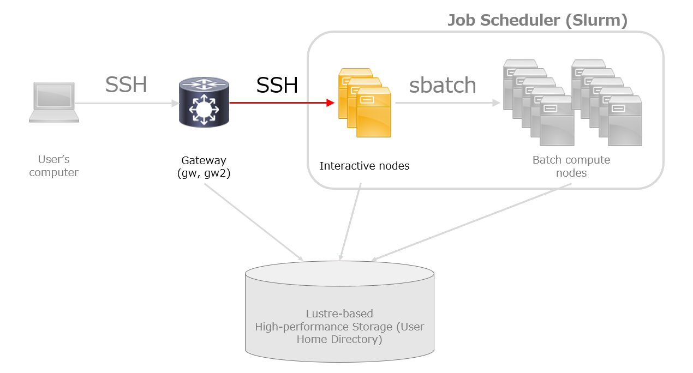

## 概要 {#introduction}

:::caution
以下の手順は、新スパコンへの移行に伴う暫定的な手順です。

後で方法をホームページからお知らせします。
:::




## インタラクティブノードへのログイン手順{#login-interactiev-node}

ゲートウェイノードへsshログイン後、インタラクティブノードa001, a002,a003のいずれかにSSHでログインしてください。

例えば、インタラクティブノードa001にログインする場合は、以下のコマンドを実行します。。

```
ssh a001
```

## 実行例 {#example}

```
you@gw2:~ (2025-06-18 15:07:52)
$ ssh a001
Welcome to Ubuntu 24.04.1 LTS (GNU/Linux ●●●●●●●●●● x86_64)

 * Documentation:  https://help.ubuntu.com
 * Management:     https://landscape.canonical.com
 * Support:        https://ubuntu.com/pro

 System information as of Wed Jun 18 15:08:05 JST 2025

  System load:  ●●.●●               Temperature:                 ●●● C
  Usage of /:   23.2% of 878.65GB   Processes:                   ●●●●
  Memory usage: ●●%                 Users logged in:             ●●
  Swap usage:   100%                IPv4 address for ibp●●●●●●: ●●●.●●.●●.●

  => There are ●● zombie processes.

 * Strictly confined Kubernetes makes edge and IoT secure. Learn how MicroK8s
   just raised the bar for easy, resilient and secure K8s cluster deployment.

   https://ubuntu.com/engage/secure-kubernetes-at-the-edge

Expanded Security Maintenance for Applications is not enabled.

●●● updates can be applied immediately.
●●● of these updates are standard security updates.
To see these additional updates run: apt list --upgradable

●● additional security updates can be applied with ESM Apps.
Learn more about enabling ESM Apps service at https://ubuntu.com/esm

Last login: Wed Jun 18 08:44:27 2025 from ●●●.●●.●●.●
you@a001:~ (2025-06-18 15:08:12)
$ 
```
