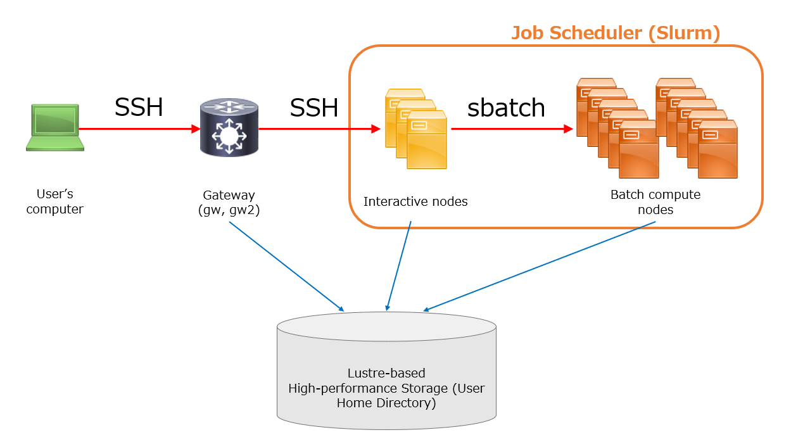

## 一般解析区画のシステム構成 {#system-configuration-general}

遺伝研スパコンの一般解析区画は多数の計算機（これらをノードと呼びます）を束ねたクラスタ構成となっています。

ユーザーからの計算要求に対してクラスタ計算機システム上の適切な計算機を割り当てる仕事をするのがジョブスケジューラと呼ばれるプログラムです。
遺伝研スパコンでは、2025年導入のスパコンから、現在多分野で広く使われているジョブスケジューラであるSlurmに切り替えました。(詳細は[Slurmの使い方](/guides/software/JobScheduler/Slurm/)を参照ください。)

Slurmで管理された全てのノードは大容量高速ストレージシステム (Lustre FS)をマウントしており、ユーザーのホームディレクトリは全てのノードから同じようにアクセスできます。

