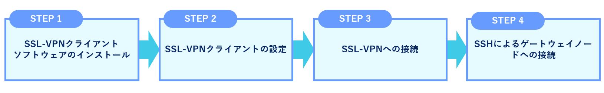
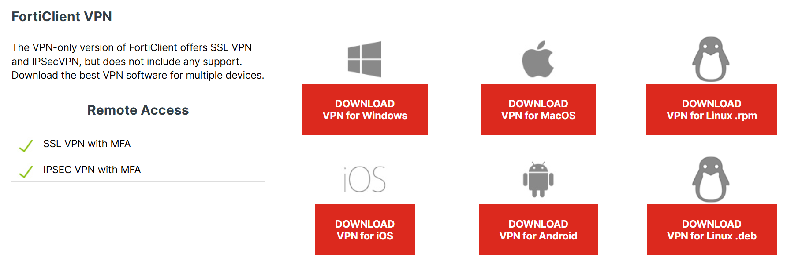

## 概要 {#introduction}

遺伝研スパコンの個人ゲノム解析区画へのログイン及びファイル転送には SSL-VPN 接続を用います。SSL-VPN 接続を行うためにはユーザーの計算機に専用のソフトウェアをインストールする必要があります(これを以下 SSL-VPN クライアントソフトウェアと呼びます)。

SSL-VPN 接続の際は二要素認証が行われます。セキュリティー向上の目的で、SSL-VPN で接続している時にはユーザの計算機のインターネットへのアクセスは遮断される設定としています。このとき、ユーザの計算機が属するローカルネットワーク内への通信は遮断されません。したがって例えばユーザの計算機がローカルネットワーク内のファイルサーバーに接続されていて、そのファイルサーバーからデータを個人ゲノム解析環境に送るといった操作は問題なく可能です。一方、ローカルネットワークの外側から ssh でユーザの計算機に接続して作業を行っていた場合はその ssh 接続は遮断されるので注意が必要です。

一方で遺伝研スパコンのファイアウォール上での設定により個人ゲノム解析環境からインターネット上の HTTPS についてのみ利用可能となっています。


## ログイン方法 {#login-to-pg}


以下の図に、ログイン方法の流れを示します。




### STEP 1. SSL-VPN クライアントソフトウェアのインストール {#install-sslvpn}

「[&#x1f517;FortiClient](https://www.fortinet.com/support/product-downloads)」の 公式サイト にアクセスし、FortiClient をダウンロードして、インストールします。

- 公式サイト：&#x1f517;https://www.fortinet.com/support/product-downloads

<table>
<tr>
<td width="400" valign="top">



</td>
<td width="400" valign="top">

「Product Downloads」の「FortiClient VPN only」をダウンロードしてください。

</td>
</tr>
</table>


ダウンロードとインストール方法の詳細は、以下のリンクからをご参照ください。

- [SSL-VPN クライアントソフトウェアのインストール (Windows の場合)](/guides/FAQ/faq_personal_genome/pg_login_ssl-vpn_install_win)
- [SSL-VPN クライアントソフトウェアのインストール (Mac の場合)](/guides/FAQ/faq_personal_genome/pg_login_ssl-vpn_install_mac)
- [SSL-VPN クライアントソフトウェアのインストール (Linux の場合)](/guides/FAQ/faq_personal_genome/pg_login_ssl-vpn_install_linux)


### STEP 2. SSL-VPN クライアントの設定 {#conf-sslvpn}

SSL-VPN クライアントのセットアップをします。

設定方法は、以下のリンクをご参照ください。
- [SSL-VPN クライアントの設定方法(Windows の場合)](/guides/FAQ/faq_personal_genome/pg_login_ssl-vpn_configure_file_win)
- [SSL-VPN クライアントの設定方法(Mac の場合)](/guides/FAQ/faq_personal_genome/pg_login_ssl-vpn_configure_file_mac)
- [SSL-VPN クライアントの設定方法(Linux の場合)](/guides/FAQ/faq_personal_genome/pg_login_ssl-vpn_configure_file_linux)


### STEP 3. SSL-VPN への接続 {#connect-sslvpn}

SSL-VPN 接続を行います。


import Tabs from '@theme/Tabs';
import TabItem from '@theme/TabItem';

<Tabs>
<TabItem value="windows" label="Windows" attributes={{className: 'tab-blue'}}>
<div className="tab-blue-content">


Windowsの場合は、FortiClient GUIを使ってSSL-VPNに接続します。


1. 「ユーザ名」と「パスワード」を入力します。
    - 「ユーザ名」：アカウント登録証の「利用区分：個人ゲノム解析区画」に記載されている個人ゲノムのアカウント名を入力してください。
    - 「パスワード」：SECURE DELIVERの往復便で送信されたSSL-VPNのパスワード「VPNパスワード」を入力してください。

 

2. SSL-VPNアカウントに紐付くメールアドレスへワンタイムパスワードが送信されます。
3. 「トークン」へワンタイムパスワード(下図の例の場合、269274)を入力し、「OK」をクリックします。


</div>
</TabItem>
<TabItem value="mac" label="MacOS" attributes={{className: 'tab-orange'}}>
<div className="tab-orange-content">

Macの場合は、FortiClient GUIを使ってSSL-VPNに接続します。

1. 「ユーザ名」と「パスワード」を入力します。
    - 「ユーザ名」：アカウント登録証の「利用区分：個人ゲノム解析区画」に記載されている個人ゲノムのアカウント名を入力してください。
    - 「パスワード」：SECURE DELIVERの往復便で送信されたSSL-VPNのパスワード「VPNパスワード」を入力してください。

 

2. SSL-VPNアカウントに紐付くメールアドレスへワンタイムパスワードが送信されます。
3. 「答え」にワンタイムパスワード(下図の例の場合、269274)を入力し、「OK」をクリックします。


</div>
</TabItem>
<TabItem value="linux" label="Linux" attributes={{className: 'tab-green'}}>
<div className="tab-green-content">

Linuxの場合は、openfortivpn CUIを使ってSSL-VPNに接続します。

1. 設定ファイルを引数に指定して、以下のコマンドを実行します。

```
sudo openfortivpn -c config
```
2. SSL-VPNアカウントに紐付くメールアドレスへワンタイムパスワードが送信されます。
3. ワンタイムパスワード(下記の実行例の場合、269347)を入力し、Enterキーを押します。

以下に、実行例を示します。

```
$ sudo openfortivpn -c config
INFO: Connected to gateway.
Two-factor authentication token:
INFO: Authenticated.
INFO: Remote gateway has allocated a VPN.
Using interface ppp0
Connect: ppp0 <--> /dev/pts/1
INFO: Got addresses: [10.212.134.11], ns [133.39.221.65, 133.39.222.41]
INFO: negotiation complete
INFO: negotiation complete
local IP address 10.212.134.11
remote IP address 192.0.2.1
INFO: Interface ppp0 is UP.
INFO: Setting new routes...
INFO: Adding VPN nameservers...
INFO: Tunnel is up and running.
```

</div>
</TabItem> 
</Tabs> 

接続方法の詳細は、以下のリンクをご参照ください。
- [Windows の場合 (FortiClient GUI)](/guides/FAQ/faq_personal_genome/pg_login_ssl-vpn_connection_win)
- [Mac の場合 (FortiClient GUI)](/guides/FAQ/faq_personal_genome/pg_login_ssl-vpn_connection_mac)
- [Linux の場合 (openfortivpn CUI)](/guides/FAQ/faq_personal_genome/pg_login_ssl-vpn_connection_linux)

うまくつながらない場合は、[FAQ](/guides/FAQ/faq_personal_genome/faq_forticlient/#dialogbox_disappear)をご参照ください。


### STEP 4. SSH によるゲートウェイへのログイン {#ssh-login-gateway}

SSL-VPN 接続を開始したら、ユーザの計算機上でターミナルエミュレータを起動し、個人ゲノム解析環境のゲートウェイにログインします。

ゲートウェイノードは、`gwa.ddbj.nig.ac.jp` と  `gwa2.ddbj.nig.ac.jp` の 2 つがあります。それぞれ、以下のコマンドを実行するとログインできます。

```
ssh [アカウント名]@gwa.ddbj.nig.ac.jp 
```

または

```
ssh [アカウント名]@gwa2.ddbj.nig.ac.jp 
```

うまく行かない場合は、[よくある質問(FAQ)](/guides/FAQ/faq_personal_genome/faq_forticlient)をご参照ください。


## SSH による解析サーバへのログイン {#ssh-login-analysis-server}

個人ゲノム解析区画はノード貸しなので、ユーザーの借りたノードにはゲートウェイ上から SSH することによりログインします。
該当のノードの名前は利用開始時にお知らせします。
