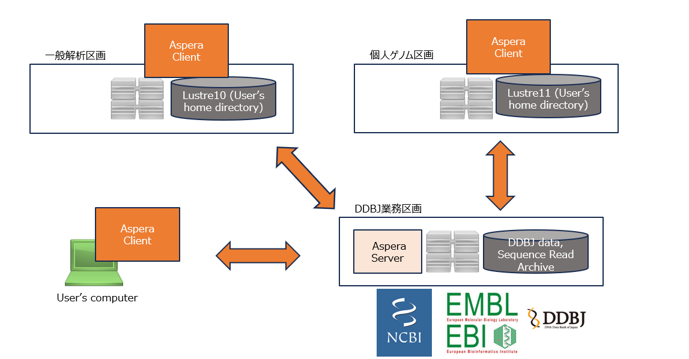

:::caution
個人ゲノム区画のArchaea tools serverは現在準備中です。
:::


遺伝研スパコンでは、通常広く使われている
scp, sftpなどに加えて、
長距離の大規模データ転送に適したソフトウェアであるAsperaおよびArchaea toolsが利用可能です。

:::info
- AsperaはNCBI/EBI/DDBJなどからデータをスパコンやユーザのパソコンにダウンロードする際に利用できます。遺伝研スパコン全体で合計10Gbpsが転送速度の上限となります。
- Archaea toolsはスパコンのユーザホーム領域とユーザのパソコンとの間のデータ転送に利用できます。ライセンス上の転送速度の
上限はありません。

遺伝研スパコンは現在100GbpsでSINET6に接続されています。**Archaea toolsを利用することで遺伝研スパコンのネットワークを有効に使うことができます。**
:::


一般解析区画及び個人ゲノム解析区画にはAspera Serverがインストールされていないため、
ユーザの計算機からAsperaでのデータのアップロード、ダウンロードはできません。

ユーザの計算機から一般解析区画及び個人ゲノム解析区画にデータ転送する場合はArchaea Toolsを使ってください。


一般解析区画や個人ゲノム解析区画のユーザホームディレクトリに`ascp` (Aspera client)をインストールすれば、NCBI/EBI/DDBJなどとのデータのダウンロード、アップロードが可能です。




## Archaea Toolsの利用方法 {#usage-archaea}


## Aspera の利用方法 {#usage-aspera}

Aspera は大容量のファイル転送を効率的に行う商用ソフトウェアです。
特に遠距離との通信の際の転送速度の劣化が少ないことと、きちんとチューニングすれば理論帯域幅にかなり近い転送速度が実現できることが特徴です。
遺伝研スパコンでは合計帯域幅上限 10Gbps の Aspera サーバーを導入し運用しています。
（遺伝研の総帯域幅は 100Gbps です。）

利用方法については[システム構成 > ソフトウェア > Aspera client(ascp)の使い方](/guides/software/CopyTool/aspera_client/) を参照してください。


## SSH プロトコルによるファイル転送の方法 (scp, sftp) {#transfer-scp-sftp}

個人ゲノム解析区画のゲートウェイサーバ(`gwa.ddbj.nig.ac.jp`)に対して `scp`, `sftp` 等を用いたファイル転送が可能です。

Linux または Mac の場合の例：

この状態で、カレントディレクトリにある`your_file.txt`ファイルを遺伝研スパコンに `scp` するには、
以下のコマンドを実行します。

ここで`you`は、遺伝研スパコンのアカウント名です。

```
scp your_file.txt you@gwa.ddbj.nig.ac.jp:/home/you
```

Windows (PowerShell) の場合の例:

1. まず PowerShell を起動します。そうすると、デフォルトの場合では、Windows 内のホームディレクトリがカレントディレクトリになった状態で PowerShell が起動します(ここで"youwin" は Windows のアカウント名)。この状態で以下のコマンドを実行して、SSH 秘密鍵ファイルが以下の位置にあることを確認します。この場合の SSH 秘密鍵ファイルは、`id_rsa` ファイルのことです。

```
PS C:\Users\youwin> ls .ssh


    Directory: C:\Users\youwin\.ssh


Mode                 LastWriteTime         Length Name
----                 -------------         ------ ----
-a----        2023/11/28     16:18            160 config
-a----        2022/11/01     16:33           1766 id_rsa
-a----        2024/01/22     12:44           4885 known_hosts
-a----        2024/01/22     12:41           5453 known_hosts.old
```

2. この状態で、ダウンロードフォルダ(`Downloads`)の中にある`your_file.txt`ファイルを遺伝研スパコンに `scp` するには、
以下のコマンドを実行します。（ここで`you`は、遺伝研スパコンのアカウント名です。）

```
PS C:\Users\youwin> scp .\Downloads\your_file.txt
you@gwa.ddbj.nig.ac.jp:/home/you
```


## Archaea tools(旧 HCPtools) によるファイル転送の方法 {#transfer-archaea-tools}

転送方法は、[Archaea tools(旧 HCPtools) の使い方](/guides/software/CopyTool/Archaea_tools)をご参照下さい。


