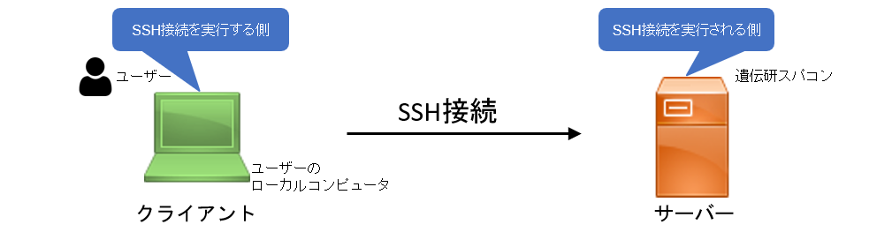

## &#x1F180; SSH接続時の「Permission denied (publickey)」エラーの原因と対策 {#error-pubkey-auth}

- ここでは、「クライアント」は、ユーザーのローカルコンピュータ(自分の計算機)を指します。
- ここでは、「サーバー」は、遺伝研スパコンを指します。

クライアントとサーバーの関係は、以下の図のようになっています。



&#x1F150; SSH接続時に「Permission denied (publickey)」エラーが発生する原因はいくつかあります。以下の確認項目を順にチェックしてください。

### 1. ファイルパーミッションの確認 (クライアント計算機がLinux, Mac, Windows WSLの場合)

以下の表に従って、クライアント側(ユーザーのローカルコンピュータ(自分の計算機))、サーバ側（遺伝研スパコン）の両方について、
ファイルパーミッションが正しく設定されているかを確認してください。

<table　cellpadding="6" cellspacing="0">
  <thead>
    <tr>
      <th>パス（例）</th>
      <th>役割</th>
      <th>パーミッション</th>
      <th>備考</th>
    </tr>
  </thead>
  <tbody>
    <tr>
      <td>/home/USERNAME/</td>
      <td>ホームディレクトリ</td>
      <td>750, 711, 700など</td>
      <td>ホームディレクトリに他人の書き込み権限がないことが必須。クライアント側とサーバ側の両方に存在する。<br />「USERNAME」には、ユーザーのアカウント名が入る。</td>
    </tr>
    <tr>
      <td>~/.ssh/</td>
      <td>鍵や設定ファイルの格納先</td>
      <td>700</td>
      <td>クライアント側とサーバ側の両方に置く。</td>
    </tr>
    <tr>
      <td>~/.ssh/id_ed25519<br />（または id_rsa）</td>
      <td>秘密鍵</td>
      <td>600</td>
      <td>秘密鍵はクライアント側のみに置く。サーバ側に置いてはいけない。</td>
    </tr>
    <tr>
    <td>~/.ssh/authorized_keys</td>
    <td>接続許可する公開鍵リスト</td>
      <td>600</td>
      <td>サーバに登録された公開鍵が書かれたファイル。サーバ側に存在する。クライアント側には存在しない。</td>
    </tr>
    <tr>
      <td>/.ssh/known_hosts</td>
      <td>接続先ホスト鍵の記録</td>
      <td>600 または 644</td>
      <td>クライアント側に存在する。サーバ側には存在しない。</td>
    </tr>
  </tbody>
</table>


#### パーミッションの確認方法(1) `stat`コマンド

`stat`コマンドを用いるとファイルパーミッションを数字で表示することができます。

```
stat -c "%a %n" your-file
```

実行例

```
you@MINIPC:~ (2025-05-05 14:07:49)
$ stat -c "%a %n" ~/.ssh
700 /home/you/.ssh
you@MINIPC:~ (2025-05-05 14:08:06)
$ stat -c "%a %n" ~/.ssh/*
600 /home/you/.ssh/authorized_keys
664 /home/you/.ssh/config
600 /home/you/.ssh/id_ed25519
644 /home/you/.ssh/id_ed25519.pub
600 /home/you/.ssh/id_rsa
644 /home/you/.ssh/id_rsa.pub
600 /home/you/.ssh/known_hosts
```

#### パーミッションの確認方法(2) `ls -l`

ファイルリストを表示する際に一般的に用いられている`ls`コマンドを用いてファイルパーミッションを表示することができます。
`rwx` はアクセス権を示す文字で、`r=4`、`w=2`、`x=1` として合計した数が数字表記です。たとえば `rwx------` は `700`、`rw-r--r--` は `644` です。

実行例

```
🎯 you@MINIPC:~ (2025-05-05 14:08:37)
$ ls -l ~/.ssh
合計 80
-rw------- 1 you you     0  4月 10 18:21 authorized_keys
-rw-rw-r-- 1 you you  1373  5月  5 13:37 config
-rw------- 1 you you   419  5月  2 07:52 id_ed25519
-rw-r--r-- 1 you you   105  5月  2 07:52 id_ed25519.pub
-rw------- 1 you you  1766  3月 14 14:09 id_rsa
-rw-r--r-- 1 you you   105  3月 14 14:09 id_rsa.pub
-rw------- 1 you you 10368  5月  2 08:05 known_hosts
```

- SSHログは `/var/log/auth.log` または `journalctl -u ssh` で確認できます。


### 2. 鍵の不一致

クライアント側の秘密鍵（`id_rsa` など）と、サーバー側に登録されている公開鍵（`authorized_keys`）が一致していない場合、認証が失敗します。公開鍵と秘密鍵のペアが正しく設定されているかを確認しましょう。

### 3. ユーザー名の確認

SSH接続時に指定するユーザー名（`USERNAME`）が間違っていないか確認してください。


## &#x1F180; SSHログイン時にWARNING: REMOTE HOST IDENTIFICATION HAS CHANGED!というエラーが出ます {#error-ssh-login}

&#x1F150; 遺伝研スパコンにログインしようとした際、下記のようなメッセージが表示されてログインできない場合があります。

```
$ ssh gw.ddbj.nig.ac.jp
@@@@@@@@@@@@@@@@@@@@@@@@@@@@@@@@@@@@@@@@@@@@@@@@@@@@@@@@@@@
@       WARNING: POSSIBLE DNS SPOOFING DETECTED!          @
@@@@@@@@@@@@@@@@@@@@@@@@@@@@@@@@@@@@@@@@@@@@@@@@@@@@@@@@@@@
The RSA host key for gw.ddbj.nig.ac.jp has changed,
and the key for the corresponding IP address 133.39.228.101
is unknown. This could either mean that
DNS SPOOFING is happening or the IP address for the host
and its host key have changed at the same time.
@@@@@@@@@@@@@@@@@@@@@@@@@@@@@@@@@@@@@@@@@@@@@@@@@@@@@@@@@@@
@    WARNING: REMOTE HOST IDENTIFICATION HAS CHANGED!     @
@@@@@@@@@@@@@@@@@@@@@@@@@@@@@@@@@@@@@@@@@@@@@@@@@@@@@@@@@@@
IT IS POSSIBLE THAT SOMEONE IS DOING SOMETHING NASTY!
Someone could be eavesdropping on you right now (man-in-the-middle attack)!
It is also possible that a host key has just been changed.
The fingerprint for the RSA key sent by the remote host is
SHA256:xkyH37QZowWjidMSCIbOZa7Vw1p46Dxt4nF9nFJG+hk.
Please contact your system administrator.
Add correct host key in /home/username/.ssh/known_hosts to get rid of this message.
Offending RSA key in /home/username/.ssh/known_hosts:X
RSA host key for gw.ddbj.nig.ac.jp has changed and you have requested strict checking.
Host key verification failed.
```

遺伝研スパコンのゲートウェイノードは `gw.ddbj.nig.ac.jp`, `gw2.ddbj.nig.ac.jp` の２つがありますが、それぞれ `ssh-keygen -R gw.ddbj.nig.ac.jp` , `ssh-keygen -R gw2.ddbj.nig.ac.jp` を実行することでこのエラーが出なくなります。**実行するときは、スパコン上ではなく、<font color="red">ユーザの計算機上で実行します</font>。**

実行すると、エラーは出なくなりますが、`Are you sure you want to continue connecting (yes/no)?` と聞かれます。「yes」を入力します。<br/>この確認メッセージは、ユーザの計算機から遺伝研スパコンのサーバに初めて接続する場合に、接続先がなりすまされた偽のサーバではなく正規のサーバであるかどうかの確認のために、表示されます。最初の1回だけ聞かれて、次回以降は表示されません。


## &#x1F180; SSH のコネクションが頻繁に切れます。 {#disconnect-ssh}

&#x1F150; `~/.ssh/config` に以下を追記してください。

```
Host *
    ServerAliveInterval 20
    TCPKeepAlive no
```

詳しくは以下ご参照ください。

&#x1f517;https://unix.stackexchange.com/questions/602518/ssh-connection-client-loop-send-disconnect-broken-pipe-or-connection-reset


## &#x1F180; Windows PowerShellからはログインできましたが、WSL2 (Windows Subsystem for Linux)上のUbuntu Linuxからはログインできないのでしょうか？  {#wls2-login}

&#x1F150; ログインできます。

現在のWindowsはWSL2を使うために最初から仮想マシンの上で動いており、WSL2上のUbuntu
Linuxは別の仮想マシンとして動作します。(例えば以下のリンク&#x1f517;
https://www.thomasmaurer.ch/2019/06/install-wsl-2-on-windows-10/)

つまり一台の物理計算機の中に２台の完全に独立な仮想計算機が入っている状態で動作しています。
ディスク領域も独立になっており、この２台の仮想計算機が一台の物理計算機の中でネットワーク接続している状態で動作します。

外見上そっくりですが、PowerShellはWindows OSがのった仮想マシン上で動いており、
Ubuntuのプロンプトが表示される画面はUbuntu LinuxOSがのった仮想マシン上で動いています。

ですからPowerShellで作った秘密鍵をUbuntu Linuxの方にコピーする必要があります。

例えば以下の通りです。

```
you@wsl2:~$ cp /mnt/c/Users/you/.ssh/id_rsa .ssh
you@wsl2:~$ ssh your_account@gw2.ddbj.nig.ac.jp
Enter passphrase for key '/home/you/.ssh/id_rsa':
Last login: Thu Dec  1 15:33:59 2022 from XXX.XXX.XXX.XXX
---------------------------------------------------------------------
Thank you for using NIG supercomputer system.
This is the gateway node, do not run program here.
Please use 'qlogin' to login to a interactive node.
---------------------------------------------------------------------
your_account@gw4:~ (2022-12-01 15:34:50)
$
```
