## &#x1F180; 最新バージョンのPowerShellをインストールする方法 {#install-latest-powershell}

&#x1F150; Windowsに標準搭載されているPowerShellを最新バージョンにアップデートする方法をご説明します。

バージョンの確認方法: 詳細は[本ページの「PowerShellのバージョンの確認方法」をご参照ください](/guides/FAQ/faq_general_analysis_division/faq_sshkeys_windows/)。

- [現在使用しているPowerShellのバージョンを確認する](/guides/FAQ/faq_general_analysis_division/faq_sshkeys_windows/#check-powershell-current-ver)には`$PSVersionTable`コマンドを実行してください。
- [最新バージョンを確認する](/guides/FAQ/faq_general_analysis_division/faq_sshkeys_windows/#check-powershell-latest-ver)には`winget search Microsoft.PowerShell`コマンドを実行してください。

※最新バージョンではない場合には以下のような画面となります。


### - インストール方法 {#how-to-install-powershell}

PowerShellのコマンドプロンプトから、以下のコマンドを入力して、[Enter]キーを押します。

```
winget install --id Microsoft.Powershell --source winget
```


すると、インストールが開始されます。

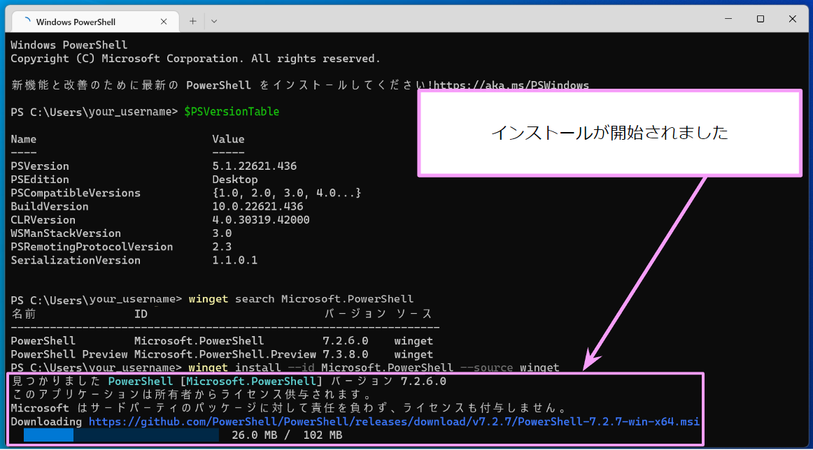

もしも以下の画面が表示された場合は、「はい」をクリックします。

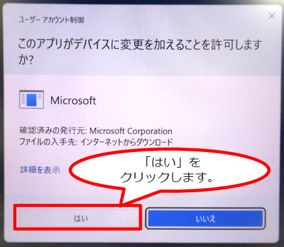

インストールが進み、以下のような画面が表示されます。この時点では、まだインストールしている最中です。インストール完了まであと少し待ちます。

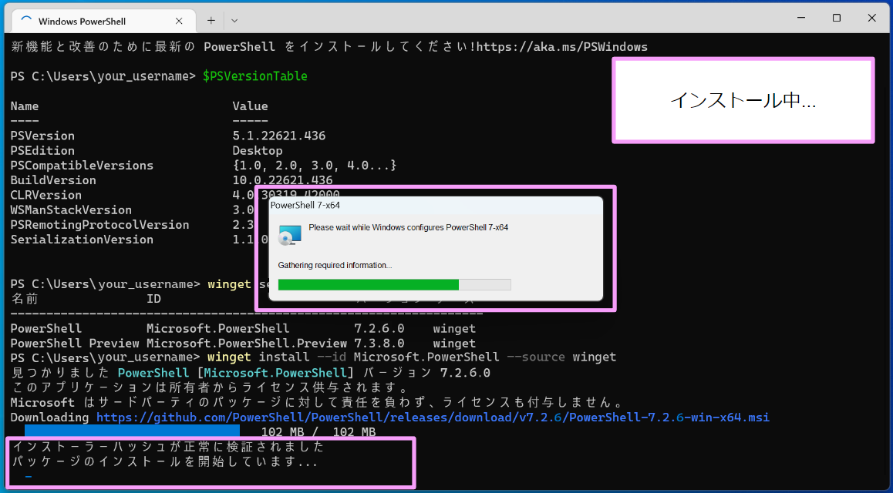

「インストールが完了しました」と表示されれば、インストール完了です。

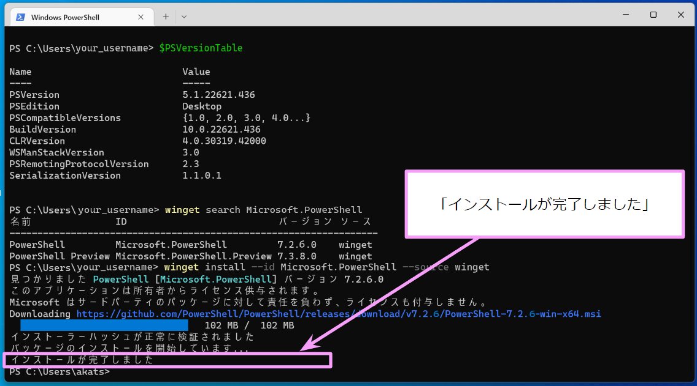

最新バージョンのPowerShellがユーザのWindows PCにインストールされました。

インストールが完了しましたので、インストールした最新バージョンのPowerShellを起動して動作確認を行います。

### - 動作確認 {#operation-check-powershell}

最新バージョンのPowerShellを起動するには`pwsh`コマンドを用います。`powershell`コマンドを用いると古いバージョンのPowerShellが起動されてしまいます。&#x1f517;<a href="https://learn.microsoft.com/ja-jp/powershell/scripting/whats-new/differences-from-windows-powershell?view=powershell-7.2#renamed-powershellexe-to-pwshexe">この事情については公式サイトの説明をご確認ください。</a>

Windowsマークをクリックして、検索ボックスの中をクリックします。

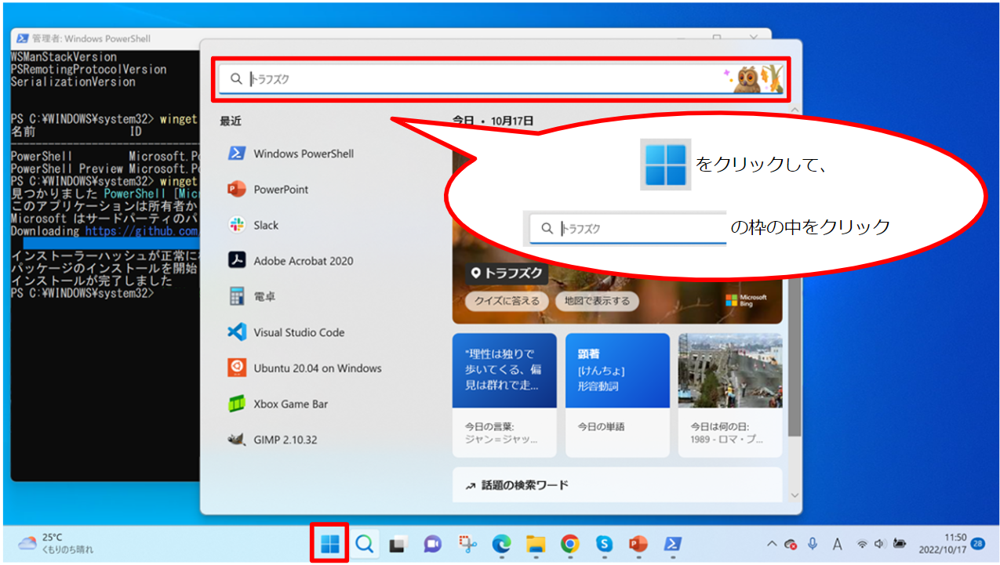


「pwsh」と入力します。


入力すると、「PowerShell 7 (x64)」の実行ファイルが検索結果に表示されますので、「開く」をクリックします。

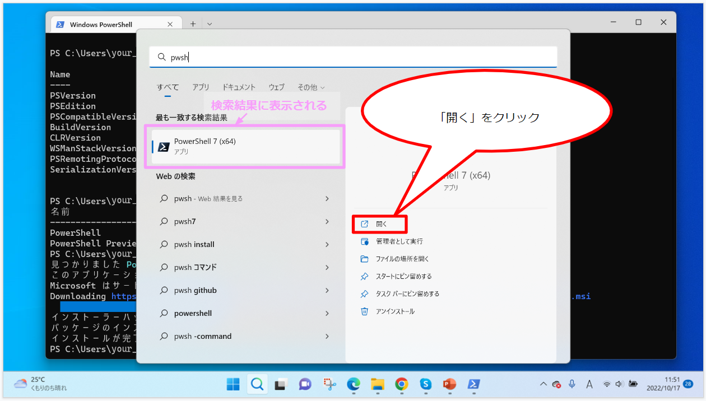

クリックすると、先ほどインストールした最新バージョンのPowerShellが起動します。

本ページでは、2022年10月19日時点の最新であるPowerShell 7.2.6をインストールしましたので、PowerShell 7.2.6が起動します。


このとき、PowerShell 7.2.6の画面は、以下のように表示されます。


最新バージョンを起動したら、起動しているPowerShellが本当に最新バージョンかどうか確認します。確認するには`$PSVersionTable`コマンドを実行してください。以下の画面のように表示されていたら、最新バージョンが起動していることを示しています。

もし最新バージョンを起動した時に、画面に以下のメッセージが表示される場合は、さらに最新バージョンが発表されていますよと言われています。

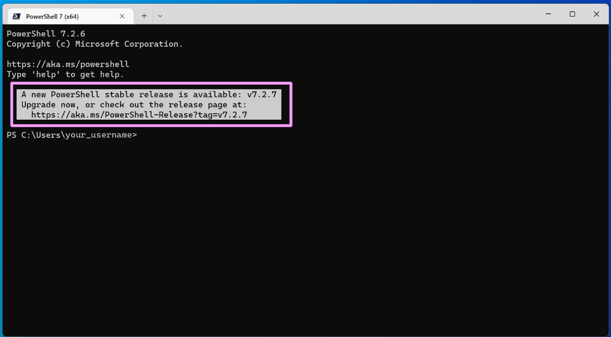

```
 A new PowerShell stable release is available: v7.2.7
   Upgrade now, or check out the release page at:
     https://aka.ms/PowerShell-Release?tag=v7.2.7
```

今回インストールした最新バージョンよりも、さらに最新バージョンがリリースされると、Microsoftの公式WebサイトにあるGithubでは即時、実行ファイルがアップロードされてインストール可能な状態になりますが、`winget`コマンドに最新バージョンが反映されるまでには時間差があるため、このようなメッセージが表示されます。

さらに最新バージョンへアップグレードする方法は、[本ページ内にアップグレード方法の説明があります](/guides/FAQ/faq_general_analysis_division/faq_sshkeys_windows/#a-new-powershell-stable-release-is-available)ので、ご参照ください。

&#x1F4D6; 時間差について
- 2022年10月19日　この時点で最新の7.2.6をインストールした。
- 2022年10月20日　さらに最新の7.2.7がリリースされた。
- 2022年10月21日　確認したところGithubに実行ファイルがアップロードされていたが、まだ`winget`コマンドに反映されていない状態であった。
- 2022年10月26日　`winget search Microsoft.PowerShell`コマンドを実行したところ、最新バージョンが更新されており、7.2.7が最新であると表示された。

&#x1F4D6; 確認したMicrosoftの公式WebサイトにあるGithubのURL: &#x1f517;https://github.com/PowerShell/PowerShell/releases/


### - 参考資料 {#references}

- &#x1f517;<a href="https://learn.microsoft.com/ja-jp/powershell/scripting/install/installing-powershell-on-windows?view=powershell-7.2#install-powershell-using-winget-recommended">microsoft公式Webサイト「WindowsへのPowerShellのインストール」</a>
- &#x1f517;<a href="https://learn.microsoft.com/ja-jp/powershell/scripting/whats-new/differences-from-windows-powershell?view=powershell-7.2#renamed-powershellexe-to-pwshexe">microsoft公式Webサイト「Windows PowerShell 5.1 と PowerShell 7.x の相違点」</a>


## &#x1F180; PowerShell を起動したいのですが、どのようにしたらよいでしょうか。 {#how-to-open-powershell}

&#x1F150; まず、検索ボックスに“powershell”と入力します。


入力すると、以下のように画面が表示されます。

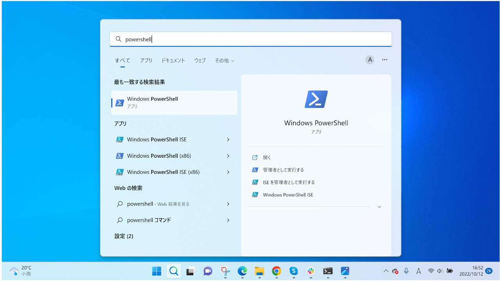

「開く」をクリックします。


クリックすると、PowerShellが起動します。

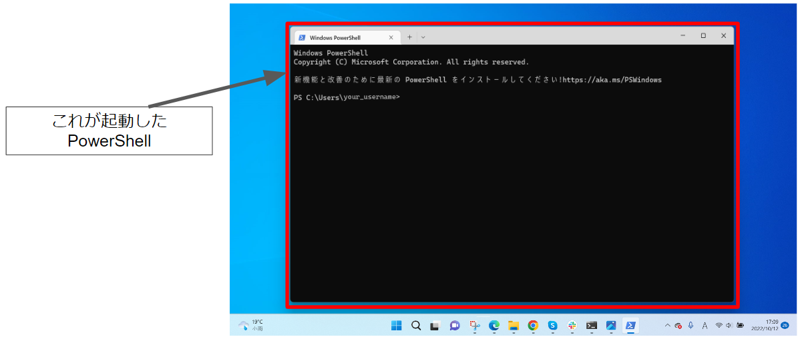


## &#x1F180; PowerShellのバージョンを確認したいのですが、どのようにしたらよいでしょうか。 {#check-powershell-version}

&#x1F150; 

### - 現在インストールされているPowerShellのバージョンの確認方法 {#check-powershell-current-ver}

以下のコマンドを入力して、[Enter]キーを押します。

```
$PSVersionTable
```

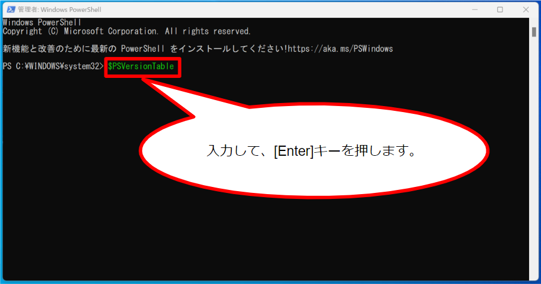

すると、以下のようにバージョンが表示されます。


### - 公開されている最新バージョンの確認方法 {#check-powershell-latest-ver}

以下のコマンドを入力して、[Enter]キーを押します。

```
winget search Microsoft.PowerShell
```


すると、検索が開始されます。


検索が完了すると、インストール可能なバージョンの一覧が表示されます。

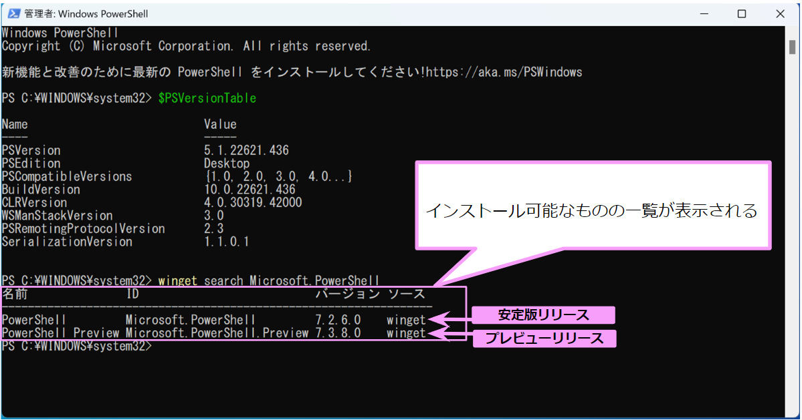

インストールする時は、正式にリリースされている安定版リリースをインストールします。末尾に'.Preview'がついていない方です。


## &#x1F180; 最新バージョンのPowerShellをインストールしたのに、`A new PowerShell stable release is available`というメッセージが表示されてしまいます。 {#a-new-powershell-stable-release-is-available}

&#x1F150; 以下のコマンドを入力して、[Enter]キーを押し、さらに最新バージョンへアップグレードします。`winget`コマンドにまだ反映されていないため、Githubのページにあるスクリプトから直接取得します。

```
Invoke-Expression "& { $(irm https://aka.ms/install-powershell.ps1) } -UseMSI"
```

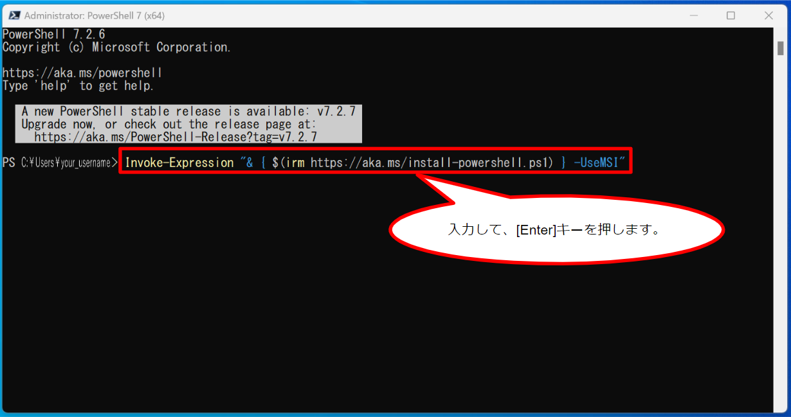

「Next」をクリックします。


「Next」をクリックします。


チェックボックスの上2つにチェックが入っていることを確認してください。初めからチェックされている状態で表示されますが、もし入っていない場合は、チェックをつけてください。それから、「Next」をクリックします。

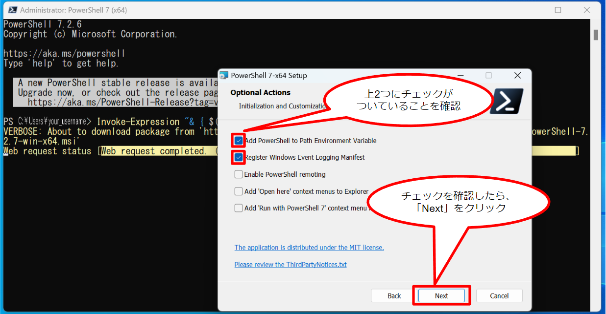

チェックボックスに両方ともチェックが入っていることを確認してください。初めからチェックされている状態で表示されますが、もし入っていない場合は、チェックをつけてください。それから、「Next」をクリックします。


「Install」をクリックします。


すると、インストールが開始され、以下の画面が表示されます。上の行のボタンが選択されていることを確認して、「OK」をクリックします。


すると、起動していたPowerShell 7.2.6が自動的に閉じられて、以下の画像のように、「PowerShell 7-x64 Setup」のウィンドウだけが開かれている状態になり、インストールが始まります。


「OK」をクリックします。

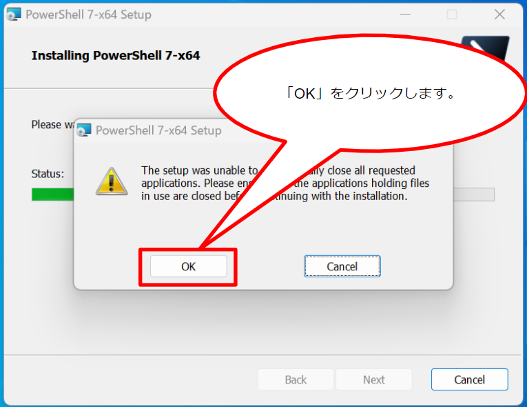

「Launch PowerShell」のチェックボックスにチェックを入れて、「Finish」をクリックします。チェックを入れると自動で再起動されます。


PowerShell 7.2.7が自動で起動します。起動すると以下のような画面が表示されます。

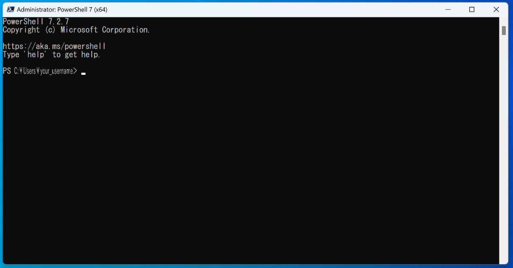

起動しましたら、以下のコマンドを入力して、[Enter]キーを押します。

```
$PSVersionTable
```


すると、現在起動しているWindows PowerShellのバージョンは、7.2.7と表示されます。


この表示により、本当にPowerShell 7.2.7がインストールされていることが確認できました。

さらに最新のPowerShellのインストールが完了しました。


## &#x1F180; PowerShell 5.1と7.2.6の主な違いはありますか。 {#diff-5.1-7.2.6}

&#x1F150; デフォルトの場合、以下のような違いがあります。

- 実行ファイルの保存場所

PowerShell 5.1 

```
C:\Windows\SysWOW64\WindowsPowerShell\v1.0\powershell.exe
```


PowerShell 7.2.6

```
C:\Program Files\PowerShell\7\pwsh.exe
```

- 実行ファイル名

PowerShell 5.1

```
powershell.exe
```

PowerShell 7.2.6

```
pwsh.exe
```

PowerShell 7.2.6では、実行ファイル名が`pwsh.exe`という名前でインストールされているため、PowerShellを検索するときは、”powershell”ではなく”pwsh”と入力して検索します。

詳細は&#x1f517;<a href="https://learn.microsoft.com/ja-jp/powershell/scripting/whats-new/differences-from-windows-powershell?view=powershell-7.2#renamed-powershellexe-to-pwshexe">Microsoft公式Webサイトの「Windows PowerShell 5.1 と PowerShell 7.x の相違点」のページをご参照ください。</a>


## &#x1F180; `winget`によるインストールについての詳細が知りたいです。 {#install-with-winget}

&#x1F150; microsoft公式Webサイトにある「WindowsへのPowerShellのインストール」のページをご参照ください。&#x1f517;<a href="https://learn.microsoft.com/ja-jp/powershell/scripting/install/installing-powershell-on-windows?view=powershell-7.2#install-powershell-using-winget-recommended">ここをクリックすると、そのページに移動できます。</a>
