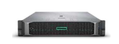
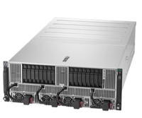

## システム全体 {#overview}

<table>
<tbody>
<tr>
<th colspan="3">機器分類</th>
<th>機器諸元</th>
</tr>
<tr>
<td rowspan="6">
計算ノード
   
総 CPU コア数: 15,424 
合計演算性能 933.560 TFLOPS 
(CPU: 434.360 TFLOPS, GPU: 499.2 TFLOPS) 
総メモリ容量 153.088 TB
</td>	
<td rowspan="4">
Thin 計算ノード
 合計 232 台  
総 CPU コア数: 14,336 
合計演算性能 844.472 TFLOPS 
(CPU: 345.272 TFLOPS, GPU: 499.2 TFLOPS) 
総メモリ容量 110.080 TB
</td>
<td>
Type 1a 
CPU に AMD EPYC 7501 を搭載 
</td>
<td>
ノード数: 136 台 
総 CPU コア数: 8,704 
合計演算性能: 139.264 TFLOPS 
総メモリ容量 69.632 TB（コアあたり 8GB） 
</td>
</tr>
<tr>
<td>
Type 1b 
CPU に AMD EPYC 7702 を搭載（2020 年 4 月増設
</td>
<td>
ノード数: 28 台 
総 CPU コア数: 3,584 
合計演算性能: 57.344 TFLOPS 
総メモリ容量 14.336 TB（コアあた 4GB）
</td>
</tr>
<tr>
<td>
Type 2a 
CPU に Intel Xeon Gold 6130 を搭載
</td>
<td>
ノード数: 52 台 
総 CPU コア数: 1,664 
合計演算性能 111.800 TFLOPS 
総メモリ容量 19.968 TB (コアあたり 12GB)
</td>
</tr>
<tr>
<td>

Type 2b 
GPU 搭載

</td>
<td>

ノード数: 16 台 
総 CPU コア数: 384 
総 GPU 数: 64 基(1 ノードあたり 4 基) 
合計演算性能: 536.064 TFLOPS 
(CPU: 36.864 TFLOPS, GPU: 499.2 TFLOPS) 
総メモリ容量 6.144 TB (コアあたり 16GB)

</td>
</tr>
<tr>
<td colspan="2">

Medium 計算ノード 
3TB の共有メモリ搭載

</td>
<td>

ノード数: 10 台 
総 CPU コア数: 800 
合計演算性能 61.440 TFLOPS 
総メモリ容量 30.72 TB (コアあたり 38.4GB)

</td>
</tr>
<tr>
<td colspan="2">

Fat 計算ノード 
12TB の共有メモリを構成

</td>
<td>

ノード数 1 台 
総 CPU コア数: 288 
合計演算性能 27.648 TFLOPS 
総メモリ容量 12.288 TB (コアあたり 42.7GB)

</td>
</tr>
<tr>
<td rowspan="2">
ストレージ
  
総ストレージ容量 57.6PB
</td>
<td colspan="2">
大容量高速ストレージ (※1) 
一般解析区画および個人ゲノム解析区画におけるユーザホーム領域
</td>
<td>
Lustre ファイルシステム 
合計容量：13.3PB
</td>
</tr>
<tr>
<td colspan="2">
DB 用ストレージ 
DRA 等の DDBJ データベースを格納している領域
</td>
<td>
Lustre ファイルシステム 
合計容量：40.5PB
</td>
</tr>
<tr>
<td colspan="3">
ノード間相互結合網
</td>
<td>
InfiniBand 4×EDR 100Gbps fat tree 
(ストレージに対しては full bi-section、
計算ノードに対しては、上流 SW への接続帯域：下流 SW への接続帯域 = 1:4)
</td>
</tr>
</tbody>
</table>

## 計算ノード {#compute-nodes}

### Thin 計算ノード Type 1a (HPE ProLiant DL385 Gen10; 136 台) {#compute-nodes#thin-type-1a}

CPU として AMD EPYC 7501 プロセッサを搭載した計算ノードです。

 

HPE ProLiant DL385 Gen10
(ホスト名: at001 -- at136)
	

| 構成要素 | 型番                                              | 員数 | ノードあたりの性能など         |
|----------|---------------------------------------------------|------|--------------------------------|
| CPU      | AMD EPYC 7501 (32 cores)  Base 2.0GHz, Max 3.0GHz |    2 | 合計 64 コア                     |
| Memory   | 32GB DDR4-2666                                    |   16 | 合計 512GB (CPU コアあたり 8GB) |
| Storage  | 1.6TB NVMe SSD x1, 3.2TB NVMe SSDx1               |      |                                |
| Network  | InfiniBand 4xEDR                                  |    1 | 100Gbps                        |

 
### Thin 計算ノード Type 1b (DELL PowerEdge R6525; 28 台) {#compute-nodes#thin-type-1b}

CPU として AMD EPYC 7702 プロセッサを搭載した計算ノードです。

DELL PowerEdge R6525
(ホスト名: at137 -- at164)

| 構成要素 | 型番                                               | 員数 | ノードあたりの性能など         |
|----------|----------------------------------------------------|------|--------------------------------|
| CPU      | AMD EPYC 7702 (64 cores)  Base 2.0GHz, Max 3.35GHz |    2 | 合計 128 コア                   |
| Memory   | 32GB DDR4-2666                                     |   16 | 合計 512GB (CPU コアあたり 4GB) |
| Storage  | 1.6TB NVMe SSD x1, 900GB SAS HDDx1                 |      |                                |
| Network  | InfiniBand 4xEDR                                   |    1 | 100Gbps                        |

 
### Thin 計算ノード Type 2a (HPE Apollo 2000 Gen10; 52 台) {#compute-nodes#thin-type-2a}

CPU として Intel Xeon プロセッサを搭載した計算ノードです。

HPE Apollo 2000 Gen10
(ホスト名: it001 -- it052)

| 構成要素 | 型番                                                    | 員数 | ノードあたりの性能など          |
|----------|---------------------------------------------------------|------|---------------------------------|
| CPU      | Intel Xeon Gold 6130 (16 cores) Base 2.1GHz, Max 3.7GHz |    2 | 合計 32 コア                     |
| Memory   | 32GB DDR4-2666                                          |   12 | 合計 384GB (CPU コアあたり 12GB) |
| Storage  | 1.6TB NVMe SSD x1, 3.2TB NVMe SSDx1                     |      |                                 |
| Network  | InfiniBand 4xEDR                                        |    1 | 100Gbps                         |

 
### Thin 計算ノード Type 2b (HPE Apollo 6500 Gen10; 16 台) {#compute-nodes#thin-type-2b}

NVIDIA Tesla V100 GPU を各ノードに 4 基搭載した計算ノードです。

HPE Apollo 6500 Gen10
(ホスト名: igt001 -- igt016)
	

| 構成要素 | 型番                                                    | 員数 | ノードあたりの性能など          |
|----------|---------------------------------------------------------|------|---------------------------------|
| CPU      | Intel Xeon Gold 6136 (12 cores) Base 3.0GHz, Max 3.7GHz |    2 | 合計 24 コア                     |
| Memory   | 32GB DDR4-2666                                          |   12 | 合計 384GB (CPU コアあたり 16GB) |
| GPU      | NVIDIA Tesla V100 SXM2                                  |    4 |                                 |
| Storage  | 1.6TB NVMe SSD x1, 3.2TB NVMe SSDx1                     |      |                                 |
| Network  | InfiniBand 4xEDR                                        |    1 | 100Gbps                         |

 
#### （参考）GPU の仕様 {#compute-nodes#thin-type-2b#reference-gpu-specifications}

|  属性名                         |  値                      |
|--------------------------------|-------------------------|
| 名称                           | NVIDIA Tesla V100 SXM2  |
| コア数(個)                     | 640                     |
| クロック速度                   | 1,455MHz                |
| 単精度浮動小数点演算ピーク性能 | 15TFLOPS                |
| 倍精度浮動小数点演算ピーク性能 | 7.5TFLOPS               |
| 単体コア理論性能               | 1.3GLOPS                |
| メモリサイズ                   | 16GB(GDDR5)              |
| メモリバンド幅                 | 900GB/sec               |
| 1GFLOPS 毎のメモリバンド幅      | 266GB/sec               |
| 接続帯域                       | 8 (PCIe2.0 x16)GB/sec   |

### Medium 計算ノード (HPE ProLiant DL560 Gen10; 10 台) {#compute-nodes#medium}

[<u>MediumノードのUbuntu Linuxへの一部移行とGride Engineキュー(medium-ubuntu.q)新設をしました。詳細は、お知らせをご確認ください。</u>](/blog/2024-07-08-news_medium-ubuntu-q)

3TB の物理メモリを搭載した 80 コアを搭載した計算ノードです。De novo アセンブラなど大規模なメモリを必要とするようなプログラムを実行するのに向いています。Grid Engine 配下のためジョブ投入により利用可能です。

HPE ProLiant DL560 Gen10
(ホスト名: m01 -- m10)

| 構成要素 | 型番                                                    | 員数 | ノードあたりの性能など              |
|----------|---------------------------------------------------------|------|-------------------------------------|
| CPU      | Intel Xeon Gold 6148 (20 cores) Base 2.4GHz, Max 3.7GHz |    4 | 合計 80 コア                         |
| Memory   | 32GB DDR4-2666                                          |   48 | 合計 3,072GB (CPU コアあたり 38.4GB) |
| Storage  | 1TB SATA HDD                                            |    2 | 1TB (RAID1)                         |
| Network  | InfiniBand 4xEDR                                        |    1 | 100Gbps                             |

 
### Fat 計算ノード (1 台 : ホスト名 fat1) {#compute-nodes#fat}

[<u>Fat ノードのハードウェア（HPE ProLiant DL560 Gen10 と HPE Superdome Flex）は、Ubuntu Linux をサポートしていないため、2023 年 11 月の定期メンテナンス時に Cent OS 7.9 から Ubuntu Linux 22.04 に移行できず、Cent OS 7.9 のままとなっております。</u>](/blog/2023-11-24-scheduled-maintenance#作業内容)

HPE Superdome Flex 2 筐体を Superdome Flex グリッド・インターコネクトで接続して合計 12TB の共有メモリの計算ノードを構成しています。

FAT ノードは申請制での利用となります。

 

FAT 計算ノード１ノード（HPE Superdome Flex 2 筐体）当たりのスペック

| 構成要素 | 型番                                                    | 員数 | ノードあたりの性能など               |
|----------|---------------------------------------------------------|------|--------------------------------------|
| CPU      | Intel Xeon Gold 6154 (18 cores) Base 3.0GHz, Max 3.7GHz |   16 | 合計 288 コア                         |
| Memory   | 32GB DDR4-2666                                          |  192 | 合計 12,288GB (CPU コアあたり 47.2GB) |
| Storage  | 1.2TB SAS HDD                                           |    4 | 2.4TB (RAID1)                        |
| Network  | InfiniBand 4xEDR                                        |    1 | 100Gbps                              |

## ストレージ {#storage}

### 大容量高速ストレージ {#storage#analysis-storage}

| アクセスパス | 実効容量 | 用途                           | ピーク性能 | 構成                                             |
|--------------|----------|--------------------------------|------------|--------------------------------------------------|
| /lustre7     | 8.0PB    | 一般解析区画のホーム領域       | 35GB/sec 以上 | DDN SFA14KXE+SS9012, DDN 1U server, DDN SFA7700X |
| /lustre8     | 5.3PB    | 個人ゲノム解析区画のホーム領域 | 35GB/sec 以上 | DDN SFA14KXE+SS9012, DDN 1U server, DDN SFA7700X |

### DB 用ストレージ {#storage#database-storage}

| アクセスパス | 実効容量 | 用途                           | ピーク性能 | 構成                                             |
|--------------|----------|--------------------------------|------------|--------------------------------------------------|
| /lustre9     | 40.5PB    | DDBJ 業務                       | 150GB/sec   | DDN ES400NVX2 + DDN SS9024 |
