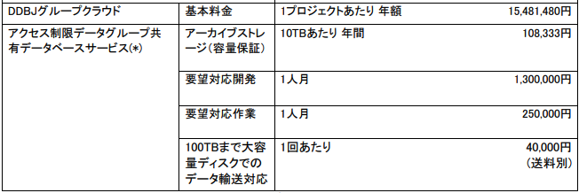

DDBJグループクラウドは、個人ゲノムデータを含みアクセス制限を必要とするデータを、研究グループ内で共有するためのサービスです。

 
## 利用申請の方法

 サービス利用の際は、利用規程および利用規程別表（料金表）をご確認いただき、拡張サービス利用計画表をダウンロードし必要事項を記入の上、までメールにてお送りください。利用目的を審査の上、課金サービス利用許可の案内をお送りします。遺伝研スパコンの混雑状況によってはご利用できない場合がありますのでご了承願います。

 
## 利用料金

ストレージの使用料金に加えて、セキュリティー監視などの管理のための基本料金350万円が別途かかります。

利用規程別表（料金表）から抜粋。

 
