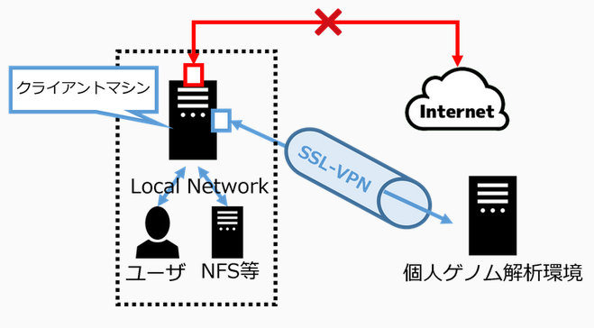

import Marker from '@site/src/components/Marker';

## 概要

遺伝研スパコンの個人ゲノム解析区画へのログイン及びファイル転送にはSSL-VPN接続を用います。SSL-VPN接続を行うためにはユーザーの計算機に専用のソフトウェアをインストールする必要があります(これを以下SSL-VPNクライアントソフトウェアと呼びます)。

SSL-VPN接続の際は二要素認証が行われます。セキュリティー向上の目的で、SSL-VPNで接続している時にはユーザの計算機のインターネットへのアクセスは遮断される設定としています。このとき、ユーザの計算機が属するローカルネットワーク内への通信は遮断されません。したがって例えばユーザの計算機がローカルネットワーク内のファイルサーバーに接続されていて、そのファイルサーバーからデータを個人ゲノム解析環境に送るといった操作は問題なく可能です。一方、ローカルネットワークの外側からsshでユーザの計算機に接続して作業を行っていた場合はそのssh接続は遮断されるので注意が必要です。

一方で遺伝研スパコンのファイアウォール上での設定により個人ゲノム解析環境からインターネット上のHTTPSについてのみ利用可能となっています。




## ログイン方法


以下の図に、ログイン方法の流れを示します。


### <Marker color="#3FCBE7">FortiClientにログインして、SSL-VPN接続を開始する。</Marker>

#### STEP 1. SSL-VPNクライアントソフトウェアのインストール

「[&#x1f517;<u>FortiClient</u>](https://www.fortinet.com/support/product-downloads)」の 公式サイト にアクセスし、FortiClient をダウンロードして、インストールします。

- 公式サイト：&#x1f517;<u>https://www.fortinet.com/support/product-downloads</u>

ダウンロードとインストール方法の詳細は、以下のリンクからをご参照ください。

- [<u>SSL-VPNクライアントソフトウェアのインストール (Windowsの場合)</u>](/personal_genome_division/pg_login_ssl-vpn_install_win)
- [<u>SSL-VPNクライアントソフトウェアのインストール (Macの場合)</u>](/personal_genome_division/pg_login_ssl-vpn_install_mac)
- [<u>SSL-VPNクライアントソフトウェアのインストール (Linuxの場合)</u>](/personal_genome_division/pg_login_ssl-vpn_install_linux)


#### STEP 2. SSL-VPNへの接続

SSL-VPN接続を行います。

接続方法の詳細は、以下のリンクをご参照ください。
- [<u>Windowsの場合 (FortiClient GUI)</u>](/personal_genome_division/pg_login_ssl-vpn_connection_win)
- [<u>Macの場合 (FortiClient GUI)</u>](/personal_genome_division/pg_login_ssl-vpn_connection_mac)
- [<u>Linuxの場合 (openfortivpn CUI)</u>](/personal_genome_division/pg_login_ssl-vpn_connection_linux)

うまくつながらない場合は、[<u>FAQ</u>](/faq/faq_login_personal#dialogbox_disappear)をご参照ください。


### <Marker color="#3FCBE7">ssh接続によりゲートウェイにログインする。</Marker>

#### STEP 3. SSHによるゲートウェイへのログイン

SSL-VPN接続を開始したら、ユーザの計算機上でターミナルエミュレータを起動し、個人ゲノム解析環境のゲートウェイにログインします。

ゲートウェイノードは、`gwa.ddbj.nig.ac.jp` と  `gwa2.ddbj.nig.ac.jp` の2つがあります。それぞれ、以下のコマンドを実行するとログインできます。

```
ssh [アカウント名]@gwa.ddbj.nig.ac.jp 
```

または

```
ssh [アカウント名]@gwa2.ddbj.nig.ac.jp 
```

うまく行かない場合は、[<u>よくある質問(FAQ)</u>](/faq/faq_login_personal)をご参照ください。


## SSHによる解析サーバへのログイン

個人ゲノム解析区画はノード貸しなので、ユーザーの借りたノードにはゲートウェイ上からSSHすることによりログインします。
該当のノードの名前は利用開始時にお知らせします。
