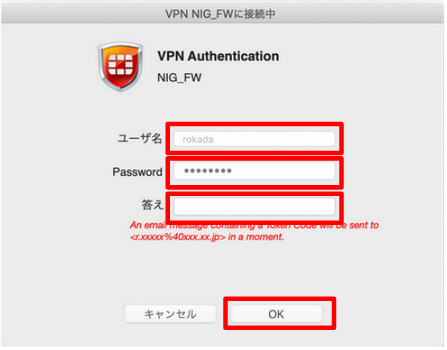

Macの場合は、FortiClient GUIを使ってSSL-VPNに接続します。

1. ユーザ名とパスワードを入力します。

 

2. 以下のように[証明書を検証]というメッセージが表示されます。[続ける]をクリックします。

3. セキュリティの警告は「はい」をクリックします。

:::info
ダイヤログボックスが表示されない場合は、[<u>FAQ</u>](/faq/faq_login_personal#dialogbox_disappear)をご参照ください。
:::

クリックすると、SSL-VPNアカウントに紐付くメールアドレスへ以下のようなワンタイムパスワードが送信されます。

送信されない場合は、[FAQ:Login > FAQ(ログインについて)](/faq/faq_login_personal#🆀-個人ゲノム解析区画に対してssl-vpn接続を行うためにforticlientにユーザ名をパスワードを入力してもvpnアカウントに紐付くメールアドレスへワンタイムパスワードが送られてきません)をご参照ください。

4. [答え]にワンタイムパスワード(上記の例の場合、269274)を入力し、[OK]をクリックします。

5. 以下の画面が表示されましたら、VPN接続が開始されます。

