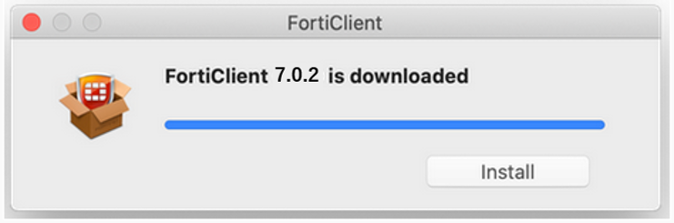
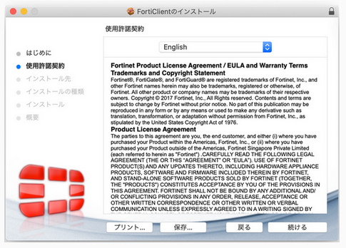
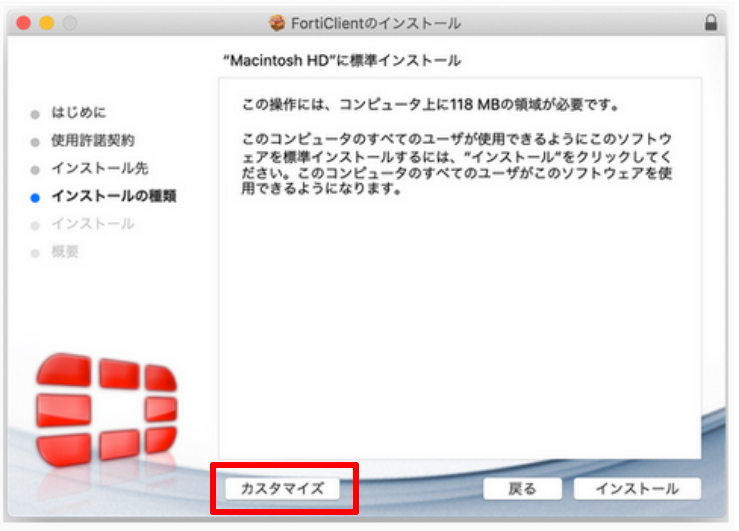
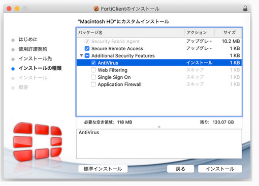

## VPN サービス「FortiClient」のダウンロード方法

1. 以下のURLから、ForiClientの公式サイトのページにアクセスして、①［Product Downloads］、②［FortiClient VPN only］の順にクリックします。
	- FortiClient公式サイト: [https://www.forticlient.com/downloads](https://www.forticlient.com/downloads)

2. 下図の①、②の順にクリックして、Mac用のFortiClient VPNインストーラをダウンロードします。

## VPN サービス「FortiClient」のインストール方法

1. ダウンロードしたインストーラを実行するために、OKをクリックします。

2. FortiClientUpdateをダブルクリックします。

3. [開く]をクリックします。

クリックすると、ダウンロードが始まりますので、このまましばらくお待ち下さい。

4. [install]をクリックします。

5. [続ける]をクリックします。

6. [続ける]をクリックします。

7. ユーザの計算機のインストールの種類を選択します。選択する種類は、ユーザの計算機にウィルスチェックソフトが入っているか否かで異なります。

- **必ず以下の画像の通りにチェックボックスにチェックされていることを確認してください。**
- **その他のチェックされていない項目にチェックが入っていると、正常に動作しない恐れがあります。**

【ユーザの計算機にウイルスチェックソフトが入っている場合】

[インストール]をクリックします。

【ユーザの計算機にウイルスチェックソフトが入っていない場合】

[カスタマイズ]をクリックします。

 
『パッケージ名』で「Secure Remote Access」と「AntiVirus」にチェックを入れ、[インストール]をクリックします。

8. [閉じる]をクリックすると、インストールが完了します。

